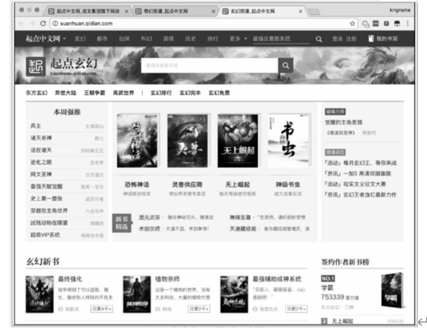
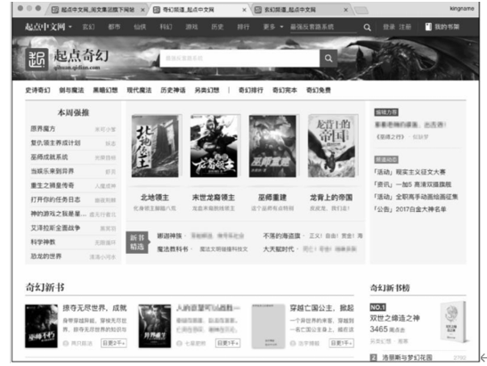
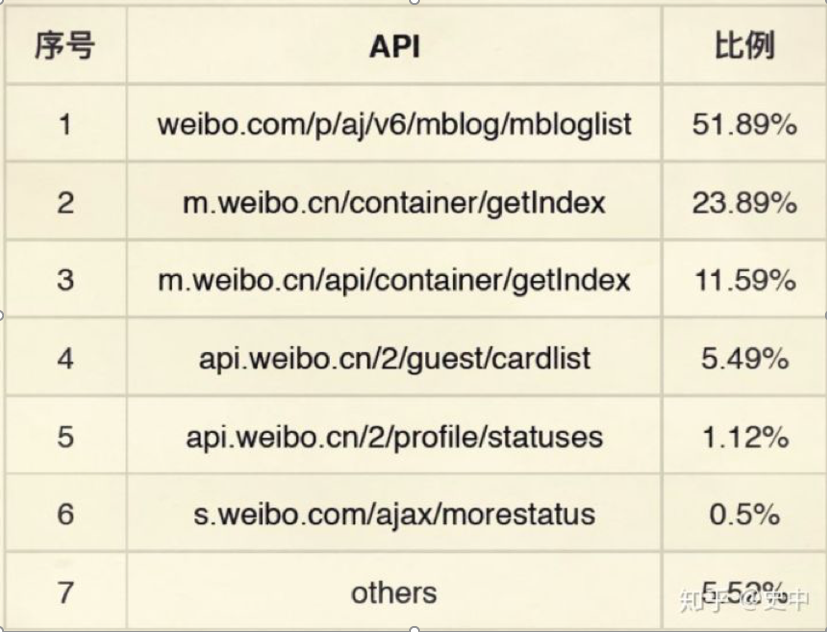
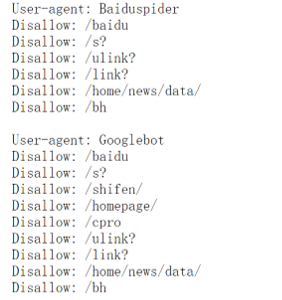
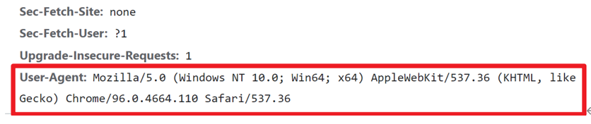

参考书籍：崔庆才《Python3网络爬虫开发实战第二版》

​					 瑞安 • 米切尔《Python网络爬虫权威指南（第2版）》

​					 黄永祥 《实战网络爬虫》


# 第一章 网络爬虫技术

## 1.1 认识网络爬虫

​	网络爬虫也被称为网络蜘蛛、网络机器人，**是一个自动下载网页的计算机程序或自动化脚本**。

​	网络爬虫作为收集互联网数据的一种常用工具，近年来随着互联网的发展而快速发展。 使用网络爬虫爬取网络数据首先需

要了解网络爬虫的概念和主要分类，各类爬虫的系统结构、运作方式，常用的爬取策略，以及主要的应用场景，同时，出于版

权和数据安全的考虑，还需了解目前有关爬虫应用的合法性及爬取网站时需要遵守的协议。


## 1.2 爬虫的用处

### 1.2.1 收集数据

​	爬虫可以用来收集数据。这也是爬虫最直接、最常用的使用方法。由于爬虫是一种程序，程序的运行速度极快，而且不会

因为做重复的事情就感觉到疲劳，因此使用爬虫来获取大量的数据，就变得极其简单和快捷了。


​	由于现在99%以上的网站都是基于模板开发的，使用模板可以快速生成相同版式、不同内容的大量页面。因此，只要针对

一个页面开发出了爬虫，那么这个爬虫也能爬取基于同一个模板生成的不同页面。这种爬虫称为定向爬虫，也是本课程大部分

的爬虫类型。






​	上图所示的这两个版面除了内容不一样外，其他地方完全一样。只要爬虫能爬取“玄幻频道”，那么就能爬取“奇幻频道”。

假设要把这两个页面的内容都获取下来，如果人工来操作，就需要对两个页面进行复制及粘贴，做很多重复的工作。


​	而如果使用爬虫，那么只需要开发“玄幻频道”的爬虫就能实现既能爬取“玄幻频道”又能爬取“奇幻频道”的目标。


​	正是由于现在的网站大量使用了模板来生成页面，所以爬虫才能够有用武之地。


### 1.2.2 尽职调查

​	所谓的尽职调查，一般是指投资人在投资一个公司之前，需要知道这个公司是否如他们自己所描述的一样尽职尽责地工

作，是否有偷奸耍滑、篡改数据、欺骗投资人的嫌疑。在过去，尽职调查一般通过调查目标公司的客户或者审计财务报表来实

现。而有了爬虫以后，要做尽职调查就方便很多了。


​	例如调查一个电商公司，想知道他们的商品销售情况。该公司自己声称每个月销售额几亿元。如果使用爬虫爬取了该公司

网站所有商品的销量情况，那么就可以计算出该公司的实际总销售额。而且，如果爬取了所有的评论并进行分析，还可以发现

该网站是否出现了刷单的行为。


​	数据不会说谎，特别是数据量极大的数据，人工伪造的总会和自然生成的存在区别。而在以前，对于数据量极大的数据进

行搜集是一件非常困难的事情，但现在有了爬虫的帮助，很多欺骗行为都会赤裸裸地暴露在阳光下


### 1.2.3 刷流量和秒杀

​	刷流量是爬虫天然自带的功能。当爬虫访问了一个网站时，如果这个爬虫隐藏得很好，网站不能识别这一次访问来自于爬

虫那么就会把它当成正常访问。于是，爬虫就“不小心”地刷了网站的访问量。


​	除了刷流量外，爬虫也可以参与各种秒杀活动，包括但不限于在各种电商网站上抢商品，抢优惠券，抢机票和火车票。目

前，网上有不少人专门使用爬虫来参加各种活动，并从中盈利。这种行为一般称为“薅羊毛”，这种人被称为“羊毛党”。


​	不过使用爬虫来“薅羊毛”进行盈利的行为实际上游走在法律的灰色地带，希望同学们不要轻易尝试。


**一些骚操作（https://www.zhihu.com/question/24098641）:**


**12306**抢票：

​	每年春运，12306 被点成什么样了吗？公开数据是这么说的：「最高峰时 1 天内页面浏览量达 813.4 亿次，1 小时最高

点击量 59.3 亿次，平均每秒 164.8 万次。」这还是加上验证码防护之后的数据。可想而知被拦截在外面的爬虫还有多少。


​    铁路被爬虫「点击」成这样已经够惨了，但它还有个难兄难弟，就是航空。而航空里，被搞得最惨的不是国航，不是海

航，也不是东航。而是亚航。


​    技术宅黄牛党们利用爬虫，不断刷新亚航的票务接口，一旦出现便宜的票，不管三七二十一先拍下来再说。


​	亚航有规定，你拍下来半小时（具体时间记不清了）不付款票就自动回到票池，继续卖。但是黄牛党们在爬虫脚本里写好

了精确的时间，到了半小时，一毫秒都不多，他又把票拍下来，如此循环。直到有人从黄牛党这里定了这个票，黄牛党就接着

利用程序，在亚航系统里放弃这张票，然后 0.00001 秒之后，就帮你用你的名字预定了这张票。


​	「我是中间商，我就要赚差价！」这波骚操作，堪称完美。


**社交网站爬虫：**




​	    上图是爬虫经常光顾的微博地址。

  	  僵尸粉都只是爬虫的常规操作，剩下的操作可以去原文….


## 1.3 爬虫的分类

### 1.3.1 通用爬虫

​	通用网络爬虫又称全网爬虫， 其爬取对象由一批种子URL扩充至整个Web，主要由搜索引擎或大型Web服务提供商使

用。这类爬虫的爬取范围和数量都非常大，对于爬取的速度及存储空间的要求都比较高，而对于爬取页面的顺序要求比较低，

通常采用并行工作的方式来应对大量的待刷新页面。


​	该类爬虫比较适合为搜索引擎搜索广泛的主题，常用的爬取策略可分为深度优先策略和广度优先策略。

**(1)深度优先策略：**

​	该策略的基本方法是按照深度由低到高的顺序，依次访问下一级网页链接，直到无法再深入为止。在完成一个爬取分支

后，返回上一节点搜索其他链接，当遍历完全部链接后，爬取过程结束。这种策略比较适合垂直搜索或站内搜索，缺点是当爬

取层次较深的站点时会造成巨大的资源浪费。

**(2)广度优先策略:**

​	该策略按照网页内容目录层次的深浅进行爬取，优先爬取较浅层次的页面。当同一层中的页面全部爬取完毕后，爬虫再深

入下一层。比起深度优先策略，度优先策略能更有效地控制页面爬取的深度，避免当遇到一个无穷深层分支时无法结束爬取的

问题。该策略不需要存储大量的中间节点，但是缺点是需要较长时间才能爬取到目录层次较深的页面。


### 1.3.2 聚焦爬虫

​	聚焦网络爬虫又被称作主题网络爬虫，其最大的特点是只选择性地爬取与预设的主题相关的页面。与通用网络爬虫相比，聚焦爬虫仅需爬取与主题相关的页面，极大地节省硬件及网络资源，能更快地更新保存的页面，更好地满足特定人群对特定领域信息的需求。

​	按照页面内容和链接的重要性评价，聚焦网络爬虫策略可分为以下4种。

**(1)基于内容评价的爬取策略**

​	该策略将用户输入的查询词作为主题，包含查询词的页面被视为与主题相关的页面。其缺点为，仅包含查询词，无法评价

页面与主题的相关性。

**(2)基于链接结构评价的爬取策略**

​	该策略将包含很多结构信息的半结构化文档Web页面用来评价链接的重要性，其中，一种广泛使用的算法为PageRank算

法， 该算法可用于排序搜索引擎信息检索中的查询结构， 也可用于评价链接重要性， 其每次选择PageRank值较大页面中的

链接进行访问。

**(3)基于增强学习的爬取策略**

​	该策略将增强学习引入聚焦爬虫，利用贝叶斯分类器基于整个网页文本和链接文本来对超链接进行分类，计算每个链接的

重要性，按照重要性决定链接的访问顺序。

**(4)基于语境图的爬取策略**

​	该策略通过建立语境图来学习网页之间的相关度，具体方法是，计算当前页面到相关页面的距离，距离越近的页面中的链

接越优先访问。


### 1.3.3 增量式爬虫

​	用来监测网站数据更新的情况，以便爬取到网站最新更新出来的数据。

### 1.3.4 分布式爬虫

​	高效率爬虫


## 1.4 爬虫的合法性和robots协议

### 1.4.1 爬虫的合法性

​	网络爬虫领域现在还处于早期的拓荒阶段，虽然已经由互联网行业自身的协议建立起一定的道德规范，但法律部分还在建

立和完善中。


​	目前，多数网站允许将爬虫爬取的数据用于个人使用或者科学研究。但如果将爬取的数据用于其他用途，尤其是转载或者

商业用途，则依据各网站的具体情况有不同的后果，严重的将会触犯法律或者引起民事纠纷。


同时，也需要注意，以下两种数据是不能爬取的，更不能用于商业用途。

**(1)个人隐私数据:**

​	如姓名、手机号码、年龄、血型、婚姻情况等，爬取此类数据将会触犯个人信息保护法。

**(2)明确禁止他人访问的数据:**

​	例如，用户设置过权限控制的账号、密码或加密过的内容等。另外，还需注意版权相关问题，有作者署名的受版权保护的

内容不允许爬取后随意转载或用于商业用途。


### 1.4.2 robots.txt协议

​	当使用爬虫爬取网站的数据时，需要遵守网站所有者针对所有爬虫所制定的协议，这便是robots.txt协议。


​	该协议通常存放在网站根目录下，里面规定了此网站中哪些内容可以被爬虫获取，以及哪些网页内容是不允许爬虫获取

的。robots.txt协议并不是一份规范，只是一个约定俗成的协议。爬虫应当遵守这份协议，否则很可能会被网站所有者封禁

IP，甚至网站所有者会采取进一步法律行行动。在著名的百度与360的爬虫之争中，由于360没有遵守百度的robots.txt协

议，爬取了百度网站的内容，而最终被判处70万元的罚款。


​	由于爬虫爬取网站时模拟的是用户的访问行为，所以必须约束自己的行为，接受网站所有者的规定，避免引起不必要的麻

烦。

### 1.4.3 查看robots.txt协议

​	在浏览器的网址搜索栏中,**输入网站的根域名，然后再输入/robots.txt。**

​	比如百度:

```
https://www.baidu.com/robots.txt
```

​	下图为百度的robots.txt协议

​			

```markdown
User-agent: 爬虫的名称

Disallow: 不允许爬虫访问的地址

Allow: 允许爬虫访问的地址

若User-agent是*，则表示对象是所有爬虫。

Disallow和Allow后面跟的是地址，地址的描述格式符合正则表达式(regex)的规则。因此可以在python中使用正则表达式来筛选出可以访问的地址。
```

​	以第一个为例:

​	`www.baidu.com`不允许(原则上)名称为Baiduspider的爬虫访问`/baidu`,`/s?`,`/ulink?`,`/link?`,

`/home/news/data/`,`/bh`等目录下的资源。


**练习：**

​    查看豆瓣，新浪微博，新浪新闻，哔哩哔哩，小红书的robots协议，并分析它们的协议规定。


### 1.5 反爬虫和反反爬虫

​	网站所有者并不欢迎爬虫，往往会针对爬虫做出限制措施。爬虫制作者需要了解网站所有者反爬虫的原因和想要通过反爬虫达成的目的，并针对网站常用的爬虫检测方法和反爬虫手段，制定相应的爬取策略来规避网站的检测和限制。


### 1.5.1 反爬虫

​	网站所有者从所有网站来访者中识别出爬虫并对其做出相应处理(通常为封禁IP)的过程，被称为反爬虫。对于网站所有者而言，爬虫并不是一个受欢迎的客人。


​	爬虫会消耗大量的服务器资源，影响服务器的稳定性，增加运营的网络成本。可供免费查询的资源也有极大可能被竞争对手使用爬虫爬走，造成竞争力下降。


​	以上种种因素导致网站所有者非常反感爬虫，想方设法阻止爬虫爬取自家网站的数据。


​	爬虫的行为与普通用户访问网站的行为极为类似，网站所有者在进行反爬虫时会尽可能地减少对普通用户的干扰。网站针对爬虫的检测方法通常分为以下几种：

**(1)** **通过User-Agent校验反爬**

​	浏览器在发送请求时，会附带一部分浏览器及当前系统环境的参数给服务器，这部分数据放在HTTP请求的Headers部分，Headers的表现形式为key-value。

​	其中， User-Agent标示一个浏览器的型号， 下图所示为Chrome浏览器中某网页的User-Agent。服务器会通过User-Agent的值来区分不同的浏览器。




**(2)** **通过访问频度反爬**

​	普通用户通过浏览器访问网站的速度相对爬虫而言要慢得多，所以不少网站会利用这一点对访问频度设定一个阈值，如果一个IP单位时间内的访问频度超过预设的阈值，则网站将会对该IP做出访问限制。通常情况下该IP需要经过验证码验证后才能继续正常访问，严重时，网站甚至会在一段时间内禁止该IP的访问。

**(3)** **通过验证码校验反爬**

​	与通过访问频度反爬不同，有部分网站不论访问频度如何，一定要来访者输入验证码才能继续操作。例如，在12306网站上，不管是登录还是购票，全部需要验证验证码，与访问频度无关。

**(4)** **通过变换网页结构反爬**

​	一些社交网站常常会更换网页结构，而爬虫大部分情况下都需要通过网页结构来解析需要的数据，所以这种做法也能起到反爬虫的作用。在网页结构变换后，爬虫往往无法在原本的网页位置找到原本需要的内容。

**(5)** **通过账号权限反爬**

​	还有部分网站需要登录才能继续操作，这部分网站虽然并不是为反爬虫才要求登录操作的，但确实起到了反爬虫的作用。


### 1.5.2 反反爬虫

**（1）发送模拟User-Agent**

​	爬虫可通过发送模拟User-Agent来通过服务器的User-Agent检验， 模拟User-Agent指的是， 将要发送至网站服务器的请求的User-Agent值伪装成一般用户登录网站时使用的User-Agent值。通过这种方法能很好地规避服务器检验， 有时有些服务器可能会禁止某种特定组合的User-Agent值， 这时就需要通过手动指定来进行测试，直到试出服务器所禁止的组合，再进行规避即可。

**（2）调整访问频度**

​	目前，大部分网站都会通过User-Agent值做基础反爬检验， 在此基础上， 还有部分网站会再设置访问频度阈值，并通过访问频度反爬。爬虫爬取此类网站时，如果设置的访问频度不当，则有极大可能会遭到封禁或需要输入验证码，所以需要通过备用IP测试网站的访问频度阈值，然后设置比阈值略低的访问频度。

​	这种方法既能保证爬取的稳定性，又能使效率不至于过于低下。如果仍然觉得访问频度设置得不足以满足需求，那么可以考虑使用异步爬虫和分布式爬虫。

**（3）通过验证码校验**

​	若因为访问频度问题导致需要通过验证码检验，则按照访问频度的方案实施即可，也可以通过使用IP代理或更换爬虫IP的方法来规避反爬虫。但对于一定要输入验证码才能进行操作的网站， 则只能通过算法识别验证码或使用Cookie绕过验证码才能进行后续操作。需要注意的是， Cookie有可能过期， 过期的Cookie无法使用。

**（4）应对网站结构变化**

根据爬取需求，应对这类网站的方法可分为两种：如果只爬取一次，那么要尽量赶在其网站结构调整之前，将需要的数据全部爬取下来；如果需要持续性爬取，那么可以使用脚本对网站结构进行监测，若结构发生变化，则发出告警并及时停止爬虫，避免爬取过多无效数据。

**（5）通过账号权限限制**

对于需要登录的网站，可通过模拟登录的方法进行规避。模拟登录时除需要提交账号和密码外，往往也需要通过验证码检验。

**（6）通过过代理IP规避**

​	网站识别爬虫进行反爬虫的一个常用标识就是IP，通过代理进行IP更换能够有效地规避网站的检测。需要注意的是，公用IP代理池往往已经被网站所有者识别为重点监测对象，使用这些公用IP代理时需要注意。

 