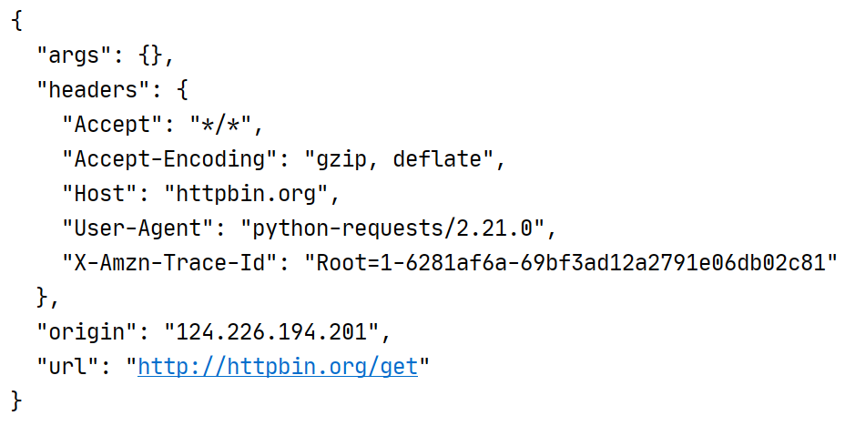
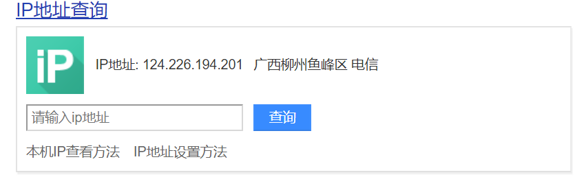
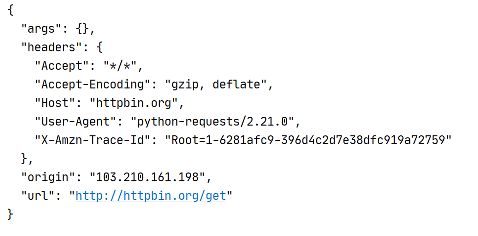
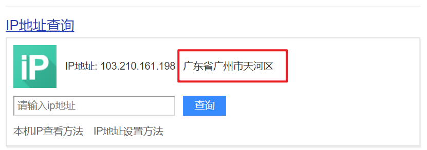
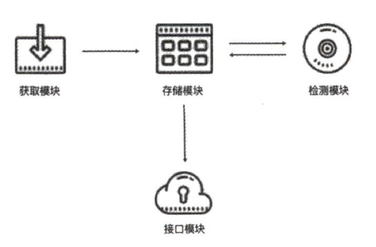
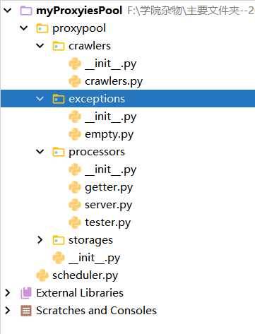
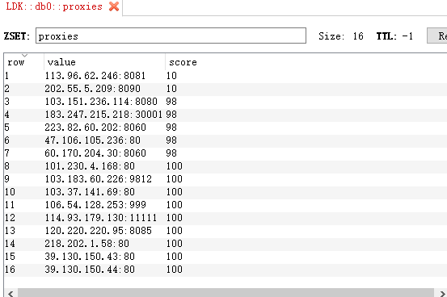
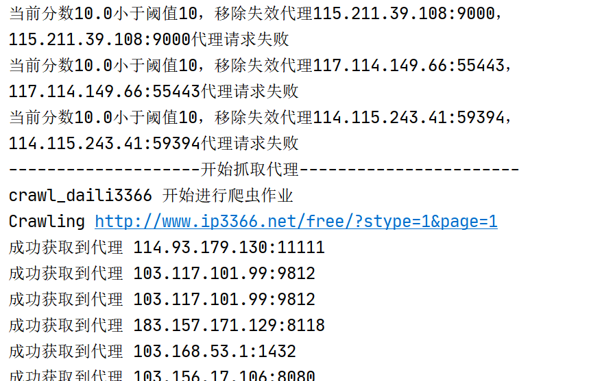
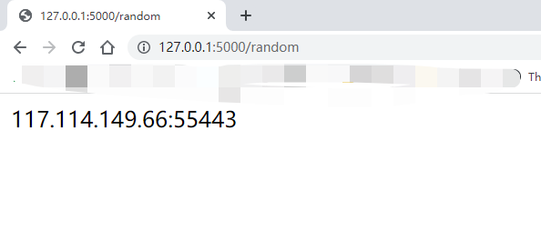

# 第十一章 代码池的构建和使用

​	在使用爬虫的过程中经常会遇到这样的情况，爬虫最初还可以正常运行，正常爬取数据，一切都看起来是那么顺利，然后突然，马上就出现了错误，比如返回403 Forbidden，这时打开网页就收到了“您的IP访问频率太高”这样的提示，或者跳出一个验证码让我们识别。

​	出现上述现象的原因是网站采取了**封IP**，当某个IP在单位时间内请求服务器的次数超过了指定的阈值，就会直接拒绝服务，或者返回一些错误信息。

​	既然服务器检测是某个IP在单位时间的请求次数，那么这样我们类似像伪装User-Agent一样，把IP伪装起来，让服务器识别不出是由我们本机发起的请求，就可以成功防止封IP了。

​	这是代理就派上用场了，本章会介绍代理的基本知识以及各种代理的使用方式，以及代理池的构建和使用。

## 11.1 代理的设置

​	在我们第4章的时候已经介绍了在requests库中设置代理的方法，我们来复习一下requests的设置代理方法，以及预习一下将在第12章学到的Selenium和Pyppeteer的代理设置方法。

​	首先我们先准备一个可用的代理（免费或付费），这里推荐两个代理的网站，一个是付费好用的【https://www.kuaidaili.com/】，一个免费好用的【http://www.ip3366.net/free/】

​	比如：

​	

### 11.1.1 requests设置代理

​	对于requests来说，代理的设置非常简单，只需要传入proxies参数即可。

​	HTTP/HTTPS代理设置方法为

```python
proxy = "127.0.0.1:7890"  # 设置的代理IP，这里以本机IP为例

# 代理参数
proxies = {
	"http": "http://" + proxy,	# HTTP类型代理
	"https": "https://" + proxy	# HTTPS类型代理
}
# 或者
proxies = {
	"http":  proxy,	# HTTP类型代理
	"https": proxy	# HTTPS类型代理
}

# 设置代理发送请求
response = requests.get("https://www.httpbin.org/get", proxies=proxies)
```

​	

​	首先我们先用本机IP请求一下 【https://www.httpbin.org/get】,这是一个专门用于测试爬虫的网站。

```python
import requests

# 链接
base_url = 'http://httpbin.org/get'
# 测试网站发起请求
response = requests.get(url=base_url)
# 输出响应正文
print(response.text)
```



​	

​	

设置代理后发起请求

```python
import requests

# 链接
base_url = 'http://httpbin.org/get'

# 代理IP
proxy = "120.232.194.134:8998"
# 设置代理参数
proxies = {
    'http': proxy,
    'https': proxy
}

# 异常处理
try:
    # 设置代理发送请求
    response = requests.get(url=base_url, proxies=proxies, timeout=10)
    # 输出
    print(response.text)
except requests.exceptions.ConnectionError as e:
    print("ERROR ", e.args)
```






​	另外，还有一种设置SOCKS代理的方法，即使用socks模块，需要安装socks库，这种设置方法如下：

```python
import requests
import socks
import socket

# 设置默认代理
socks.set_default_proxy(socks.SOCKS5, "120.232.194.134", 8998)
# 实例化
socket.socket = socks.socksocket
# 异常处理
try:
    response = requests.get("http://httpbin.org/get")
    print(response.text)
except requests.exceptions.ConnectionError as e:
    print('ERROR ', e.args)
```


### 11.1.2 Selenium设置代理

​	我们将在第十二章中具体介绍

​	预习代码

```python
from selenium import webdriver

proxy = '122.9.101.6:8888'
options = webdriver.ChromeOptions()
options.add_argument('--proxy-server=http://' + proxy)
browser = webdriver.Chrome(options=options)
browser.get("http://httpbin.org/get")
print(browser.page_source)
browser.close()
```


## 11.2 代理池

​	我们在11.1节中了解了设置代理的方法，如果实时高效地获取大量可用代理变成了新的问题。

​	首先，互联网上有大量公开的免费代理，当然我们也可以购买付费代理，但无论是免费代理还是付费代理，都不能保证是可用的，因为自己选用的IP，可能其他人也在用，甚至爬取的目标也是一样的网站，从而被封禁；或者代理服务器突然发生故障。

​	一旦选用的是一个不可用的代理，势必会影响爬虫的工作效率，所以要提前做筛选，删除掉不可用的代理，只保留可用代理。

​	这就是我们本节所构建的代理池的作用了。

### 11.2.1 代理池的设计

​	代理池通常分为4个基本模块：

1. **存储模块**

   负责存储爬取下来的代理。首先要保证代理不重复，标识代理的可用情况，其次要动态实时地处理每个代理。

   一种比较高效和方便的存储方式就**Redis**的`Sorted Set`，即有序集合。

2. **获取模块**

   负责定时在各大代理网站爬取代理。可用选择付费，也可以是免费的。最好尽量从不同来源爬取。

3. **检测模块**

   负责定时检测存储模块中的代理是否可用。

   这里可以有两层检验方式。

   ​	第一层（先验）：向该代理服务器发起请求，如果请求成功，说明代理服务器是正常的，没有发生故障。

   ​	第二层（后验）：设置一个检验链接，最好是设置为要爬取的那个网站（这样更具有针对性）。对于一个通用型的代理，可								 	设置为百度等链接。

   

   ​	我们需要设置一个分数表示用来标识每一个代理的状态，100分代表完全可用，分数越少代表越不可用。

   ​	经检测，如果代理可用，可以将分数标识立即设置为满分100，也可以在原分数基础上加1。如果代理不可用，就将分数标识减1。

   ​	当分数减到一定阈值后，直接从存储模块中删除此代理。

   

4. **接口模块**

   ​	用API提供对外服务的接口。其实我们也可以直接链接数据库来获取对应的数据，但这样需要知道数据库的连接信息，并且要配置连接。

   ​	比较安全和方便的方式是提供一个Web API接口，访问这个接口即可拿到可用代理。

   ​	如果可用代理很多，可以设置一个随机返回，这样就能保证每个代理都要机会被获取，实现负载均衡。





### 11.2.2 代理池的简单实现

​	首先建立如下的目录结构



#### ① 存储模块的实现

​	存储在这里我们使用 Redis 的有序集合，集合的每一个元素都是不重复的，对于代理代理池来说，集合的元素就变成了一个个代理，也就是 IP 加端口的形式，如 60.207.237.111:8888，这样的一个代理就是集合的一个元素。另外有序集合的每一个元素还都有一个分数字段，分数是可以重复的，是一个浮点数类型，也可以是整数类型。该集合会根据每一个元素的分数对集合进行排序，数值小的排在前面，数值大的排在后面，这样就可以实现集合元素的排序了。 对于代理池来说，这个分数可以作为我们判断一个代理可用不可用的标志，我们将 100 设为最高分，代表可用，0 设为最低分，代表不可用。从代理池中获取代理的时候会随机获取分数最高的代理，注意这里是随机，这样可以保证每个可用代理都会被调用到。 分数是我们判断代理稳定性的重要标准，在这里我们设置分数规则如下：

- 分数 100 为可用，检测器会定时循环检测每个代理可用情况，一旦检测到有可用的代理就立即置为 100，检测到不可用就将分数减 1，减至 0 后移除。
- 新获取的代理添加时将分数置为 10，当测试可行立即置 100，不可行分数减 1，减至 0 后移除。

这是一种解决方案，当然可能还有更合理的方案。此方案的设置有一定的原因，在此总结如下：

- 当检测到代理可用时立即置为 100，这样可以保证所有可用代理有更大的机会被获取到。你可能会说为什么不直接将分数加 1 而是直接设为最高 100 呢？设想一下，我们有的代理是从各大免费公开代理网站获取的，如果一个代理并没有那么稳定，平均五次请求有两次成功，三次失败，如果按照这种方式来设置分数，那么这个代理几乎不可能达到一个高的分数，也就是说它有时是可用的，但是我们筛选是筛选的分数最高的，所以这样的代理就几乎不可能被取到，当然如果想追求代理稳定性的化可以用这种方法，这样可确保分数最高的一定是最稳定可用的。但是在这里我们采取可用即设置 100 的方法，确保只要可用的代理都可以被使用到。
- 当检测到代理不可用时，将分数减 1，减至 0 后移除，一共 100 次机会，也就是说当一个可用代理接下来如果尝试了 100 次都失败了，就一直减分直到移除，一旦成功就重新置回 100，尝试机会越多代表将这个代理拯救回来的机会越多，这样不容易将曾经的一个可用代理丢弃，因为代理不可用的原因可能是网络繁忙或者其他人用此代理请求太过频繁，所以在这里设置为 100 级。
- 新获取的代理分数设置为 10，检测如果不可用就减 1，减到 0 就移除，如果可用就置 100。由于我们很多代理是从免费网站获取的，所以新获取的代理无效的可能性是非常高的，可能不足 10%，所以在这里我们将其设置为 10，检测的机会没有可用代理 100 次那么多，这也可以适当减少开销。

以上便是代理分数的一个设置思路，不一定是最优思路，但个人实测实用性还是比较强的。 所以我们就需要定义一个类来操作数据库的有序集合，定义一些方法来实现分数的设置，代理的获取等等。 实现如下：

```python
MAX_SCORE = 100
MIN_SOCRE = 10
INITIAL_SCORE = 10
REDIS_HOST = '127.0.0.1'
REDIS_PROT = 6379
REDIS_PASSWORD = None
REDIS_KEY = 'proxies'

import redis
from random import choice

from proxypool.exceptions import PoolEmptyException

class RedisClient(object):
    def __init__(self,host=REDIS_HOST, port=REDIS_PROT, password=REDIS_PASSWORD):
        '''
        初始化
        :param host: Redis地址
        :param port: Redis 端口
        :param password: Redis密码
        '''
        self.db = redis.StrictRedis(host=host, port=port, password=password, decode_responses=True)

    def add(self, proxy, score=INITIAL_SCORE):
        '''
        添加代理，设置分数为默认值
        :param proxy: 代理
        :param score: 分数
        :return: 添加结果
        '''
        if not self.db.zscore(REDIS_KEY,proxy):
            return self.db.zadd(REDIS_KEY, {proxy:score})

    def random_get(self):
        '''
        随机获取有效代理，首先尝试获取最高分数代理，如果不存在，按照排名获取
        否则异常
        :return: 随机代理
        '''
        result = self.db.zrangebyscore(REDIS_KEY, MAX_SCORE, MAX_SCORE)
        if len(result):
            return choice(result)
        else:
            result = self.db.zrevrank(REDIS_KEY,0,100)
            if len(result):
                return choice(result)
            else:
                raise PoolEmptyException

    def decrease(self, proxy):
        '''
        代理制减一分，小于最小值则删除
        :param proxy: 代理
        :return: 修改后的代理分数
        '''
        # 取出代理的分数
        score = self.db.zscore(REDIS_KEY, proxy)
        if score and score > MIN_SOCRE:
            print("代理{}当前分数{}减1".format(proxy,score))
            return self.db.zincrby(REDIS_KEY,-1,proxy)
        else:
            print("当前分数{}小于阈值{}，移除失效代理{}，".format(score,MIN_SOCRE,proxy))
            return self.db.zrem(REDIS_KEY, proxy)


    def exists(self, proxy):
        '''
        判断代理是否存在
        :param proxy: 代理
        :return: 是否存在
        '''
        if self.db.zscore(REDIS_KEY, proxy) is not None:
            return True
        else:
            return False


    def set_max(self, proxy):
        '''
        将代理设置为MAX_SCORE
        :param proxy: 代理
        :return: 设置结果
        '''
        print("{}可用，设置为{}".format(proxy, MAX_SCORE))
        return self.db.zadd(REDIS_KEY, {proxy: MAX_SCORE})


    def count(self):
        '''
        统计代理数量
        :return: 代理数量
        '''
        return self.db.zcard(REDIS_KEY)


    def all(self):
        """
        获取全部代理
        :return: 全部代理列表
        """
        return self.db.zrangebyscore(REDIS_KEY, MIN_SOCRE, MAX_SCORE)

```

​	首先定义了一些常量，如 MAX_SCORE、MIN_SCORE、INITIAL_SCORE 分别代表最大分数、最小分数、初始分数。REDIS_HOST、REDIS_PORT、REDIS_PASSWORD 分别代表了 Redis 的连接信息，即地址、端口、密码。REDIS_KEY 是有序集合的键名，可以通过它来获取代理存储所使用的有序集合。 接下来定义了一个 RedisClient 类，用以操作 Redis 的有序集合，其中定义了一些方法来对集合中的元素进行处理，主要功能如下：

- **init**() 方法是初始化的方法，参数是Redis的连接信息，默认的连接信息已经定义为常量，在 **init**() 方法中初始化了一个 StrictRedis 的类，建立 Redis 连接。这样当 RedisClient 类初始化的时候就建立了Redis的连接。
- add() 方法向数据库添加代理并设置分数，默认的分数是 INITIAL_SCORE 也就是 10，返回结果是添加的结果。
- random() 方法是随机获取代理的方法，首先获取 100 分的代理，然后随机选择一个返回，如果不存在 100 分的代理，则按照排名来获取，选取前 100 名，然后随机选择一个返回，否则抛出异常。
- decrease() 方法是在代理检测无效的时候设置分数减 1 的方法，传入代理，然后将此代理的分数减 1，如果达到最低值，那么就删除。
- exists() 方法判断代理是否存在集合中
- max() 方法是将代理的分数设置为 MAX_SCORE，即 100，也就是当代理有效时的设置。
- count() 方法返回当前集合的元素个数。
- all() 方法返回所有的代理列表，供检测使用。

定义好了这些方法，我们可以在后续的模块中调用此类来连接和操作数据库，非常方便。如我们想要获取随机可用的代理，只需要调用 random() 方法即可，得到的就是随机的可用代理。


#### ② 获取模块的实现

获取模块的逻辑相对简单，首先需要定义一个 Crawler 来从各大网站抓取代理，示例如下：

```python
import json
from lxml import etree
import requests
from retrying import RetryError, retry

HEADERS = {
    "User-Agent":"Mozilla/5.0 (Windows NT 10.0; Win64; x64) AppleWebKit/537.36 (KHTML, like Gecko) Chrome/99.0.4844.84 Safari/537.36"
}


class ProxyMetaclass(type):
    '''
    MetaClass 元类，其必须符合以下条件：
        1.  必须显式继承自 type 类；
        2.  类中需要定义并实现 __new__() 方法，该方法一定要返回该类的一个实例对象，
            因为在使用元类创建类时，该 __new__() 方法会自动被执行，用来修改新建的类。
    '''

    def __new__(cls, name, bases, attrs):
        '''
        cls代表动态修改的类
        :param name: 代表动态修改的类名
        :param bases: 代表被动态修改的类的所有父类
        :param attrs: 代表被动态修改的类的所有属性、方法组成的字典
        '''
        count = 0
        attrs['__CrawlFunc__'] = []
        for k, v in attrs.items():
            # 如果是以 'crawl_'开头的方法，那么添加它
            if 'crawl_' in k:
                attrs['__CrawlFunc__'].append(k)
                count += 1
        attrs['__CrawlFuncCount__'] = count
        return type.__new__(cls, name, bases, attrs)


class Crawlers(object, metaclass=ProxyMetaclass):

    def get_proxies(self, callback):
        proxies = []
        for proxy in eval("self.{}()".format(callback)):
            print('成功获取到代理', proxy)
            proxies.append(proxy)
        return proxies

    @retry(stop_max_attempt_number=3, retry_on_result=lambda x:x is None, wait_fixed=2000)
    def get_page(self, url):
        '''
        请求链接，返回链接
        :param url: url
        :return: html
        '''
        try:
            html = requests.get(url=url, headers=HEADERS, timeout=5).text
            return html
        except:
            print("获取失败")
            return None

    def crawl_daili3366(self, page_count=4):
        """
        获取代理336
        :param page_count: 页码
        :return: 代理
        """
        start_url = 'http://www.ip3366.net/free/?stype=1&page={}'
        urls = [start_url.format(page) for page in range(1, page_count + 1)]
        for url in urls:
            print('Crawling', url)
            html = self.get_page(url)
            if html:
                doc = etree.HTML(html)
                trs = doc.xpath('//tbody/tr')
                for tr in trs:
                    ip = ''.join(tr.xpath('./td[1]/text()'))
                    port = ''.join(tr.xpath('./td[2]/text()'))
                    yield ':'.join([ip, port])

    def crawl_kuaidaili(self, page_count=4):
        """
        获取快代理
        :param page_count: 页码
        :return: 代理
        """
        start_url = "https://free.kuaidaili.com/free/inha/{}/"
        urls = [start_url.format(page) for page in range(1, page_count + 1)]
        for url in urls:
            print('Crawling', url)
            html = self.get_page(url)
            if html:
                doc = etree.HTML(html)
                trs = doc.xpath('//tbody/tr')
                for tr in trs:
                    ip = ''.join(tr.xpath('.//td[@data-title="IP"]/text()'))
                    port = ''.join(tr.xpath('.//td[@data-title="PORT"]/text()'))
                    yield ':'.join([ip, port])


# 单元测试
if __name__ == "__main__":
    print('获取器开始执行')
    crawlers = Crawlers()
    for callback_label in range(crawlers.__CrawlFuncCount__):
        callback = crawlers.__CrawlFunc__[callback_label]
        proxies = crawlers.get_proxies(callback)
        for proxy in proxies:
            print(proxy)

```

​	为了实现灵活，在这里我们将获取代理的一个个方法统一定义一个规范，如统一定义以 crawl 开头，这样扩展的时候只需要添加 crawl 开头的方法即可。 在这里实现了几个示例，如抓取代理 3366、快代理两个免费代理网站，这些方法都定义成了生成器，通过 yield 返回一个个代理。

​	首先将网页获取，然后用xpath 解析，解析出IP加端口的形式的代理然后返回。 然后定义了一个 get_proxies() 方法，将所有以 crawl 开头的方法调用一遍，获取每个方法返回的代理并组合成列表形式返回。 

​	你可能会想知道是怎样获取了所有以 crawl 开头的方法名称的。

​	其实这里借助于元类来实现，定义了一个 ProxyMetaclass，Crawl 类将它设置为元类，元类中实现了 **new**() 方法，这个方法有固定的几个参数，其中第四个参数 attrs 中包含了类的一些属性，这其中就包含了类中方法的一些信息，我们可以遍历 attrs 这个变量即可获取类的所有方法信息。所以在这里我们在 **new**() 方法中遍历了 attrs 的这个属性，就像遍历一个字典一样，键名对应的就是方法的名称，接下来判断其开头是否是 crawl，如果是，则将其加入到 **CrawlFunc** 属性中，这样我们就成功将所有以 crawl 开头的方法定义成了一个属性，就成功动态地获取到所有以 crawl 开头的方法列表了。

​	 所以说，如果要做扩展的话，我们只需要添加一个以 crawl开头的方法，例如抓取快代理，我们只需要在 Crawler 类中增加 crawl_kuaidaili() 方法，仿照其他的几个方法将其定义成生成器，抓取其网站的代理，然后通过 yield 返回代理即可，所以这样我们可以非常方便地扩展，而不用关心类其他部分的实现逻辑。 代理网站的添加非常灵活，不仅可以添加免费代理，也可以添加付费代理，一些付费代理的提取方式其实也类似，也是通过 Web 的形式获取，然后进行解析，解析方式可能更加简单，如解析纯文本或 Json，解析之后以同样的方式返回即可，在此不再添加，可以自行扩展。 既然定义了这个 Crawler 类，我们就要调用啊，所以在这里再定义一个 Getter 类，动态地调用所有以 crawl 开头的方法，然后获取抓取到的代理，将其加入到数据库存储起来。

​	加入的数据库存储的实现如下：

```python
PROXY_NUMBER_MAX = 1000

from proxypool.storages import RedisClient
from proxypool.crawlers.crawlers import Crawlers

class Getter(object):
    '''
    将爬取到的代理保存到Redis数据库中
    '''

    def __init__(self):
        '''
        初始化 数据库 和 爬虫
        '''
        self.redis = RedisClient()
        self.crawlers = Crawlers()


    def is_full(self):
        '''
        判断 proxypool 是不是满的
        :return: bool
        '''
        return self.redis.count() >= PROXY_NUMBER_MAX


    def run(self):
        '''
        开始爬虫
        :return: None
        '''
        if self.is_full():
            return None
        for callback_label in range(self.crawlers.__CrawlFuncCount__):
            try:
                print("{} 开始进行爬虫作业".format(self.crawlers.__CrawlFunc__[callback_label]))
                callback = self.crawlers.__CrawlFunc__[callback_label]
                proxies = self.crawlers.get_proxies(callback)
                for proxy in proxies:
                    self.redis.add(proxy)
            except Exception as e:
                pass


# 单元测试
if __name__ == '__main__':
    getter = Getter()
    getter.run()
```

​	Getter 类就是获取器类，这其中定义了一个变量 POOL_UPPER_THRESHOLD 表示代理池的最大数量，这个数量可以灵活配置，然后定义了 is_over_threshold() 方法判断代理池是否已经达到了容量阈值，它就是调用了 RedisClient 的 count() 方法获取代理的数量，然后加以判断，如果数量达到阈值则返回 True，否则 False。如果不想加这个限制可以将此方法永久返回 True。 接下来定义了 run() 方法，首先判断了代理池是否达到阈值，然后在这里就调用了 Crawler 类的 **CrawlFunc** 属性，获取到所有以 crawl 开头的方法列表，依次通过 get_proxies() 方法调用，得到各个方法抓取到的代理，然后再利用 RedisClient 的 add() 方法加入数据库，这样获取模块的工作就完成了。


#### ③ 检测模块的实现

​	在获取模块中，我们已经成功将各个网站的代理获取下来了，然后就需要一个检测模块来对所有的代理进行一轮轮的检测，检测可用就设置为 100，不可用就分数减 1，这样就可以实时改变每个代理的可用情况，在获取有效代理的时候只需要获取分数高的代理即可。 

​	由于代理的数量非常多，为了提高代理的检测效率，我们在这里使用异步请求库 Aiohttp 来进行检测。 Requests 作为一个同步请求库，我们在发出一个请求之后需要等待网页加载完成之后才能继续执行程序。也就是这个过程会阻塞在等待响应这个过程，如果服务器响应非常慢，比如一个请求等待十几秒，那么我们使用 Requests 完成一个请求就会需要十几秒的时间，中间其实就是一个等待响应的过程，程序也不会继续往下执行，而这十几秒的时间其实完全可以去做其他的事情，比如调度其他的请求或者进行网页解析等等。 

​	异步请求库就解决了这个问题，它类似 JavaScript 中的回调，意思是说在请求发出之后，程序可以继续接下去执行去做其他的事情，当响应到达时，会通知程序再去处理这个响应，这样程序就没有被阻塞，充分把时间和资源利用起来，大大提高效率。 对于响应速度比较快的网站，可能 Requests 同步请求和 Aiohttp 异步请求的效果差距没那么大，可对于检测代理这种事情，一般是需要十多秒甚至几十秒的时间，这时候使用 Aiohttp 异步请求库的优势就大大体现出来了，效率可能会提高几十倍不止。 所以在这里我们的代理检测使用异步请求库 Aiohttp，实现示例如下：

```python
VALID_STATUS_CODES = [200]
TEST_URL = 'http://www.baidu.com'
BATCH_TEST_SIZE = 100

import asyncio
import aiohttp
from aiohttp import ClientProxyConnectionError, ServerDisconnectedError, ClientOSError, ClientHttpProxyError
from asyncio import TimeoutError
import time

from proxypool.storages import RedisClient


HTTP_EXCEPTIONS = (
    ClientProxyConnectionError, ServerDisconnectedError, ClientOSError, ClientHttpProxyError, TimeoutError
)


class Tester(object):
    def __init__(self):
        self.redis = RedisClient()

    async def test_single_proxy(self, proxy):
        '''
        测试单个单例（异步方式）
        :param proxy: 单个代理
        :return: None
        '''

        conn = aiohttp.TCPConnector(verify_ssl=False)
        async with aiohttp.ClientSession(connector=conn) as session:
            try:
                # 如果代理是bytes类型
                if isinstance(proxy, bytes):
                    proxy = proxy.decode('utf-8')
                real_proxy = 'http://' + proxy
                print('正在测试{}'.format(proxy))

                async with session.get(TEST_URL, proxy=real_proxy, timeout=15) as response:
                    if response.status in VALID_STATUS_CODES:
                        self.redis.set_max(proxy)
                        print("{}代理可用".format(proxy))
                    else:
                        self.redis.decrease(proxy)
                        print("请求响应码不合法", proxy)
            except HTTP_EXCEPTIONS as e:
                self.redis.decrease(proxy)
                print("{}代理请求失败".format(proxy))

            except Exception as e:
                print("其它错误，",e.args)

    def run(self):
        """
        测试主函数
        :return: None
        """
        print('测试器开始运行')
        try:
            proxies = self.redis.all()
            loop = asyncio.get_event_loop()
            # 批量测试
            for i in range(0, len(proxies), BATCH_TEST_SIZE):
                test_proxies = proxies[i:i + BATCH_TEST_SIZE]
                tasks = [self.test_single_proxy(proxy) for proxy in test_proxies]
                loop.run_until_complete(asyncio.wait(tasks))
                time.sleep(5)
        except Exception as e:
            print('测试器发生错误', e.args)


if __name__ == '__main__':
    tester = Tester()
    tester.run()

```

​	在这里定义了一个类 Tester，**init**() 方法中建立了一个 RedisClient 对象，供类中其他方法使用。接下来定义了一个 test_single_proxy() 方法，用来检测单个代理的可用情况，其参数就是被检测的代理，注意这个方法前面加了 async 关键词，代表这个方法是异步的，方法内部首先创建了 Aiohttp 的 ClientSession 对象，此对象类似于 Requests 的 Session 对象，可以直接调用该对象的 get() 方法来访问页面，在这里代理的设置方式是通过 proxy 参数传递给 get() 方法，请求方法前面也需要加上 async 关键词标明是异步请求，这也是 Aiohttp 使用时的常见写法。 

​	测试的链接在这里定义常量为 TEST_URL，如果针对某个网站有抓取需求，建议将 TEST_URL 设置为目标网站的地址，因为在抓取的过程中，可能代理本身是可用的，但是该代理的 IP 已经被目标网站封掉了。例如，如要抓取知乎，可能其中某些代理是可以正常使用，比如访问百度等页面是完全没有问题的，但是可能对知乎来说可能就被封了，所以可以将 TEST_URL 设置为知乎的某个页面的链接，当请求失败时，当代理被封时，分数自然会减下来，就不会被取到了。 如果想做一个通用的代理池，则不需要专门设置 TEST_URL，可以设置为一个不会封 IP 的网站，也可以设置为百度这类响应稳定的网站。

​	 另外我们还定义了 VALID_STATUS_CODES 变量，是一个列表形式，包含了正常的状态码，如可以定义成 [200]，当然对于某些检测目标网站可能会出现其他的状态码也是正常的，可以自行配置。 获取 Response 后需要判断响应的状态，如果状态码在 VALID_STATUS_CODES 这个列表里，则代表代理可用，调用 RedisClient 的 max() 方法将代理分数设为 100，否则调用 decrease() 方法将代理分数减 1，如果出现异常也同样将代理分数减 1。 另外在测试的时候设置了批量测试的最大值 BATCH_TEST_SIZE 为 100，也就是一批测试最多测试 100个，这可以避免当代理池过大时全部测试导致内存开销过大的问题。 随后在 run() 方法里面获取了所有的代理列表，使用 Aiohttp 分配任务，启动运行，这样就可以进行异步检测了。

​	写法可以参考 Aiohttp 的官方示例：http://aiohttp.readthedocs.io/。 这样测试模块的逻辑就完成了。


#### ④ 接口模块的实现

​	通过上述三个模块我们已经可以做到代理的获取、检测和更新了，数据库中就会以有序集合的形式存储各个代理还有对应的分数，分数 100 代表可用，分数越小代表越不可用。 但是我们怎样来方便地获取可用代理呢？用 RedisClient 类来直接连接 Redis 然后调用 random() 方法获取当然没问题，这样做效率很高，但是有这么几个弊端：

- 需要知道 Redis 的用户名和密码，如果这个代理池是给其他人使用的就需要告诉他连接的用户名和密码信息，这样是很不安全的。
- 代理池如果想持续运行需要部署在远程服务器上运行，如果远程服务器的 Redis 是只允许本地连接的，那么就没有办法远程直连 Redis 获取代理了。
- 如果爬虫所在的主机没有连接 Redis 的模块，或者爬虫不是由 Python 语言编写的，那么就无法使用 RedisClient 来获取代理了。
- 如果 RedisClient 类或者数据库结构有更新，那么在爬虫端还需要去同步这些更新。

​	综上考虑，为了使得代理池可以作为一个独立服务运行，我们最好增加一个接口模块，以 Web API 的形式暴露可用代理。 这样获取代理只需要请求一下接口即可，以上的几个缺点弊端可以解决。 我们在这里使用一个比较轻量级的库 Flask 来实现这个接口模块，实现示例如下：

```python
from flask import Flask, g
from proxypool.storages import RedisClient

__all__ = ['app']
app = Flask(__name__)

def get_conn():
    if not hasattr(g, 'redis'):
        g.redis = RedisClient()
    return g.redis

@app.route("/")
def index():
    return '<h2>Welcome to Proxy Pool System</h2>'

@app.route('/random')
def get_proxy():
    """
    获取随机可用代理
    :return: 随机代理
    """
    conn = get_conn()
    return conn.random_get()

@app.route('/count')
def get_counts():
    """
    获取代理池总量
    :return: 代理池总量
    """
    conn = get_conn()
    return str(conn.count())

if __name__ == '__main__':
    app.run(host="127.0.0.1",port=5555,threaded=True)
```

#### ⑤ 调度模块的实现

这个模块其实就是调用以上所定义的三个模块，将以上三个模块通过多进程的形式运行起来，示例如下：

```python
TESTER_CYCLE = 20
GETTER_CYCLE = 120
TESTER_ENABLED = True
GETTER_ENABLED = True
API_ENABLED = True
API_HOST = '127.0.0.1'
API_PORT = 5555
API_THREADED = True


from multiprocessing import Process
import time

from proxypool.processors.server import app
from proxypool.processors.getter import Getter
from proxypool.processors.tester import Tester


class Scheduler(object):
    '''
    调度器（并行）
    '''

    def schedule_tester(self, cycle=TESTER_CYCLE):
        '''
        定时测试代理
        :param cycle: 休眠时间
        :return: None
        '''
        tester = Tester()
        while True:
            print("-------------测试器开始运行----------------")
            tester.run()
            time.sleep(cycle)


    def schedule_getter(selfm, cycle=GETTER_CYCLE):
        '''
        定时获取代理
        :param cycle: 休眠时间
        :return: None
        '''
        getter = Getter()
        while True:
            print("--------------------开始抓取代理-----------------------")
            getter.run()
            time.sleep(cycle)

    def schedule_api(self):
        '''
        开启api
        :return:
        '''
        app.run(host=API_HOST, port=API_PORT, threaded=API_THREADED)


    def run(self):
        print("代理池开始运行！！！！")

        if GETTER_ENABLED:
            getter_process = Process(target=self.schedule_getter)
            getter_process.start()

        if TESTER_ENABLED:
            tester_process = Process(target=self.schedule_tester)
            tester_process.start()

        if API_ENABLED:
            api_process = Process(target=self.schedule_api)
            api_process.start()


if __name__ == "__main__":
    schedule = Scheduler()
    schedule.run()
```

​	在这里还有三个常量，TESTER_ENABLED、GETTER_ENABLED、API_ENABLED 都是布尔类型，True 或者 False。标明了测试模块、获取模块、接口模块的开关，如果为 True，则代表模块开启。 

​	启动入口是 run() 方法，其分别判断了三个模块的开关，如果开启的话，就新建一个 Process 进程，设置好启动目标，然后调用 start() 方法运行，这样三个进程就可以并行执行，互不干扰。 

​	三个调度方法结构也非常清晰，比如 schedule_tester() 方法，这是用来调度测试模块的方法，首先声明一个 Tester 对象，然后进入死循环不断循环调用其 run() 方法，执行完一轮之后就休眠一段时间，休眠结束之后重新再执行。在这里休眠时间也定义为一个常量，如 20 秒，这样就会每隔 20 秒进行一次代理检测。 最后整个代理池的运行只需要调用 Scheduler 的 run() 方法即可启动。 

​	以上便是整个代理池的架构和相应实现逻辑。









### 11.2.3 从代理池中提取ip

​	后面我们只需要访问此接口即可获取一个随机可用代理，非常方便。 示例如下：

```python
PROXY_POOL_URL = 'http://localhost:5555/random'

import requests


def get_proxy():
    '''
    随机从API中获取代理
    :return: proxy 代理IP
    '''
    try:
        response = requests.get(PROXY_POOL_URL)
        if response.status_code == 200:
            return response.text
    except ConnectionError:
        return None

while True:
    # 代理IP
    proxy = get_proxy()
    # 链接
    base_url = 'http://httpbin.org/get'
    # 设置代理参数
    proxies = {
        'http': proxy,
        'https': proxy
    }
    # 输出代理
    print(proxies)
    # 异常处理
    try:
        # 设置代理发送请求
        response = requests.get(url=base_url, proxies=proxies, timeout=10)
        # 输出
        print(response.text)
    except requests.exceptions.ConnectionError as e:
        print("ERROR ", e.args)

    else:
        break

```

