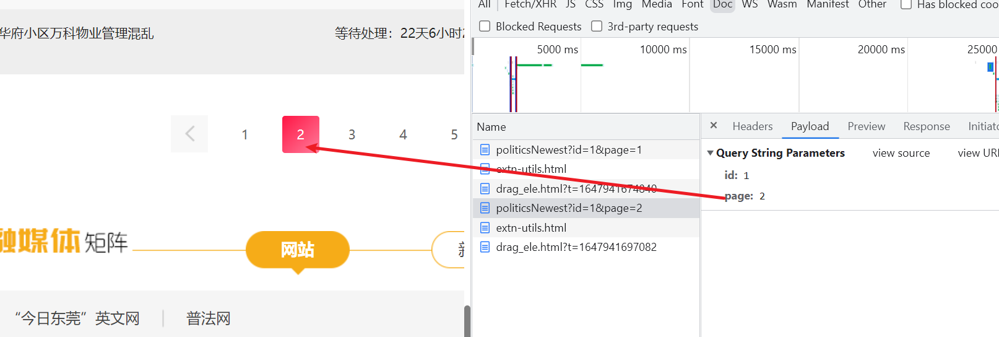

# 第五章 正则表达式解析网页


## 5.0 前言

​	通过之前的学习，我们已经学习通过爬虫获取HTML网页，但是HTML里面的信息太多，我们如何去获取有效的信息呢？

​	HTML是超文本，本质是TEXT类型，对于TEXT，有一个很强大的工具叫做**正则表达式**，它有自己特定的语法结构，有了它，实现对文本的检索、替换、匹配验证都不在话下。

​	我们可以通过正则表达式从HTML中提取有用的信息。


## 5.1 正则表达式

​	**正则表达式**在几乎所有语言中都可以使用，无论是前端的JavaScript、还是后端的Java、c#，Python。他们都提供相应的接口/函数支持正则表达式

​	我们先来简单回顾一下**正则表达式**的用法（参考下表）																																				   

### 5.1.1 单字符

```
         . : 通配符，除换行以外所有字符
        [] ：[aoe] [a-w] 匹配集合中任意一个字符
        \d ：数字  [0-9]
        \D : 非数字
        \w ：数字、字母、下划线
        \W : 非\w
        \s ：所有的空白字符包,括空格、制表符、换页符等等。等价于 [ \f\n\r\t\v]。
        \S : 非空白
```


### 5.1.2 数量修饰

```
        * : 任意多次  >=0
        + : 至少1次   >=1
1
        {m} ：固定m次 hello{3,}
        {m,} ：至少m次
        {m,n} ：m-n次
```

### 5.1.3 边界

```
        $ : 以某某结尾 
        ^ : 以某某开头
```

### 5.1.4 分组

```
        (ab) 
```

### 5.1.5 (非)贪婪模式

```
        贪婪模式： .*
        非贪婪（惰性）模式： .*?
```

**完整版参考表可以在本章节实训手册最后看到**

最常用的正则表达式： *****  **+**  **？**   ---> 都可以用于匹配一个，多个或者没有出现的字符串模式

1. \*      匹配其左边的正则表达式出现0次或多次的情况 
2. \+      匹配其左边的正则表达式出现1次或多次的情况	 
3. ？     匹配其左边的正则表达式出现0次或1次的情况


### 5.1.6 在线练习

​	练习网站：https://tool.lu/regex

​	数据：

```
<!DOCTYPE HTML PUBLIC "-//W3C//DTD HTML 4.01 Transitional//EN">
<html>
<head>
<meta http-equiv="pragma" content="no-cache">
    <meta http-equiv="cache-control" content="no-cache">
    <meta http-equiv="expires" content="0">    
    <meta http-equiv="keywords" content="keyword1,keyword2,keyword3">
    <meta http-equiv="description" content="This is my page">
<title>橙汁园餐厅 -- 首页</title>
<link href="http://120.79.0.124:8080/lcvc_ebuy_jsp/jsp/shop/resources/css/index.css" rel="stylesheet" type="text/css">
</head>
<body>
    <div class="wrap">
        
        <iframe src="http://120.79.0.124:8080/lcvc_ebuy_jsp/jsp/shop/header.jsp" style="height: 168px;"></iframe>
        <div class="content">
            <div class="logo">
                
                <div class="menu">
                    <ul>
                        
                        <li><a href="http://120.79.0.124:8080/lcvc_ebuy_jsp/shop/producttype?productTypeId=30">小吃甜点</a></li>
                        
                        <li><a href="http://120.79.0.124:8080/lcvc_ebuy_jsp/shop/producttype?productTypeId=6">国内食品</a></li>
                        
                        <li><a href="http://120.79.0.124:8080/lcvc_ebuy_jsp/shop/producttype?productTypeId=25">进口食品</a></li>
                                            
                    </ul>
                </div>
            </div>
            <div class="block">
                <div class="title">
                    <label class="new">新品</label>
                    <a href="#">更多&gt;&gt;</a>
                </div>
                <div class="block-wrap">
                    
                    <div class="item">
                        <a href="http://120.79.0.124:8080/lcvc_ebuy_jsp/shop/product?productId=88"></a>
                        <label><em>18.0</em><span>78.0</span>库存：84</label>
                        <h3>蜜雪冰城</h3>
                    </div>
                    
                    <div class="item">
                        <a href="http://120.79.0.124:8080/lcvc_ebuy_jsp/shop/product?productId=86"></a>
                        <label><em>3.0</em><span>6.0</span>库存：110</label>
                        <h3>冰淇淋</h3>
                    </div>
                    
                    <div class="item">
                        <a href="http://120.79.0.124:8080/lcvc_ebuy_jsp/shop/product?productId=85"></a>
                        <label><em>12.0</em><span>16.0</span>库存：292</label>
                        <h3>特色猪肉肠粉</h3>
                    </div>
                    
                    <div class="item">
                        <a href="http://120.79.0.124:8080/lcvc_ebuy_jsp/shop/product?productId=84"></a>
                        <label><em>21.0</em><span>25.0</span>库存：683</label>
                        <h3>南瓜饼</h3>
                    </div>
                    
                    <div class="item">
                        <a href="http://120.79.0.124:8080/lcvc_ebuy_jsp/shop/product?productId=83"></a>
                        <label><em>15.6</em><span>28.0</span>库存：494</label>
                        <h3>泰芒了</h3>
                    </div>
                    
                    <div class="item">
                        <a href="http://120.79.0.124:8080/lcvc_ebuy_jsp/shop/product?productId=82"></a>
                        <label><em>18.5</em><span>21.0</span>库存：283</label>
                        <h3>芒果冰</h3>
                    </div>
                    
                    <div class="item">
                        <a href="http://120.79.0.124:8080/lcvc_ebuy_jsp/shop/product?productId=81"></a>
                        <label><em>12.0</em><span>15.0</span>库存：12336</label>
                        <h3>鸡腿饭</h3>
                    </div>
                    
                    <div class="item">
                        <a href="http://120.79.0.124:8080/lcvc_ebuy_jsp/shop/product?productId=80"></a>
                        <label><em>12.0</em><span>18.0</span>库存：531</label>
                        <h3>白切鸡饭</h3>
                    </div>
                    
                </div>
            </div>
            <div class="block">
                <div class="title">
                    <label class="hot">热门订单</label>
                    <a href="#">更多&gt;&gt;</a>
                </div>
                <div class="block-wrap">
                    
                    <div class="item">
                        <a href="http://120.79.0.124:8080/lcvc_ebuy_jsp/shop/product?productId=71"></a>
                        <label><em>17.0</em><span>26.0</span>关注：3001</label>
                        <h3>芒果冰</h3>
                    </div>
                    
                    <div class="item">
                        <a href="http://120.79.0.124:8080/lcvc_ebuy_jsp/shop/product?productId=88"></a>
                        <label><em>18.0</em><span>78.0</span>关注：999</label>
                        <h3>蜜雪冰城</h3>
                    </div>
                    
                    <div class="item">
                        <a href="http://120.79.0.124:8080/lcvc_ebuy_jsp/shop/product?productId=86"></a>
                        <label><em>3.0</em><span>6.0</span>关注：32</label>
                        <h3>冰淇淋</h3>
                    </div>
                    
                    <div class="item">
                        <a href="http://120.79.0.124:8080/lcvc_ebuy_jsp/shop/product?productId=72"></a>
                        <label><em>66.0</em><span>88.0</span>关注：0</label>
                        <h3>8寸蛋糕</h3>
                    </div>
                    
                    <div class="item">
                        <a href="http://120.79.0.124:8080/lcvc_ebuy_jsp/shop/product?productId=73"></a>
                        <label><em>13.0</em><span>28.0</span>关注：0</label>
                        <h3>圣诞老人蛋糕</h3>
                    </div>
                    
                    <div class="item">
                        <a href="http://120.79.0.124:8080/lcvc_ebuy_jsp/shop/product?productId=74"></a>
                        <label><em>12.0</em><span>16.0</span>关注：0</label>
                        <h3>南瓜甜点</h3>
                    </div>
                    
                    <div class="item">
                        <a href="http://120.79.0.124:8080/lcvc_ebuy_jsp/shop/product?productId=75"></a>
                        <label><em>12.0</em><span>16.0</span>关注：0</label>
                        <h3>螺蛳粉</h3>
                    </div>
                    
                    <div class="item">
                        <a href="http://120.79.0.124:8080/lcvc_ebuy_jsp/shop/product?productId=76"></a>
                        <label><em>8.0</em><span>12.0</span>关注：0</label>
                        <h3>桂林米粉</h3>
                    </div>
                    
                </div>
            </div>
        </div>
        <iframe src="http://120.79.0.124:8080/lcvc_ebuy_jsp/jsp/shop/footer.html" style="height: 120px;"></iframe>
    </div>
</body>
</html>
```


练习一：匹配全部合法的HTML标签（可能是最难的）

```

```

练习二：匹配全部**<div class="item">**标签内的内容

```

```

练习三：匹配全部商品名称

```

```

ps:答案在下面，先自己做，别看答案！！！！！


​	以练习二为例，我们经常会用 `<div class="item">(.*?)</div>`去匹配内容，但是我们在在线编辑器发现，这样的匹配结果为空，这是因为 `通配符.`不匹配\s和\n


​	那如果我们想让`通配符.`，可以设置一个匹配策略`s模式`，这样用 `<div class="item">(.*?)</div>`就能匹配成功

- 标记也称为修饰符，正则表达式的标记用于指定额外的匹配策略。

| 修饰符 |                  含义                  | 描述                                                         |
| :----: | :------------------------------------: | :----------------------------------------------------------- |
|   i    |         ignore - 不区分大小写          | 将匹配设置为不区分大小写，搜索时不区分大小写: A 和 a 没有区别。 |
|   g    |           global - 全局匹配            | 查找所有的匹配项。                                           |
|   m    |         multi line - 多行匹配          | 使边界字符 **^** 和 **$** 匹配每一行的开头和结尾，记住是多行，而不是整个字符串的开头和结尾。 |
|   s    | 特殊字符圆点 **.** 中包含换行符 **\n** | 默认情况下的圆点 **.** 是 匹配除换行符 **\n** 之外的任何字符，加上 **s** 修饰符之后, **.** 中包含换行符 \n。 |


​	如下使用s模式， `<div class="item">(.*?)</div>`就成功了


## 5.2 re模块

​	re模块是python独有的匹配字符串的模块，该模块中提供的很多功能是基于正则表达式实现的，而正则表达式是对字符串进行模糊匹配，提取自己需要的字符串部分，他对所有的语言都通用。注意：

- re模块是python独有的
- 正则表达式所有编程语言都可以使用
- re模块、正则表达式是对字符串进行操作

### 5.2.0 下载re

在终端输入

```python
pip install re
```

下载完毕后，在程序的开头写下

```python
import re
```

### 5.2.1  常用方法

#### ① re.search（）  

```
re.search（pattern，string，flags = 0 ）
```

​	扫描字符串以查找正则表达式模式产生匹配项的第一个位置 ，然后返回相应的match对象。`None`如果字符串中没有位置与模式匹配，则返回；否则返回false。请注意，这与在字符串中的某个点找到零长度匹配不同。

```python
import re
#在这个字符串进行匹配，只会匹配一个对象
print(re.search('\w\d','a1b1c1d1e1'))   # <re.Match object; span=(0, 2), match='a1'>
print(re.search('\w\d','a1b1c1d1e1').group())   # a1

print(re.search('(\w)(\d)','a1b1c1d1e1')) # <re.Match object; span=(0, 2), match='a1'>
print(re.search('(\w)(\d)','a1b1c1d1e1').group())   # a1
print(re.search('(\w)(\d)','a1b1c1d1e1').group(0))  # a1
print(re.search('(\w)(\d)','a1b1c1d1e1').group(1))  # a
print(re.search('(\w)(\d)','a1b1c1d1e1').group(2))  # 1
```


#### ② re.match（）

 `re.match（pattern，string，flags = 0 ）`

​	如果字符串开头的零个或多个字符与正则表达式模式匹配，则返回相应的匹配对象。None如果字符串与模式不匹配，则返回；否则返回false。请注意，这与零长度匹配不同。

```python
import re

# # 同search,不过在字符串开始处进行匹配，只会匹配一个对象
print(re.match('a','a1b1c1d1e1'))   # <re.Match object; span=(0, 1), match='a'>
print(re.match('a','a1b1c1d1e1').group())   # a

print(re.match('b','a1b1c1d1e1')) # None 因为只查看开头，所以找不到返回None
```


**search（）与match（）方法**

​	Python提供了两种基于正则表达式的原始操作： re.match()仅在字符串的开头匹配，re.search()检查匹配项，在字符串中的任何位置检查匹配项（这是Perl的默认设置）。

```python
import re
print(re.search('b','a1b1c1d1e1')) # <re.Match object; span=(2, 3), match='b'>
print(re.match('b','a1b1c1d1e1')) # None 因为只查看开头，所以找不到返回None
```


#### ③ re.findall（）  用得最多 *****

```
re.findall（pattern，string，flags = 0 ）
```

​	以string列表形式返回string中pattern的所有非重叠匹配项。从左到右扫描该字符串，并以找到的顺序返回匹配项。如果该模式中存在一个或多个组，则返回一个组列表；否则，返回一个列表。如果模式包含多个组，则这将是一个元组列表。空匹配项包含在结果中。

```python
import re

# 返回所有满足条件的匹配
print(re.findall('\w\d','a1b1c1d1e1'))  # ['a1', 'b1', 'c1', 'd1', 'e1']

# 加上分组
print(re.findall('(\w)\d','a1b1c1d1e1')) # ['a', 'b', 'c', 'd', 'e']


print(re.findall('(\w)(\d)','a1b1c1d1e1')) # [('a', '1'), ('b', '1'), ('c', '1'), ('d', '1'), ('e', '1')]
```


#### ④ re.compile（）

```
re.compile（pattern，flags = 0 ）
```

​	将正则表达式模式编译为正则表达式对象，可使用match()，search()以及下面所述的其他方法将其用于匹配

```python
import re
prog = re.compile('\d{2}') # 正则对象
print(prog.search('12abc')) # <_sre.SRE_Match object; span=(0, 2), match='12'>
print(prog.search('12abc').group()) # 通过调用group()方法得到匹配的字符串,如果字符串没有匹配，则返回None。
#结果为12
print(prog.match('123abc')) # <_sre.SRE_Match object; span=(0, 2), match='12'>
print(prog.match('123abc').group()) # '12'
```


​	除此之外，还有**re.split()**，**re.finditer()**，**re.sub()**，**re.escape()**等等很多正则方法，同学们感兴趣的话可以自行去了解

​	

### 5.2.2 修饰符（标记）

​	以`re.search（pattern，string，flags = 0 ）`  为例，我们发现它还有一个参数叫做`flags`，这是修饰符（标记），前面的学习中，我们知道可以**通过修饰符（标记）指定匹配策略**。


**① re.A（re.ASCII）**

​	让\w，\W，\b，\B，\d，\D，\s和\S 执行ASCII-只匹配完整的Unicode匹配代替。这仅对Unicode模式有意义，而对于字节模式则忽略。


**② re.I（re.IGNORECASE）**

​	执行不区分大小写的匹配；类似的表达式也[A-Z]将匹配小写字母。


**③ re.L（re.LOCALE）**

　　让\w，\W，\b，\B和区分大小写的匹配取决于当前的语言环境。该标志只能与字节模式一起使用。不建议使用此标志，因为语言环境机制非常不可靠，它一次只能处理一种“区域性”，并且仅适用于8位语言环境。默认情况下，Python 3中已为Unicode（str）模式启用了Unicode匹配，并且能够处理不同的语言环境/语言。


**④ re.M（re.MULTILINE）**

　　指定时，模式字符'^'在字符串的开头和每行的开头（紧随每个换行符之后）匹配；模式字符''在字符串的末尾和每行的末尾（紧接在每个换行符之前）匹配。默认情况下，'^' 仅在字符串的开头，字符串''在字符串的末尾和每行的末尾（紧接在每个换行符之前）匹配。默认情况下，'^' 仅在字符串的开头，字符串''的末尾和字符串末尾的换行符（如果有）之前立即匹配。


**⑤ re.S（re.DOTALL） 比较常用**

​	使'.'特殊字符与任何字符都匹配，包括换行符；没有此标志，'.'将匹配除换行符以外的任何内容。


以`re.S`模式为例

```python
import re

text = '''             <div class="item">
                  <a href="http://120.79.0.124:8080/lcvc_ebuy_jsp/shop/product?productId=88"></a>
                  <label><em>18.0</em><span>78.0</span>关注：999</label>
                  <h3>蜜雪冰城</h3>
               </div>
               
               <div class="item">
                  <a href="http://120.79.0.124:8080/lcvc_ebuy_jsp/shop/product?productId=86"></a>
                  <label><em>3.0</em><span>6.0</span>关注：32</label>
                  <h3>冰淇淋</h3>
               </div>
'''

# 无匹配策略
print(re.findall('<div class="item">(.*?)</div>',text))  # []

# S策略
print(re.findall('<div class="item">(.*?)</div>',text,re.S)) # ['\n\t\t\t\t\t\t<a href="........
```


## 5.3 正则爬虫


​	我们已经学习了正则表达式以及在Python中的使用方法，那么我们接下来就要进入正则爬虫的实训了。

### 实训一：订餐系统首页爬虫

​	链接：http://120.79.0.124:8080/lcvc_ebuy_jsp/shop/index


- 获取首页中**所有商品**的**名称**，**价格**，**原价**，**库存**
- 以字典列表的形式存储数据，格式如下：
  - [{"商品名":"蜜雪冰城","价格":18.0,"原价":78.0,"库存":84},{"商品名":"冰淇淋","价格":3.0,"原价":6.0,"库存":110}.....................]

- 每解析完一个商品，提示"已获取xxxx"
- 输出最终结果


首先我们导入库

```python
import re
import requests
```

 创建一个商品列表来存储最终结果

```python
# 商品列表
food_ls = []
```

  请求获取订餐系统首页的文本

```python
# 链接
url = "http://120.79.0.124:8080/lcvc_ebuy_jsp/shop/index"
# 伪装头信息
headers = {"User-Agent": "Mozilla/5.0 (Windows NT 10.0; Win64; x64) AppleWebKit/537.36 (KHTML, like Gecko) Chrome/99.0.4844.74 Safari/537.36"}
# 发送请求
response = requests.get(url=url,headers=headers)
# 获取文本
text = response.text
```

接下来我们要去把这个文本用正则表达式解析出目标数据

以下面为例，我们首先把每个div标签给匹配出来，每个div标签对应一个商品


```python
# # 第一步：匹配所有div标签
pattern_div = r'<div class="item">(.*?)</div>'
div_ls = re.findall(pattern=pattern_div,string=text,flags=re.S)
print(div_ls)
```

返回的是一个列表，列表下是每一个div标签的文本值

```python
['\r\n\t\t\t\t\t\t<a href="http://120.79.0.124:8080/lcvc_ebuy_jsp/shop/product?productId=88"></a>\r\n\t\t\t\t\t\t<label><em>18.0</em><span>78.0</span>库存：84</label>\r\n\t\t\t\t\t\t<h3>蜜雪冰城</h3>\r\n\t\t\t\t\t', '\r\n\t\t\t\t\t\t<a href="http://120.79.0.124:8080/lcvc_ebuy_jsp/shop/product?productId=86"></a>\r\n\t\t\t\t\t\t<label><em>3.0</em><span>6.0</span>库存：110</label>\r\n\t\t\t\t\t\t<h3>冰淇淋</h3>\r\n\t\t\t\t\t', '\r\n\t\t\t\t\t\t<a href="http://120.79.0.124:8080/lcvc_ebuy_jsp/shop/product?productId=85"></a>\r\n\t\t\t\t\t\t<label><em>12.0</em><span>16.0</span>库存：292</label>\r\n\t\t\t\t\t\t<h3>特色猪肉肠粉</h3>\r\n\t\t\t\t\t', '\r\n\t\t\t\t\t\t<a href="http://120.79.0.124:8080/lcvc_ebuy_jsp/shop/product?productId=84"></a>\r\n\t\t\t\t\t\t<label><em>21.0</em><span>25.0</span>库存：683</label>\r\n\t\t\t\t\t\t<h3>南瓜饼</h3>\r\n\t\t\t\t\t', ...............]
```


接下来我们就要去遍历这个div列表，获取每一个商品的目标值


```python
# # 第二步：遍历每个div标签，从中匹配目标值
for div in div_ls:
    # 商品名
    name = re.search(pattern='<h3>(.*?)</h3>',string=div,flags=re.S).group(1)
    # 价格
    price = float(re.search(pattern='<em>(.*?)</em>',string=div,flags=re.S).group(1))
    # 原价
    origin = float(re.search(pattern='<span>([\d\.]*?)</span>',string=div,flags=re.S).group(1))
    # 库存
    stock = int(re.search('</span>\D*?(\d*?)</label>',div).group(1))

    # print(name,price,origin,stock)

    # 将数据添加到商品列表中
    food_ls.append({"商品名":name,"价格":price,"原价":origin,"库存":stock})
    # 提醒
    print("已获取{}".format(name))
```

输出结果

```python
# 输出最终结果
print(food_ls)
```

### 实训二：阳光问政平台爬虫

在上面我们已经实现了爬虫和正则解析首页，接下来我们要结合分页爬取，爬取更多的数据了。

链接：https://wz.sun0769.com/political/index/politicsNewest?id=1&page=1


- 爬取1-5页的数据
- 每次请求休眠5秒（非常重要），否则会被锁IP
- GET()请求参数用params方式传入
- 获取页面中的**编号**，**问政标题**，**等待时间**，**问政时间**
- 以字典列表的形式存储数据
- 每解析完一条问题，提示"已获取xxxx"
- 输出最终结果


我们已经学习了如何用正则去做解析，那么我们来解析第一页的数据

```python
import re
import requests
import time

# 问题列表
question_ls = []
# 链接
url = 'https://wz.sun0769.com/political/index/politicsNewest?'
# 伪装头信息
headers = {"User-Agent": "Mozilla/5.0 (Windows NT 10.0; Win64; x64) AppleWebKit/537.36 (KHTML, like Gecko) Chrome/99.0.4844.74 Safari/537.36"}
# 发送请求
response = requests.get(url=url,headers=headers)
# 获取文本
text = response.text
# 休眠5秒
time.sleep(5)

# ----------------------正则解析-----------------------
# 第一步：获取所有的li标签
li_ls = re.findall('<li class="clear">.*?</li>',text,re.S)
print(li_ls[0])
```


下面是li标签的值


下一步来解析获取目标值（这里稍微注意一些空格和换行）

```python
# 第二步：遍历li_ls
for li in li_ls:
    # ① 问题码
    code = re.search('<span class="state1">(\d*?)</span>', li, re.S).group(1)

    # ② 标题
    title = re.search('<span class="state3">.*?class="color-hover">(.*?)</a>', li, re.S).group(1)

    # ③ 响应时间 这里不要空格和换行
    rq_time = re.search('<span class="state4">\s+?(\S*?)\s*?</span>', li).group(1)
    # # 方式二 响应时间 先把数据取出来再处理空格
    # rq_time = re.search('<span class="state4">(.*?)</span>',li,re.S).group(1).strip()

    # ④ 问政时间
    qu_time = re.search('<span class="state5 ">(.*?)</span>', li, re.S).group(1)

    # 添加数据
    question_ls.append({"问题码":code, "标题":title, "响应时间":rq_time, "问政时间":qu_time})

    # 提醒
    print("已添加{}".format(code))
```


上面是我们爬取一页的数据，那么接下来我们要进行一个分页爬取处理，我们分析一下它的分页规则




​																			第n页：`page=n`


知道了上述这点，那么我们只需要把逻辑代码放入循环体内就行了

```python
# 多页爬取
for i in range(1, 11):
    params = {"id":1,
              "page":i}
	# 页面提醒
    print("--------------正在抓取第{}页-----------------".format(i))
    
    # 发送请求
    response = requests.get(url=url, headers=headers,params=params)
    # 获取文本
    text = response.text
    # 休眠5秒
	time.sleep(5)

    # ----------------------正则解析-----------------------
   						    ......
  						    
            			  这里是解析代码
            
                            ......
```


### 实训三：阳光问政平台爬虫（包含详情页）


在实训二中，我们已经爬取了阳光问政平台的数据，但是我们发现一个问题，详细的问题不是在**首页**中，而是在**详情页**中。


详情页链接为https://wz.sun0769.com/political/politics/index?id=550531。

它也是一个页面，那我们只要想办法跳转到这个**详情页**，然后再获取目标数据不就可以了！！！

通常在**首页**中会有关联到**详情页**的**关键词**，有的会直接设置在`<a>`标签中的`href`属性中，每个网站的规则都不一样，我们以阳光政务来说明。


在下图中，我们可以看到在`<span class="stata3">`中的`<a>`的href属性设置了部分链接


通过正则解析把它找出

```python
        # ⑤ 详情页链接
        detail_part_url = re.search('<a.*?href="(.*?)"',li,re.S).group(1)
        print(detail_part_url) # /political/politics/index?id=550558
```


可以看到这个链接是不完整的，我们需要补充完整

```python
        detail_url = "https://wz.sun0769.com/" + detail_part_url  # 详情页链接
```


接下来我们只需要向它发起请求，并解析里面的问题内容就可以了

```python
        # 向详情页发起请求
        detail_text = requests.get(url=detail_url,headers=headers).text
        # 休眠一下
        time.sleep(3)

        # ⑥ 详细问题
        detail = re.search('<pre>(.*?)</pre>',detail_text,re.S).group(1)
```


`detail`就是详细的问题了


### 实训四（备用）：PSN中文站讨论区爬虫

阳光问政当请求过分频繁时，会封IP，所以直接给到实训四**PSN中文站讨论区爬虫**的代码以供练习。

讨论区链接：http://www.psnine.com/topic

- 爬取1-5页的数据
- GET()请求参数用params方式传入
- 获取页面中的**标题**，**作者**，**发布时间**，**关注度**，**详情数据**
- 以字典列表的形式存储数据
- 每解析完一条问题，提示"已获取xxxx"
- 输出最终结果

```python
# -*- coding: utf-8 -*-
""" 
PSNNINE讨论区爬虫
"""

import re
import requests

# 主题列表
topic_ls = []
# 链接
url = 'http://www.psnine.com/topic?'
# 伪装头信息
headers = {
    "User-Agent":"Mozilla/5.0 (Windows NT 10.0; Win64; x64) AppleWebKit/537.36 (KHTML, like Gecko) Chrome/99.0.4844.74 Safari/537.36"}


# 多页爬取
for i in range(1,6):

    # GET参数
    params = {"page":i}

    # 页面提醒
    print("--------------正在抓取第{}页-----------------".format(i))

    # 发送请求
    response = requests.get(url=url, headers=headers,params=params)
    # 获取文本
    text = response.text

    # -----------------------正则解析-------------------------

    # 第一步：获取所有的li标签
    # 因为别的地方也有li标签，我们先把 <ul class="list">提出来
    ul = re.search('<ul class="list">.*?</ul>',text,re.S).group()
    # li标签
    li_ls = re.findall('<li>.*?</li>', ul, re.S)
    # print(li_ls[0])

    # # 第二步：遍历li标签
    for li in li_ls:
        # ① 标题
        title = re.search('<div class="title.*?<a.*?>(.*?)</a>',li,re.S).group(1)

        # ② 作者
        master = re.search('<div class="meta".*?<a.*?>(.*?)</a>',li,re.S).group(1)

        # ③ 发布时间
        time = re.search('<div class="meta".*?</a>(.*?)<em',li,re.S).group(1).strip().strip("&nbsp;")

        # ④ 关注度
        # 这个站点不是所有讨论都有关注的,做一个校验
        req = re.search('class="rep r">(.*?)</a>',li,re.S)
        if req != None:
            req = int(req.group(1))

        # ⑤ 详情页链接
        detail_url = re.search('div class="title font16">.*?<a.*?href="(.*?)">',li,re.S).group(1)

        # # 请求详情页并获取数据
        detail_text = requests.get(detail_url,headers=headers).text
        # ⑥ 详情页数据（这里偷下懒，把整个div取出来）
        detail = re.search('<div itemprop="articleBody".*?</div>',detail_text,re.S)


        # 添加数据
        topic_ls.append({
            "标题":title,"作者":master,"发布时间":time,
            "关注度":req, "详细数据":detail
        })

        print("已抓取{}".format(title))

# 输出最终数据
print(topic_ls)
```


## 附录一：练习题答案

练习一答案：

```
(</?[^>]+>)
```

练习二答案：

```
<div class="item"([\s\S]*?)</div>
```

练习三答案:

```
<h3>(.*?)</h3>  #简单版
<div class="item">[\s\S]*?<h3>(.*?)</h3>[\s\S]*?</div> # 严谨版																	
```

## 附录二：完整版正则参考表

**1、. ^ $**

| 正则 | 待匹配字符                                                   | 匹配结果 | 说明               |
| ---- | ------------------------------------------------------------ | -------- | ------------------ |
| a.   | abacad                                                       | abacad   | 匹配所有"a."的字符 |
| ^a.  | abacad                                                       | ab       | 只从开头匹配"a."   |
| a.$  | xxxxxxxxxx #1.导入requests库#2.分析网页#3.发起请求import requestsimport time#伪装头信息headers = {   'User-Agent':'Mozilla/5.0 (Windows NT 6.1; Win64; x64) AppleWebKit/537.36 (KHTML, like Gecko) Chrome/86.0.4240.193 Safari/537.36'}params ={   'keyword':'笔记本电脑',   #搜索词   'page': None}#网站地址url = 'https://search.jd.com/Search'#分页爬取京东商品for n in range(1,11):   #构造分页规则   page_count = 2*n - 1   params['page'] = page_count   #print(parmas)   #发起请求   response = requests.get(url=url,headers=headers,params=params)   #获取主体数据   page = response.text   #持久化存储   print('正在保存第{}页数据'.format(n))   fp = open('./京东网页分页/京东商品第{}页.html'.format(n),'wt',encoding=response.encoding)   fp.write(page)   fp.close()   time.sleep(5)  #休眠5秒python | ad       | 只匹配结尾的"a.$   |

**2、 + ? { }**

| 正则    | 待匹配字符 | 匹配结果   | 说明                                                    |
| ------- | ---------- | ---------- | ------------------------------------------------------- |
| a.?     | abefacgad  | ab ac ad   | ?表示重复零次或一次，即只匹配"a"后面一个任意字符。      |
| a.*     | abefacgad  | abefacgad  | *表示重复零次或多次，即匹配"a"后面0或多个任意字符。     |
| a.+     | abefacgad  | abefacgad  | +表示重复一次或多次，即只匹配"a"后面1个或多个任意字符。 |
| a.{1,2} | abefacgad  | abe acg ad | {1,2}匹配1到2次任意字符。                               |

注意：前面的*,+,?等都是贪婪匹配，也就是尽可能匹配，后面加?号使其变成惰性匹配

| 正则 | 待匹配字符 | 匹配结果 | 说明     |
| ---- | ---------- | -------- | -------- |
| a.*? | abefacgad  | a a a    | 惰性匹配 |

**3、字符集［］［^］**

| 正则       | 待匹配字符 | 匹配结果    | 说明                                  |
| ---------- | ---------- | ----------- | ------------------------------------- |
| a[befcgd]* | abefacgad  | abef acg ad | `表示匹配"a"后面[befcgd]的字符任意次` |
| a[^f]*     | abefacgad  | abe acgad   | `表示匹配一个不是"f"的字符任意次`     |
| [\d]       | 412a3bc    | 4 1 2 3     | `表示匹配任意一个数字，匹配到4个结果` |
| [\d]+      | 412a3bc    | 412 3       | `表示匹配任意个数字，匹配到2个结果`   |

 **4、分组 ()与 或 ｜［^］**

身份证号码是一个长度为15或18个字符的字符串，如果是15位则全部由数字组成，首位不能为0；如果是18位，则前17位全部是数字，末位可能是数字或x，下面我们尝试用正则来表示：

| 正则                               | 待匹配字符         | 匹配结果           | 说明                                                         |
| ---------------------------------- | ------------------ | ------------------ | ------------------------------------------------------------ |
| ^[1-9]\d{13,16}[0-9x]$             | 110101198001017032 | 110101198001017032 | 表示可以匹配一个正确的身份证号                               |
| ^[1-9]\d{13,16}[0-9x]$             | 1101011980010170   | 1101011980010170   | `表示也可以匹配这串数字，但这并不是一个正确的身份证号码，它是一个16位的数字` |
| ^[1-9]\d{14}(\d{2}[0-9x])?$        | 1101011980010170   | False              | `现在不会匹配错误的身份证号了()表示分组，将\d{2}[0-9x]分成一组，就可以整体约束他们出现的次数为0-1次` |
| ^([1-9]\d{16}[0-9x]\|[1-9]\d{14})$ | 110105199812067023 | 110105199812067023 | `表示先匹配[1-9]\d{16}[0-9x]如果没有匹配上就匹配[1-9]\d{14}` |

**5、转义符 \**

| 正则  | 待匹配字符 | 匹配 结果 | 说明                                                         |
| ----- | ---------- | --------- | ------------------------------------------------------------ |
| \n    | \n         | False     | `因为在正则表达式中\是有特殊意义的字符，所以要匹配\n本身，用表达式\n无法匹配` |
| \n    | \n         | True      | `转义\之后变成\\，即可匹配`                                  |
| "\\n" | '\n'       | True      | `如果在python中，字符串中的'\'也需要转义，所以每一个字符串'\'又需要转义一次` |
| r'\n' | r'\n'      | True      | `在字符串之前加r，让整个字符串不转义`                        |

**6、贪婪匹配**

贪婪匹配：在满足匹配时，匹配尽可能长的字符串，默认情况下，采用贪婪匹配

| 正则  | 待匹配字符          | 匹配结果            | 说明                                                         |
| ----- | ------------------- | ------------------- | ------------------------------------------------------------ |
| <.*>  | <script>...<script> | <script>...<script> | `默认为贪婪匹配模式，会匹配尽量长的字符串`                   |
| <.*?> | <script>...<script> | <script> <script>   | `加上？为将贪婪匹配模式转为非贪婪匹配模式，会匹配尽量短的字符串` |


## 附录三：实训完整代码


### ① 实训一完整代码

```python
'''
订单系统首页正则爬虫
http://120.79.0.124:8080/lcvc_ebuy_jsp/shop/index
'''

import re
import requests


# 商品列表
food_ls = []

# 链接
url = "http://120.79.0.124:8080/lcvc_ebuy_jsp/shop/index"
# 伪装头信息
headers = {"User-Agent": "Mozilla/5.0 (Windows NT 10.0; Win64; x64) AppleWebKit/537.36 (KHTML, like Gecko) Chrome/99.0.4844.74 Safari/537.36"}
# 发送请求
response = requests.get(url=url,headers=headers)
# 获取文本
text = response.text

# --------------------------正则解析 ---------------------------

# 查看一下解析目标  3.0  6.0  库存：110  冰淇淋
'''
               <div class="item">
                  <a href="http://120.79.0.124:8080/lcvc_ebuy_jsp/shop/product?productId=86"></a>
                  <label><em>(3.0)</em><span>(6.0)</span>(库存：110)</label>
                  <h3>(冰淇淋)</h3>
               </div>
'''

# # 第一步：匹配所有div标签
pattern_div = r'<div class="item">(.*?)</div>'
div_ls = re.findall(pattern=pattern_div,string=text,flags=re.S)
# print(div_ls)


# # 第二步：遍历每个div标签，从中匹配目标值
for div in div_ls:
    # 商品名
    name = re.search(pattern='<h3>(.*?)</h3>',string=div,flags=re.S).group(1)
    # 价格
    price = float(re.search(pattern='<em>(.*?)</em>',string=div,flags=re.S).group(1))
    # 原价
    origin = float(re.search(pattern='<span>([\d\.]*?)</span>',string=div,flags=re.S).group(1))
    # 库存
    stock = int(re.search('</span>\D*?(\d*?)</label>',div).group(1))

    # print(name,price,origin,stock)

    # 将数据添加到商品列表中
    food_ls.append({"商品名":name,"价格":price,"原价":origin,"库存":stock})
    # 提醒
    print("已获取{}".format(name))


# 输出最终结果
print(food_ls)
```


### ② 实训二完整代码

```python
"""
阳光问政平台爬虫
"""
import re
import requests
import time

# 问题列表
question_ls = []
# 链接
url = 'https://wz.sun0769.com/political/index/politicsNewest?'
# 伪装头信息
headers = {
    "User-Agent":"Mozilla/5.0 (Windows NT 10.0; Win64; x64) AppleWebKit/537.36 (KHTML, like Gecko) Chrome/99.0.4844.74 Safari/537.36"}

# 多页爬取
for i in range(1, 6):
    params = {"id":1,
              "page":i}

    # 页面提醒
    print("--------------正在抓取第{}页-----------------".format(i))

    # 发送请求
    response = requests.get(url=url, headers=headers,params=params)
    # 获取文本
    text = response.text
    # 休眠5秒
	time.sleep(5)

    # ----------------------正则解析-----------------------
    # 第一步：获取所有的li标签
    li_ls = re.findall('<li class="clear">.*?</li>', text, re.S)
    # print(li_ls[0])

    # 第二步：遍历li_ls
    for li in li_ls:
        # ① 问题码
        code = re.search('<span class="state1">(\d*?)</span>', li, re.S).group(1)

        # ② 标题
        title = re.search('<span class="state3">.*?class="color-hover">(.*?)</a>', li, re.S).group(1)

        # ③ 响应时间 这里不要空格和换行
        rq_time = re.search('<span class="state4">\s+?(\S*?)\s*?</span>', li).group(1)
        # # 方式二 响应时间 先把数据取出来再处理空格
        # rq_time = re.search('<span class="state4">(.*?)</span>',li,re.S).group(1).strip()

        # ④ 问政时间
        qu_time = re.search('<span class="state5 ">(.*?)</span>', li, re.S).group(1)

        # 添加数据
        question_ls.append({"问题码":code, "标题":title, "响应时间":rq_time, "问政时间":qu_time})

        # 提醒
        print("已添加{}".format(code))

# 输出结果
print(question_ls)
```


### ③ 实训三完整代码

```python
"""
阳光问政平台爬虫
"""
import re
import requests
import time

# 问题列表
question_ls = []
# 链接
url = 'https://wz.sun0769.com/political/index/politicsNewest?'
# 伪装头信息
headers = {
    "User-Agent":"Mozilla/5.0 (Windows NT 10.0; Win64; x64) AppleWebKit/537.36 (KHTML, like Gecko) Chrome/99.0.4844.74 Safari/537.36"}

# 多页爬取
for i in range(1, 2):
    params = {"id":1,
              "page":i}

    # 页面提醒
    print("--------------正在抓取第{}页-----------------".format(i))

    # 发送请求
    response = requests.get(url=url, headers=headers,params=params)
    # 获取文本
    text = response.text
    # 休眠时间
    time.sleep(5)

    # ----------------------正则解析-----------------------
    # 第一步：获取所有的li标签
    li_ls = re.findall('<li class="clear">.*?</li>', text, re.S)
    # print(li_ls[0])

    # 第二步：遍历li_ls
    for li in li_ls:
        # ① 问题码
        code = re.search('<span class="state1">(\d*?)</span>', li, re.S).group(1)

        # ② 标题
        title = re.search('<span class="state3">.*?class="color-hover">(.*?)</a>', li, re.S).group(1)

        # ③ 响应时间 这里不要空格和换行
        rq_time = re.search('<span class="state4">\s+?(\S*?)\s*?</span>', li).group(1)
        # # 方式二 响应时间 先把数据取出来再处理空格
        # rq_time = re.search('<span class="state4">(.*?)</span>',li,re.S).group(1).strip()

        # ④ 问政时间
        qu_time = re.search('<span class="state5 ">(.*?)</span>', li, re.S).group(1)


        # ⑤ 详情页链接
        detail_part_url = re.search('<a.*?href="(.*?)"',li,re.S).group(1)
        # print(detail_part_url) # /political/politics/index?id=550558
        detail_url = "https://wz.sun0769.com/" + detail_part_url  # 详情页链接

        # 向详情页发起请求
        detail_text = requests.get(url=detail_url,headers=headers).text
        # 休眠一下
        time.sleep(3)

        # ⑥ 详细问题
        detail = re.search('<pre>(.*?)</pre>',detail_text,re.S).group(1)

        # 添加数据
        question_ls.append({"问题码":code, "标题":title, "响应时间":rq_time,
                            "问政时间":qu_time,"详细问题":detail})

        # 提醒
        print("已添加{}".format(code))


print(question_ls)
```