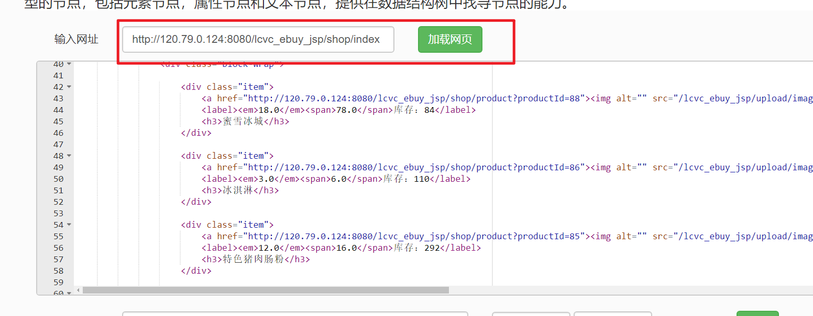

# 第六章 Xpath解析网页

​	在上一章的学习中，我们学习了基本的爬虫，并且学习了**正则表达式**解析页面信息，但实际使用发现，正则用起来还是比较费事，有一个地方写错了，可能导致匹配失败，而且内容较多的时候（比如PSNNINE讨论区详情页数据），使用**正则表达式**多少有点不方便且繁琐。

​	对于网页的节点来说，它可以定义`id`、`class`或其他属性，而且节点之间还有层次关系，在网页中可以通过`Xpath`或者`CSS选择器`来定位。那么，在页面解析时，用节点定位的方式解析将会非常便利。

​	在Python中，用很多可以强大的库如`lxml`、`Beautiful Soup`等来完成节点定位，这一章我们首先来学习使用`lxml`库进行`Xpath`定位。


## 6.1 使用Xpath

​	`Xpath`，全称XML Path Language，即XML路径语言。它是一门在XML文档中查找消息的语言。它最初是用来搜索XML文档的，现在也同样适用于HTML文档的搜索。


### ① Xpath语法

#### a、常用规则

​	下表列举了Xpath的几个常用规则：


​	比如:

```
//title[@lang="eng"]
```

​	这是一个`Xpath`规则，它代表选择所有名称为`title`，同时属性`lang`的值为`eng`的节点


#### b、通配符

​	除此之外，还有`Xpath`通配符


​	比如：

```
//li/*
```

​	它匹配`li`下的所有子节点


####  c、多路径匹配

多个 `Xpath` 路径表达式可以同时使用，其语法如下：

```
xpath表达式1 | xpath表达式2 | xpath表达式3
```

比如：

```
表达式：//ul/li[@class="book2"]/p[@class="price"]|//ul/li/@href
```


#### d、Xpath内建函数

​	Xpath 提供 100 多个内建函数，这些函数给我们提供了很多便利，比如实现文本匹配、模糊匹配、以及位置匹配等，下面介绍几个常用的内建函数。


### ② 在线练习

​	在线测试链接：https://www.toolnb.com/tools/xpath.html

​	在页面输入链接：http://120.79.0.124:8080/lcvc_ebuy_jsp/shop/index

​	

​	选择：


​	练习一：定位全部**\<div class="item">**节点

```

```

​	练习二：定位全部商品名称

```

```

​	练习三：定位全部商品图片链接

```

```

​	ps:答案在下面，先自己做，别看答案！！！！！


## 6.2 lxml模块

### 6.2.0 下载lxml

​	下载`lxml`库

```
pip install lxml
```

​	导入`lxml`库的`etree`模块

```python
from lxml import etree
```


### 6.2.1 实例化etree对象

​	我们首先先要将`HTML`实例化成`etree对象`，才可以使用`xpath()`方法。

实例化分为两种情况：

- 一种是加载本地html文档
- 一种是直接将网站获取的页面数据(文本)加载到该对象    **\**\***

#### ① 加载本地html （不常用）

```python
from lxml import etree

#本地导入html文档(不常用)
#douban_tree = etree.parse('./t1.html')  #报错,html语法不规范

#解决办法
parser = etree.HTMLParser(encoding='utf-8')
tree = etree.parse('./t1.html',parser=parser)
```

#### ② 加载在线html（常用，重点）

```python
import requests
from lxml import etree

# 伪装请求头
headers = {
    'User-Agent':'Mozilla/5.0 (Windows NT 10.0; WOW64) AppleWebKit/537.36 \
    (KHTML, like Gecko) Chrome/70.0.3538.25 Safari/537.36 Core/1.70.3867.400 QQBrowser/10.7.4315.400'
}

# 链接
url = 'http://120.79.0.124:8080/lcvc_ebuy_jsp/shop/index'

response = requests.get(url=url,headers=headers)

text = response.text # 页面文本数据

tree = etree.HTML(text) # 实例化对象

print(tree)  # <Element html at 0x22b68f9d588>
print(type(tree)) # <class 'lxml.etree._Element'>
```


### 6.2.2 Xpath标签定位

​	其实就是使用`Xpath`表达式进行定位，我们再来复习一下

	最左侧的/   :    如果xpath表达式最左侧是以/开头则表示该xpath表达式一定要从根标签开始定位指定标签(忽略)
	非最左侧的/ :    表示一个层级
	非左侧的//  :    表示多个层级
	最左侧的//  :    xpath表达式可以从任意位置进行标签定位


​	
​	属性定位：
​		tagName[@attrName="value"]
​	
​	索引定位：
​		tag[index]:索引是从1开始
​		
​	模糊匹配：
​		//div[contains(@class, "ng")]
​		//div[starts-with(@class, "ta")]
​		
​	取文本
​		/text():直系文本内容
​		//text()：所有的文本内容
​		
​	取属性
​		/@attrName


在Python的lxml库中，使用`Xpath`表达式的语法如下：

```python
etree对象.xpath('//div[@class="item"]')
```

#### ① 基本使用

```python
from lxml import etree

text = """
<div>
    <ul>
        <li class="item-0"><a href="www.baidu.com">baidu</a></li>
        <li class="item-1"><a href="https://blog.csdn.net/qq_25343557">myblog</a></li>
        <li class="item-2"><a href="https://www.csdn.net/">csdn</a></li>
        <li class="item-3"><a href="https://hao.360.cn/?a1004">hao123</a></li>
        <li class="item-4"><a href="www.baidu.com">baidu2</a></li>
        <li class="item-5"><a href="https://blog.csdn.net/qq_25343557">myblog2</a></li>
        <li class="item-6"><a href="https://www.csdn.net/">csdn2</a></li>
        <li class="item-7"><a href="https://hao.360.cn/?a1004">hao1232</a></li>
    </ul>
    <a>sdsada</a>
</div>
"""
tree = etree.HTML(text)

#//表示获取当前节点子孙节点，*表示所有节点   所以//*表示获取所有节点
result = tree.xpath('//*')
for item in result:
    print(item)

#获取所有的节点     表示只获取名称为li的节点
result = tree.xpath("//li")
for item in result:
    print(item)

#获取子节点
result = tree.xpath("//li/a")
for item in result:
    print(item)
#等价于
print("-------------1------------------")
result = tree.xpath("//ul/li/a")
for item in result:
    print(item)

print("-------------2------------------")
result = tree.xpath("//ul//a")
for item in result:
    print(item)

print("--------------3---------------")
result = tree.xpath("/html/body/div/ul/li/a")
for item in result:
    print(item)

#根据属性获取节点
print("--------------4---------------")
result = tree.xpath("//li[@class = 'item-2']")
print(result)


print("--------------5----------------")
result = tree.xpath("//a[@href='https://hao.360.cn/?a1004']/../@class")
print(result)
#//a[@href='https://hao.360.cn/?a1004'] 选择href属性为https://hao.360.cn/?a1004的a节点
#.. 选取父情节点
#@class  选取class属性，获取属性值

#获取文本信息
print("--------------6----------------")
result = tree.xpath("//a/text()")
print(result)

#打印"https://www.csdn.net/"   和  csdn
result = tree.xpath("//li[@class='item-2']/a/@href")
print(result)
result = tree.xpath("//li[@class='item-2']/a/text()")
print(result)

```

#### ② 顺序选择

```python
from lxml import etree

text = """
<div>
    <ul>
        <li class="item-0"><a href="www.baidu.com">baidu</a></li>
        <li class="item-1"><a href="https://blog.csdn.net/qq_25343557">myblog</a></li>
        <li class="item-2"><a href="https://www.csdn.net/">csdn</a></li>
        <li class="item-3"><a href="https://hao.360.cn/?a1004">hao123</a></li>
        <li class="item-4"><a href="www.baidu.com">baidu2</a></li>
        <li class="item-5"><a href="https://blog.csdn.net/qq_25343557">myblog2</a></li>
        <li class="item-6"><a href="https://www.csdn.net/">csdn2</a></li>
        <li class="item-7"><a href="https://hao.360.cn/?a1004">hao1232</a></li>
    </ul>
    <a>sdsada</a>
</div>
"""
tree = etree.HTML(text)
#我想取出第二个li节点，并且获取它的a的文本
result = tree.xpath("//li[2]/a/text()")
print(result)
#我想取出最后一个节点，并且获取它的a的文本
result = tree.xpath("//li[last()]/a/text()")
print(result)
#我想取出倒数第二个节点，并且获取它的a的文本
result = tree.xpath("//li[last()-1]/a/text()")
print(result)
#我想去前面三个节点，并且取出a的文本
result = tree.xpath("//li[position()<=3]/a/text()")
print(result)

#我要取后面三个了？
result = tree.xpath("//li[position() >= last()-2]/a/text()")
print(result)
```

#### ③ 多属性值匹配

```python
from lxml import etree

text = """
<div>
    <ul>
        <li yanjing="da yousheng se" shengao="169"><a href="www.baidu.com">baidu</a>
        </li>
         <li yanjing="xiao chou" shenggao="200"><a href="www.baidu.com">baidu1</a>
        </li>
         <li yanjing="da chou" shengao="150"><a href="www.baidu.com">baidu2</a>
        </li>
"""
tree = etree.HTML(text)
result = tree.xpath('//li[contains(@yanjing,"da") and @shengao="169"]/a/text()')
print(result)
```

#### ④ 属性多值匹配

```python
from lxml import etree

text = '''
<div>
    <ul>
        <li class="item-0">
            <a href="www.baidu.com">baidu</a>
        </li>
        <li class="item-1 sp">
            <a href="https://blog.csdn.net/qq_25343557">myblog</a>
        </li>
        <li class="item-1 dp">
            <a href="https://www.csdn.net/">csdn</a>
        </li>
        <li class="item-3">
            <a href="https://hao.360.cn/?a1004">hao123</a>
        </li>
    </ul>
</div>
'''

#这样子是不行的
tree =  etree.HTML(text)
result = html.xpath("//li[@class = 'item-1']")
print(result)

result = tree.xpath("//li[contains(@class,'item-1')]/a/text()")
print(result)
#如果一个节点的属性值有两个值，比如sp和item-1，如果我们的xpath匹配规则为
#[@class = 'item-1']匹配的仅仅是class属性值只为item-1的节点
#遇到属性值为多个的情况下，我们需要使用contains函数
```


## 6.3 Xpath爬虫

### 实训一：订餐系统首页爬虫

链接：http://120.79.0.124:8080/lcvc_ebuy_jsp/shop/index


- 获取首页中**所有商品**的**名称**，**价格**，**原价**，**库存**

- 以字典列表的形式存储数据，格式如下：

  - [{"商品名":"蜜雪冰城","价格":18.0,"原价":78.0,"库存":84},{"商品名":"冰淇淋","价格":3.0,"原价":6.0,"库存":110}.....................]


- 每解析完一个商品，提示"已获取xxxx"
- 输出最终结果

```python
# -*- coding: utf-8 -*-
""" 
订餐系统首页爬虫
"""
import requests
from lxml import etree

import requests
from lxml import etree
import re

# 商品列表
food_ls = []

#伪装请求头
headers = {
    'User-Agent':'Mozilla/5.0 (Windows NT 10.0; WOW64) AppleWebKit/537.36 \
    (KHTML, like Gecko) Chrome/70.0.3538.25 Safari/537.36 Core/1.70.3867.400 QQBrowser/10.7.4315.400'
}
response = requests.get(url='http://120.79.0.124:8080/lcvc_ebuy_jsp/shop/index',headers=headers)
page_text = response.text #页面文本数据
tree = etree.HTML(page_text)


# # 第一步：匹配所有div标签
div_ls = tree.xpath("/html/body/div/div/div[2]/div[2]/div")


# # 第二步：遍历每个div标签，从中匹配目标值
for div in div_ls:
    # 商品名
    name = div.xpath("./h3/text()")[0]
    # 价格
    price = float(div.xpath("./label/em/text()")[0])
    # 原价
    origin = float(div.xpath("./label/span/text()")[0])
    # 库存
    stock = div.xpath("./label/text()")[0]
    stock = re.search("(\d+)",stock).group(1)
    # print(name,price,origin,stock)

    # 将数据添加到商品列表中
    food_ls.append({"商品名":name,"价格":price,"原价":origin,"库存":stock})
    # 提醒
    print("已获取{}".format(name))


# 输出最终结果
print(food_ls)

```


### 实训二：PSN中文站讨论区爬虫

讨论区链接：http://www.psnine.com/topic

- 爬取1-5页的数据
- GET()请求参数用params方式传入
- 获取页面中的**标题**，**作者**，**发布时间**，**关注度**，**详情数据**
- 以字典列表的形式存储数据
- 每解析完一条问题，提示"已获取xxxx"
- 输出最终结果

```python
# -*- coding: utf-8 -*-
"""
PSNNINE讨论区爬虫
"""

from lxml import etree
import requests


# 主题列表
topic_ls = []
# 链接
url = 'http://www.psnine.com/topic?'
# 伪装头信息
headers = {
    "User-Agent":"Mozilla/5.0 (Windows NT 10.0; Win64; x64) AppleWebKit/537.36 (KHTML, like Gecko) Chrome/99.0.4844.74 Safari/537.36"}


# 多页爬取
for i in range(1,6):

    # GET参数
    params = {"page":i}

    # 页面提醒
    print("--------------正在抓取第{}页-----------------".format(i))

    # 发送请求
    response = requests.get(url=url, headers=headers,params=params)
    # 获取文本
    text = response.text

    # -----------------------xpath解析-------------------------
    # 实例化etree对象
    tree = etree.HTML(text)
    # 第一步：获取所有的li标签
    li_ls = tree.xpath('//ul[@class="list"]/li')
    # print(li_ls)

    # # # 第二步：遍历li标签
    for li in li_ls:
        # ① 标题
        title = li.xpath('.//div[contains(@class,"title")]/a/text()')[0]

        # ② 作者
        master = li.xpath('.//div[@class="meta"]/a/text()')[0]

        # ③ 发布时间
        # print(li.xpath('.//div[@class="meta"]/text()'))  # 列表，抓到了两个元素
        r_time = ''.join(li.xpath('.//div[@class="meta"]/text()')).strip()

        # # ④ 关注度
        # 这个站点不是所有讨论都有关注的,做一个校验
        req = li.xpath('.//a[contains(@class,"rep")]/text()')
        if len(req) != 0:
            req = int(req[0])

        # ⑤ 详情页链接
        detail_url = li.xpath('.//div[contains(@class,"title")]/a/@href')[0]
        # # 请求详情页并获取数据
        detail_text = requests.get(detail_url,headers=headers).text
        d_tree = etree.HTML(detail_text)
        # ⑥ 详情页数据
        # detail = ''.join(d_tree.xpath('/html/body/div[3]/div[1]/div[1]/div[3]//text()')).strip()
        detail = ''.join(d_tree.xpath('//div[contains(@class,"content")]//text()')).replace(" ","")


        # 添加数据
        topic_ls.append({
            "标题":title,"作者":master,"发布时间":r_time,
            "关注度":req, "详细数据":detail
        })

        print("已抓取{}".format(title))


# 输出最终数据
print(topic_ls)
```


### 实训三：图片爬虫

链接：https://wall.alphacoders.com/search.php?search=%E9%A3%8E%E6%99%AF&lang=Chinese

```python
import requests
from lxml import etree

# 图片站链接
url = "https://wall.alphacoders.com/search.php?"
# 伪装头信息
headers = {
    "User-Agent": "Mozilla/5.0 (Windows NT 10.0; Win64; x64) AppleWebKit/537.36 (KHTML, like Gecko) Chrome/99.0.4844.84 Safari/537.36"
}
# 请求参数
params = {
    "search":"风景",
    "lang":"Chinese"
}

# 发起请求
response = requests.get(url=url,headers=headers,params=params)
text = response.text

# 用xpath解析
# 1.实例化etree
tree = etree.HTML(text)
# 2.获取div列表
div_ls = tree.xpath('//div[@class="thumb-container-big "]')

# 3. 遍历div列表
for div in div_ls:

    # ① 图片编号
    code = div.xpath("./@id")[0].split("_")[1]

    # ② 图片链接（big链接）
    src = ''.join(div.xpath(".//div[@class='boxgrid']/a/picture/source/@srcset"))
    # print(img_src)
    # 这里获取的是350p的图片，转换成原图格式
    # 获得链接 https://images2.alphacoders.com/677/thumb-350-677740.webp
    # 原图链接 https://images2.alphacoders.com/677/677740.jpg
    origin_src = src.replace("thumb-350-","").replace("webp","jpg")
    # print(origin_src)

    # 请求图片
    img = requests.get(origin_src,headers).content
    # print(img)

    # 保存图片
    fp = open("{}.jpg".format(code),"wb")
    fp.write(img)
    fp.close()

    # 提示
    print("已保存{}图片".format(code))
```


爬取完第一页的图片，想继续爬取全站的数据，发现一个问题：加载第二页之后的数据后，url没有发生变化！！！


​	这是因为使用`XMLHTTPRequest`技术，我们到后面的章节会介绍。


### 实训四：小说爬虫

单本爬取：

链接：https://b.faloo.com/html_1125_1125922/

```python
import os
import requests
from lxml import etree

# 某小说目录链接
url = "https://b.faloo.com/html_1125_1125922/"
# 伪装头信息
headers = {
    "User-Agent": "Mozilla/5.0 (Windows NT 10.0; Win64; x64) AppleWebKit/537.36 (KHTML, like Gecko) Chrome/99.0.4844.84 Safari/537.36"
}

# 请求目录页
response = requests.get(url=url,headers=headers)
text = response.text

# 实例化etree
contents_tree = etree.HTML(text)

# 书名
name = ''.join(contents_tree.xpath("/html/body/div[2]/div[3]/div[4]/div[1]/text()"))
# 根据书名创建文件夹
novel_path = "./{}".format(name)
if not os.path.exists(novel_path):
    os.mkdir(novel_path)

# 这里我们只能采集免费的章节，非免费的章节无法提取
a_ls = contents_tree.xpath('//div[@class="c_con_list"]/a')
if len(a_ls) != 0:
    # 遍历所有的免费章节
    for a in a_ls:
        # 因为工程量巨大，未防止程序失败，做个异常捕获(有的章节没名字)
        try:
            chapters_name = a.xpath('./span/text()')[0]  # 章节名
            chapters_url = 'https:' + a.xpath('./@href')[0]  # 章节链接
            chapters_text = requests.get(chapters_url, headers=headers).text  # 章节页面
            chapters_tree = etree.HTML(chapters_text)  # 章节etree对象
            chapters = '\n'.join(chapters_tree.xpath('//p/text()'))  # 正文
            # 保存小说
            with open(novel_path + '/{}.txt'.format(chapters_name), "wt", encoding="utf-8") as fp:
                fp.write(chapters)

        except Exception as e:
            print(e)

        else:
            print("已保存{}的{}".format(name, chapters_name))
```


全站爬取：

链接：https://b.faloo.com/y_0_1.html

```python
# -*- coding: utf-8 -*-
""" 
小说爬虫
"""
import requests
from lxml import etree
import os

# 小说网链接
base_url = 'https://b.faloo.com/y_0_{}.html'  # 这个站点没有params参数，是直接修改url的
# 伪装头信息
headers = {
    "User-Agent": "Mozilla/5.0 (Windows NT 10.0; Win64; x64) AppleWebKit/537.36 (KHTML, like Gecko) Chrome/99.0.4844.84 Safari/537.36"
}


# # 遍历页面
for i in range(1,5):

    # 提示
    print("---------------正在抓取第{}页----------------".format(i))

    # 每一页的小说列表，[{“书名”:"xxxx","链接":"xxxxx.html"},{“书名”:"yyyy","链接":"yyy.html"}......]
    novel_ls = []

    # 补齐页面
    url = base_url.format(i)
    # 发起请求并获取响应
    response = requests.get(url,headers=headers)
    text = response.text
    tree = etree.HTML(text)

    # 获取所有div标签
    div_ls = tree.xpath('//div[@class="TwoBox02_02"]')

    # 遍历每部小说
    for div in div_ls:
        # 书名
        book_name = div.xpath('.//div[@class="TwoBox02_08"]/h1/a/text()')[0]
        # 书的预览链接
        book_url = div.xpath('.//div[@class="TwoBox02_08"]/h1/a/@href')[0]  # //b.faloo.com/1125922.html
        book_url = 'https:' + book_url
        # 预览链接
        d1_text = requests.get(url=book_url,headers=headers).text
        d1_tree = etree.HTML(d1_text)
        # 书的目录链接
        book_contents_url = 'https:' + d1_tree.xpath("/html/body/div[3]/div[2]/div[3]/div[2]/div[2]/div[2]/a[4]/@href")[0]

        # 将书名和目录链接添加到小说列表中
        novel_ls.append({"书名":book_name,"链接":book_contents_url})


    # 提示
    print("第{}页的书名和链接也抓取完毕，开始下载".format(i))

    for novel in novel_ls:
        # 开始下载小说
        # 创建小说目录
        novel_path = "./{}".format(novel["书名"])
        if not os.path.exists(novel_path):
            os.mkdir(novel_path)
        # 提示词
        print("正在开始下载{}".format(novel["书名"]))

        # 请求目录页
        contents_tree = etree.HTML(requests.get(url=novel["链接"],headers=headers).text)

        # 这里我们只能采集免费的章节，非免费的章节无法提取
        a_ls = contents_tree.xpath('//div[@class="c_con_list"]/a')
        if len(a_ls) != 0:
            # 遍历所有的免费章节
            for a in a_ls:
                # 因为工程量巨大，未防止程序失败，做个异常捕获(有的章节没名字)
                try:
                    chapters_name = a.xpath('./span/text()')[0]  # 章节名
                    chapters_url = 'https:' + a.xpath('./@href')[0] # 章节链接
                    chapters_text = requests.get(chapters_url,headers=headers).text # 章节页面
                    chapters_tree = etree.HTML(chapters_text) # 章节etree对象
                    chapters = '\n'.join(chapters_tree.xpath('//p/text()'))  # 正文
                    # 保存小说
                    with open(novel_path+'/{}.txt'.format(chapters_name),"wt",encoding="utf-8") as fp:
                        fp.write(chapters)

                except Exception as e:
                    print(e)

                else:
                    print("已保存{}的{}".format(novel["书名"],chapters_name))

```


### 实训五：豆瓣爬虫（函数式编程）

```python
import requests
from lxml import etree

# 获取网页资源
def get_page_source(start_url,headers):
    response = requests.get(url=start_url,headers = headers)
    if response.status_code == 200:
        response.encoding = response.apparent_encoding
        page_data = response.text
        return page_data
    else:
        return "未连接到页面"

# 校验提取xpath解析处理的列表
def isIndexLegal(xp_ls):
    '''
    :param xp_ls: xpath解析出来的列表
    :return: 
    	如果列表index = 1 返回 xp_ls[0]; 
    	如果列表index = 0 返回 None; 
    	如果列表index > 1 返回 xp_ls
    '''
    if len(xp_ls) == 1:
        return xp_ls[0]
    elif len(xp_ls) == 0:
        return None
    else:
        return xp_ls


# 提取网页电影信息
def page_content(text):
    '''
    :param text:网页
    :return tmp_ls: 返回一页的所有电影数据
    '''
    tmp_ls = []  # 临时存放整张网页的所有电影
    tree = etree.HTML(text)
    selector = tree.xpath('//*[@class="article"]/ol/li/div/div[2]')
    # print(selector)
    for item in selector:

        # 电影名称
        movie_name = isIndexLegal(item.xpath('./div[@class="hd"]/a/span[1]/text()'))
        # print(movie_name)

        # 电影别名
        movie_other_name=isIndexLegal(item.xpath('./div/a/span[3]/text()'))
        #print(movie_other_name)

        # 电影信息
        movie_info= isIndexLegal(item.xpath('./div[@class="bd"]/p[1]/text()'))

        # 电影评分
        movie_score = isIndexLegal(
            item.xpath('./div[@class="bd"]/div/span[@class="rating_num"]/text()'))
        # print(movie_score)

        # 电影评论人数
        movie_numbers = isIndexLegal(item.xpath('./div[@class="bd"]/div/span[4]/text()'))
        # print(movie_numbers)

         # 对电影的描述语
        quotes = isIndexLegal(item.xpath('./div[2]/p[2]/span/text()'))
        #print(quotes)

        # 将一个电影的列表添加到大的列表中
        tmp_ls.append({"电影名称":movie_name,"电影别名":movie_other_name,
                       "电影信息":movie_info,"电影评分":movie_score,
                       "电影评论人数":movie_numbers,"电影描述语":quotes})

        # 提示词
        print("已爬取{}".format(movie_name))

    return tmp_ls


if __name__ == '__main__':

    movie_info_list = [] # 总电影列表

    for page in range(1,11):
        # 页码提示
        print("-----------正在爬取第{}页-------------".format(page))
        # 带get参数的url
        url = 'https://movie.douban.com/top250?start={}&filter='.format((page-1)*25)
        # page += 25
        
        # 伪装头信息
        headers = {'user-agent':
                       'Mozilla/5.0 (Windows NT 10.0; Win64; x64) '
                       'AppleWebKit/537.36 (KHTML, like Gecko) '
                       'Chrome/84.0.4147.105 Safari/537.36'}
        # 获取页面
        text = get_page_source(start_url=url,headers=headers)
        # 将解析的数据拓展到总电影列表中
        movie_info_list.extend(page_content(text))


    # 输出结果
    print(movie_info_list)
```


### 实训六：汽车之家爬虫（面对对象编程）

```python
# -*- coding: utf-8 -*-
""" 
    汽车之家二手车爬虫
"""
import requests
from lxml import etree


class CarSpider(object):
    # 默认属性

    # base_url
    #       第一个{}是地区  第二个{} 是页码
    base_url = "https://car.autohome.com.cn/2sc/{}/a0_0msdgscncgpi1ltocsp{}ex/"
    # 地区，默认为beijing
    __area = "beijing"
    # 总页数，默认为1
    __pages = 1

    # 头信息字典
    headers = {
        'User-Agent':'Mozilla/5.0 (Windows NT 10.0; WOW64) AppleWebKit/537.36 \
        (KHTML, like Gecko) Chrome/70.0.3538.25 Safari/537.36 Core/1.70.3867.400 QQBrowser/10.7.4315.400'
    }

    # 数据存储列表
    __data_ls = []

    def set_area(self,area):
        '''
        :param area: 地区
        :return: None
        '''
        self.__area = area
        return None

    def set_pages(self,pages):
        '''
        :param pages: 一共要爬多少页
        :return: None
        '''
        self.__pages= pages


    def join_url(self,page):
        '''
        :param page: 当前页码
        :return : 完整的url
        '''
        # print(self.base_url.format(self.__area,page))
        return self.base_url.format(self.__area,page)

    def car_requests(self,url):
        '''
        :param page:  当前页码
        :return Response: 响应对象
        '''
        response = requests.get(url=url,headers=self.headers)
        if response.status_code == 200:
            response.encoding = "GBK"
            return response
        else:
            raise requests.HTTPError("状态码错误,状态码为{}".format(response.status_code))

    def parse(self,response):
        # 使用lxml进行解析
        tree =  etree.HTML(response.text)

        # 获取li列表
        li_ls = tree.xpath('//div[@class="piclist"]/ul/li')
        # 遍历li列表
        for li in li_ls:
            try:
                # (商品)字典
                item = {}
                # ① 商品名称
                name = ''.join(li.xpath("./div[2]/a/text()"))
                if name in [""," "]:
                    continue
                item["name"] = name
                # ② 车的价格
                price = ''.join(li.xpath('./div[3]/div[1]/span/text()'))
                item["price"] = price
                # ③ 公里数
                odo = ''.join(li.xpath("./div[3]/div[2]/p[1]/text()"))
                item["odo"] = odo
                # ④ 年份
                year = ''.join(li.xpath("./div[3]/div[2]/p[2]/text()"))
                item["year"] = year
                # ⑤ 详情页链接
                detail_url = "https:" + ''.join(li.xpath('./div[1]/a/@href'))
                item["detail_url"] = detail_url

                # 使用商品数据
                self.pipelines(item)

            except Exception as e:
                print("失败",e)
                continue


    def pipelines(self,item):
        '''
        :param item: 商品字典
        :return: None
        '''
        self.__data_ls.append(item)
        return None

    def get_data(self):
        '''
        :return: __data_ls
        '''
        return self.__data_ls

    def start(self):
        # 循环
        for page in range(1,self.__pages+1):
            try:
                # 拼接url
                url = self.join_url(page)
                # 获取响应
                response = self.car_requests(url)
                # 页面提示
                print("正在爬取第{}页".format(page))
                # 解析数据
                self.parse(response)

            except Exception as e:
                print(e)
                continue


if __name__ == "__main__":
    # 实例化
    car_spider = CarSpider()
    # 设置地区
    car_spider.set_area("liuzhou")
    # 设置页码
    car_spider.set_pages(10)
    # 开始爬虫
    car_spider.start()
    # 输出最终结果
    print(car_spider.get_data())

```


## 附录一：练习题答案


### 练习一答案

定位全部**\<div class="item">**节点

```
//div[@class="item"]
```

### 练习二答案

定位全部商品名称

```333
//div[@class="item"]/h3/text()
```

### 练习三答案

定位全部商品图片链接

```
//div[@class="item"]/a/img/@src
```

