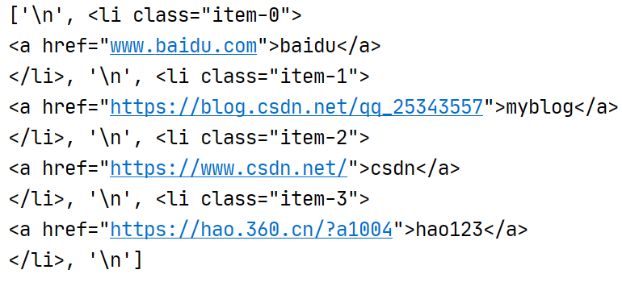
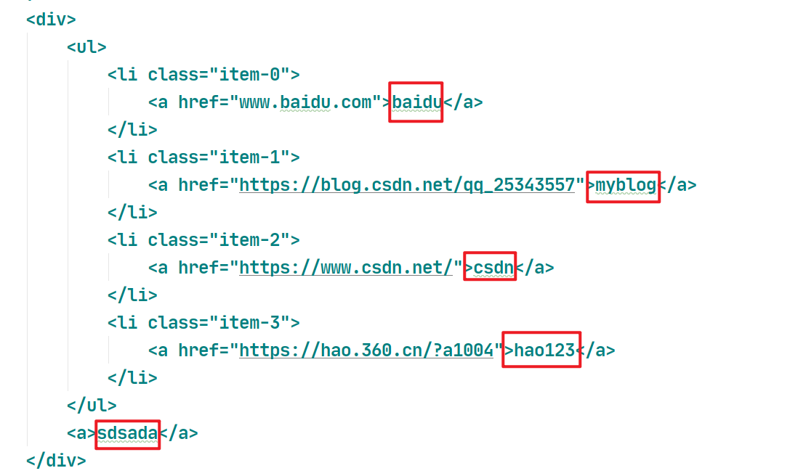
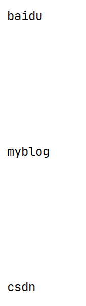
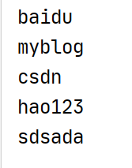
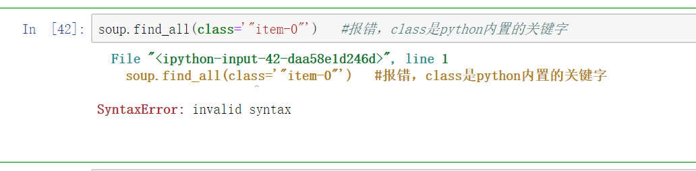

# 第七章 BS4解析网页

​	 在这一章中，我们会介绍另外一个解析网页的强大工具`Beautiful Soup`。

[	Beautiful Soup](http://www.crummy.com/software/BeautifulSoup/) 是一个可以从HTML或XML文件中提取数据的Python库，它是Python特有的。它提供了一些简单的、Python式的函数来处理导航、搜索、修改分析树等功能。

​	`	Beautiful Soup` 同样也是基于网页结构和属性等特性来进行解析的。

​	


## 7.1 BS4的使用

### 7.1.0 下载bs4

下载`bs4`库

```
pip install bs4
```

导入`bs4`库的`BeautifulSoup`模块

```python
from bs4 import BeautifulSoup
```


### 7.1.1 bs4解析器对比

下表列出了主要的解析器,以及它们的优缺点:

| 解析器           | 使用方法                               | 优势                                                  | 劣势                                            |
| ---------------- | :------------------------------------- | ----------------------------------------------------- | ----------------------------------------------- |
| Python标准库     | `BeautifulSoup(markup, "html.parser")` | Python的内置标准库执行速度适中文档容错能力强          | Python 2.7.3 or 3.2.2)前 的版本中文档容错能力差 |
| lxml HTML 解析器 | `BeautifulSoup(markup, "lxml")`        | 速度快文档容错能力强                                  | 需要安装C语言库                                 |
| lxml XML 解析器  | `BeautifulSoup(markup, ["lxml-xml"])`  | 速度快唯一支持XML的解析器                             | 需要安装C语言库                                 |
| lxml XML 解析器  | `BeautifulSoup(markup, "xml")`         | 速度快唯一支持XML的解析器                             | 需要安装C语言库                                 |
| html5lib         | `BeautifulSoup(markup, "html5lib")`    | 最好的容错性以浏览器的方式解析文档生成HTML5格式的文档 | 速度慢不依赖外部扩展                            |

​	官方文档推荐使用lxml作为解析器,因为效率更高. 在Python2.7.3之前的版本和Python3中3.2.2之前的版本,必须安装lxml或html5lib, 因为那些Python版本的标准库中内置的HTML解析方法不够稳定.


### 7.1.2 实例化bs4对象

​	将一段文档传入BeautifulSoup 的构造方法,就能得到一个文档的对象, 可以传入一段字符串或一个文件句柄.

​	**本地文档（不常用）**

```python
# 实例化本地文档
soup = BeautifulSoup(open('douban250.html','rt',encoding='utf-8'),"lxml")
#print(soup)
```

​	**加载文本**

```python
import requests

#伪装请求头
headers = {
    'User-Agent':'Mozilla/5.0 (Windows NT 10.0; WOW64) AppleWebKit/537.36 \
    (KHTML, like Gecko) Chrome/70.0.3538.25 Safari/537.36 Core/1.70.3867.400 QQBrowser/10.7.4315.400'
}

response = requests.get(url='http://120.79.0.124:8080/lcvc_ebuy_jsp/shop/index',headers=headers)
page_text = response.text #页面文本数据

soup = BeautifulSoup(page_text,"lxml")
```


### 7.1.3 bs4四大对象种类

Beautiful Soup将复杂HTML文档转换成一个复杂的树形结构,每个节点都是Python对象。

所有对象可以归纳为4种: 

- `Tag` 
- `NavigableString` 
- `BeautifulSoup` 
- `Comment` 


下面统一的使用的bs4实例

```python
text_html = '''<html>
    <body>
        <div>
            <ul>
                <li class="item-0">
                    <a href="www.baidu.com">baidu</a>
                </li>
                <li class="item-1">
                    <a href="https://blog.csdn.net/qq_25343557">myblog</a>
                </li>
                <li class="item-2">
                    <a href="https://www.csdn.net/">csdn</a>
                </li>
                <li class="item-3">
                    <a href="https://hao.360.cn/?a1004">hao123</a>
                </li>
            </ul>
            <a>sdsada</a>
        </div>
    </body>
</html>
'''

soup = BeautifulSoup(text_html,"lxml")
print(type(soup)) # <class 'bs4.BeautifulSoup'>
```


#### ①`Tag`

​	`Tag` 是什么？通俗点讲就是 HTML 中的一个个标签

```python
a = soup.a
print(a) # <a href="www.baidu.com">baidu</a>
print(type(a)) # <class 'bs4.element.Tag'>
```


对于`Tag`来说，它有两个最重要的属性: **name**和**attributes**


**name**

​	每个tag都有自己的名字,通过 `.name` 来获取:

```python
print(a.name) # a
```

​	如果改变了tag的name,那将影响所有通过当前Beautiful Soup对象生成的HTML文档:

```python
a.name = "b"
print(soup)
```

**Attributes**

​	一个tag可能有很多个属性. tag `<b class="boldest">` 有一个 “class” 的属性,值为 “boldest” . tag的属性的操作方法与字

典相同:

```python
print(a["href"]) # www.baidu.com
```

​	也可以直接”点”取属性, 比如: `.attrs` :

```python
print(a.attrs) # {'href': 'www.baidu.com'}
```

​	tag的属性可以被添加,删除或修改. 再说一次, tag的属性操作方法与字典一样

```python
a["href"] = "xxxxx.com"
print(soup)
```

​	还可以通过`.has_attr()`方法来判断这个tag是否有这个属性

```python
soup.li.has_attr('class')  #如果标签有该属性返回True，反之返回False
```


**多值属性**

​	HTML 4定义了一系列可以包含多个值的属性.在HTML5中移除了一些,却增加更多.最常见的多值的属性是 class (一个tag可以有多个CSS的class). 还有一些属性 `rel` , `rev` , `accept-charset` , `headers` , `accesskey` . 在Beautiful Soup中多值属性的返回类型是list:

```python
css_soup = BeautifulSoup('<p class="body strikeout"></p>')
print(css_soup.p['class'])
# ["body", "strikeout"]

css_soup = BeautifulSoup('<p class="body"></p>')
print(css_soup.p['class'])
# ["body"]
```

​	

​	如果某个属性看起来好像有多个值,但在任何版本的HTML定义中都没有被定义为多值属性,那么Beautiful Soup会将这个属性作为字符串返回：

```python
id_soup = BeautifulSoup('<p id="my id"></p>')
id_soup.p['id']
# 'my id'
```


​	如果转换的文档是XML格式,那么tag中不包含多值属性

```python
xml_soup = BeautifulSoup('<p class="body strikeout"></p>', 'xml')
xml_soup.p['class']
# u'body strikeout'
```


#### ②`NavigableString`

​	既然我们已经得到了标签的内容，那么问题来了，我们要想获取标签内部的文字怎么办呢？很简单，用 `.string` 即可

```python
a = soup.a
print(a.string)     # baidu
print(type(a.string))   # <class 'bs4.element.NavigableString'>
```

​	tag文本字符串常被包含在tag内。

​	Beautiful Soup用 `NavigableString` 类来包装tag中的字符串，它是可以遍历的字符串


​	也可以通过调用`.prettify()`方法，把要解析的字符串以标准的缩进格式输出

```python
a = soup.a
print(a.prettify())     
print(type(a.prettify()))   # <class 'str'>
```


​	除此之外，`Tag`还提供一个方法.`get_text()`来提取标签文本，并且类型为`str`

```python
a = soup.a
print(a.get_text()) # baidu
print(type(a.get_text())) # <class 'str'>
```

​	或者也可以直接用`.text`属性提取标签文本，类型为`str`

```python
a = soup.a
print(a.text) # baidu
print(type(a.text)) # <class 'str'>
```


#### ③`BeautifulSoup`

​	`BeautifulSoup` 对象表示的是一个文档的全部内容.大部分时候,可以把它当作 `Tag` 对象。

```python
print(soup)
print(type(soup))   # <class 'bs4.BeautifulSoup'>
print(soup.name)    # [document]
print(soup.attrs)   # {}
```


#### ④`Comment`

​	`Comment` 对象是一个特殊类型的 `NavigableString` 对象，是标签内字符串的注释部分，一种特殊的`Comment`类型。

​	但是如果不好好处理它，可能会对我们的文本处理造成意想不到的麻烦。

```python
newsoup=BeautifulSoup("<b><!--This is a conment --></b><p>This is not a conment</p>","html.parser")
print(newsoup.b.string)
print(type(newsoup.b.string))
print('-'*50)
print(newsoup.p.string)
```


### 7.1.4 遍历文档树

#### ① 遍历节点

​	一个Tag可能包含多个字符串或其它的Tag,这些都是这个Tag的子节点.Beautiful Soup提供了许多操作和遍历子节点的属性。


**tag的名字**

​	操作文档树最简单的方法就是告诉它你想获取的tag的name.如果想获取 <ul> 标签,只要用 `soup.ul` :

```python
soup.ul
```

​	这是个获取tag的小窍门,可以在文档树的tag中多次调用这个方法.下面的代码可以获取<ul>标签中的第一个<li>标签:

```python
soup.ul.li
```


**.contents**

​	tag 的 **.contents** 属性可以将 tag 的子孙节点以**列表**的方式输出

```python
print(soup.ul.contents)
```



​	**注意换行符也是一个节点**


**.descendants**

​	tag 的 **.descendants** 属性可以将 tag 的子孙节点以**迭代器**的方式输出

```python
print(soup.div.descendants) # <generator object Tag.descendants at 0x0000019BE931DB88>
```


#### ② 遍历字符串

​	`.strings`

​	如果我们想获取某个`Tag`下所有的`NavigableString`，比如我们想获取<div>下的所有标签文本



​	可以用`.strings`遍历

```python
print(soup.div.strings) # <generator object Tag._all_strings at 0x0000020266D3EB88>
```

​	得到一个迭代器，我们用`for`循环取值:

```python
for string in soup.div.strings:
    print(string)
```



​	当然也是注意别忘了换行符也是节点。


​	输出的字符串中可能包含了很多空格或空行,使用 `.stripped_strings` 可以去除多余空白内容:

```python
for div in soup.div.stripped_strings:
    print(div)
```




### 7.1.5 搜索文档树（重点）

#### ① find_all()

 `find_all( name , attrs , recursive , text , **kwargs )`

​	find_all () 方法搜索当前 tag 的所有 tag 子节点，并判断是否符合过滤器的条件。


**name参数**

​	name 参数 name 参数可以查找所有名字为 name 的 tag, 字符串对象会被自动忽略掉


A. 传字符串 

​	最简单的过滤器是字符串。在搜索方法中传入一个字符串参数，Beautiful Soup 会查找与字符串完整匹配的内容，下面的例子用于查找文档中所有的标签。

```python
print(soup.find_all('a'))
```

B. 传正则表达式 

​	如果传入正则表达式作为参数，Beautiful Soup 会通过正则表达式的 match () 来匹配内容。

```python
#下面例子中找出所有以 l 开头的标签
import re

print(soup.find_all(re.compile("^l")))
```

C. 传列表 

​	如果传入列表参数，Beautiful Soup 会将与列表中任一元素匹配的内容返回。

```python
print(soup.find_all(['a','li']))
```

D. 传 True   

​	可以匹配任何值，下面代码查找到所有的 tag, 但是不会返回字符串节点。相当于遍历节点。

```python
for tag in soup.find_all(True):
    print(tag.name)
```

E. 传方法 

​	如果没有合适过滤器，那么还可以定义一个方法，方法只接受一个元素参数 , 如果这个方法返回 True 表示当前元素匹配并且被找到，如果不是则反回 False 下面方法校验了当前元素，如果包含 class 属性却不包含 id 属性，那么将返回 True:

```python
def has_class_but_no_id(tag):
    return tag.has_attr('class') and not tag.has_attr('id')

print(soup.find_all(has_class_but_no_id))
```


**attrs参数**

​	`attrs = {}`

​	通过属性名和属性值去查询，接收字典。

```python
#下面例子中找出所有class="item-0" 的li标签
print(soup.find_all("li",attrs={"class":"item-0"}))
```


**keyword参数**

​	这个参数比较特殊，它起到的作用和**attrs参数**一样，通过属性名和属性值查询。（能用**attrs**就不要用**keyword**）

```python
text = '''
<div>
    <ul>
        <li class="item" id="1">
            <a href="www.baidu.com">baidu</a>
        </li>
        <li class="item" id="2">
            <a href="https://blog.csdn.net/qq_25343557">myblog</a>
        </li>
</div>
'''

text_soup = BeautifulSoup(text,"lxml")

#下面例子中找出所有id="1" 的li标签
print(text_soup.find_all("li",id="1"))
```

​	如果一个指定名字的参数不是搜索内置的参数名，搜索时会把该参数当作指定名字 tag 的属性来搜索。如果包含一个名字为 id 

的参数，Beautiful Soup 会搜索每个 tag 的”id” 属性。


​	class属性比较特殊，因为class是python内置的关键字



​	要改成：

```python
soup.find_all(class_="item-0")  # 在class后面加一个_
```


​	`keyword`参数能不用就不用，`attrs`可以替代，唯一`keyword`的特殊点就是可以支持正则表达式。

```python
import re

print(text_soup.find_all(class_=re.compile('item-1')))
```


**text 参数**

​	通过 text 参数可以搜搜文档中的字符串内容。与 name 参数的可选值一样，text 参数接受 字符串，正则表达式，列表，

True

```python
soup.find_all(text = 'myblog')
```

```python
soup.find_all(text=['myblog','baidu'])  # ['baidu', 'myblog']  列表下标按照标签搜索的顺序
```

```pythona
soup.find_all(text=re.compile('my'))
```


**limit 参数**

​	效果与 SQL 中的 limit 关键字类似，当搜索到的结果数量达到 limit 的限制时，就停止搜索返回结果。

```python
# 搜索前三个a标签
print(soup.find_all('a',limit=3))
```


#### 其他find方法

**② find( name , attrs , recursive , text , kwargs )**

​	它与 find_all () 方法唯一的区别是 find_all () 方法的返回结果是值包含一个元素的列表，而 find () 方法直接返回结果


**③ find_parents() find_parent()**

​	find_all () 和 find () 只搜索当前节点的所有子节点，孙子节点等. find_parents () 和 find_parent () 用来搜索当前节点的父辈节点，搜索方法与普通 tag 的搜索方法相同，搜索文档搜索文档包含的内容


**④ find_next_siblings() find_next_sibling()**

​	这 2 个方法通过 .next_siblings 属性对当 tag 的所有后面解析的兄弟 tag 节点进行迭代，find_next_siblings () 方法返回所有符合条件的后面的兄弟节点，find_next_sibling () 只返回符合条件的后面的第一个 tag 节点


**⑤ find_previous_siblings() find_previous_sibling()**

​	这 2 个方法通过 .previous_siblings 属性对当前 tag 的前面解析的兄弟 tag 节点进行迭代，find_previous_siblings () 方法返回所有符合条件的前面的兄弟节点，find_previous_sibling () 方法返回第一个符合条件的前面的兄弟节点


**⑥ find_all_next() find_next()**

​	这 2 个方法通过 .next_elements 属性对当前 tag 的之后的 tag 和字符串进行迭代，find_all_next () 方法返回所有符合条件的节点，find_next () 方法返回第一个符合条件的节点


**⑦ find_all_previous () 和 find_previous ()**

​	这 2 个方法通过 .previous_elements 属性对当前节点前面的 tag 和字符串进行迭代，find_all_previous () 方法返回所有符合条件的节点，find_previous () 方法返回第一个符合条件的节点


**注：以上方法参数用法与 find_all () 完全相同，原理均类似，在此不再赘述。**


### 7.1.6 CSS选择器(拓展)

​	Beautiful Soup提供了另外一种选择器，那就是CSS选择器。使用CSS选择器时，只需要调用select()方法，传入相应的CSS选择器即可,返回类型是 list

​	css选择器：https://www.w3school.com.cn/cssref/css_selectors.asp

```python
text_html = '''<html>
    <body>
        <div>
            <ul>
                <li class="item-0">
                    <a href="www.baidu.com">baidu</a>
                </li>
                <li class="item-1">
                    <a href="https://blog.csdn.net/qq_25343557" id="link1">myblog</a>
                </li>
                <li class="item-2">
                    <a href="https://www.csdn.net/">csdn</a>
                </li>
                <li class="item-3">
                    <a href="https://hao.360.cn/?a1004">hao123</a>
                </li>
            </ul>
            <a>sdsada</a>
        </div>
    </body>
</html>
'''

soup = BeautifulSoup(text_html)

# 标签名搜索
print(soup.select('li'))

# 类名搜索
print(soup.select('.item-0'))

# id搜索
print(soup.select('#link1'))

# 组合搜索
print(soup.select('li.item-0'))
print(soup.select('a#link1'))

# 子标签搜索
print(soup.select("ul > li"))

# 属性搜索
print(soup.select('li[class="item-0"]'))
```


## 7.2 BS4爬虫


### 实训一：订餐系统首页爬虫

链接：http://120.79.0.124:8080/lcvc_ebuy_jsp/shop/index


- 获取首页中**所有商品**的**名称**，**价格**，**原价**，**库存**

- 以字典列表的形式存储数据，格式如下：

  - [{"商品名":"蜜雪冰城","价格":18.0,"原价":78.0,"库存":84},{"商品名":"冰淇淋","价格":3.0,"原价":6.0,"库存":110}.....................]


- 每解析完一个商品，提示"已获取xxxx"
- 输出最终结果

```python
import requests
from bs4 import BeautifulSoup

# 商品列表,用于存储最终结果
food_ls = []

# 伪装请求头
headers = {
    'User-Agent':'Mozilla/5.0 (Windows NT 10.0; WOW64) AppleWebKit/537.36 \
    (KHTML, like Gecko) Chrome/70.0.3538.25 Safari/537.36 Core/1.70.3867.400 QQBrowser/10.7.4315.400'
}
response = requests.get(url='http://120.79.0.124:8080/lcvc_ebuy_jsp/shop/index',headers=headers)
# 获取页面文本数据
page_text = response.text
# 文本数据bs实例化
soup = BeautifulSoup(page_text,"lxml")

# # 开始进行bs4解析

# 获取所有的div标签
div_ls = soup.find_all(name="div",attrs={"class":"item"})

# 遍历获得的div标签
for div in div_ls:
    # ① 商品名称
    name = div.find(name="h3").get_text()

    # ② 价格
    price = float(div.label.em.get_text())

    # ③ 原价
    origin = float(div.select("label > span")[0].get_text())

    # ④ 商品库存
    # (暂时没想到比较好的办法)
    stock = [i for i in div.label.strings][2]

    # ⑤ 图片链接
    img_src = "http://120.79.0.124:8080/" + div.a.img.get("src")

    # 将(单个)商品数据存储到商品列表中
    food_ls.append({
        "商品名":name,
        "价格":price,
        "原价":origin,
        "商品库存":stock,
        "图片链接":img_src
    })


# 输出最终结果
print(food_ls)
```


### 实训二：阳光政务爬虫（面对对象设计）

```python
# -*- coding: utf-8 -*-
"""
    阳光政务二手车爬虫
"""
import requests
from bs4 import BeautifulSoup


class SunSpider(object):
    # 默认属性

    # base_url
    # {}参数是page
    base_url = "https://wz.sun0769.com/political/index/politicsNewest?id=1&page={}"

    # 总页数，默认为1
    __pages = 1

    # 头信息字典
    headers = {
        'User-Agent':'Mozilla/5.0 (Windows NT 10.0; WOW64) AppleWebKit/537.36 \
        (KHTML, like Gecko) Chrome/70.0.3538.25 Safari/537.36 Core/1.70.3867.400 QQBrowser/10.7.4315.400'
    }

    # 数据存储列表
    __data_ls = []


    def set_pages(self,pages):
        '''
        :param pages: 一共要爬多少页
        :return: None
        '''
        self.__pages= pages


    def join_url(self,page):
        '''
        :param page: 当前页码
        :return : 完整的url
        '''
        # print(self.base_url.format(self.__area,page))
        return self.base_url.format(page)

    def sun_requests(self,url):
        '''
        :param page:  当前页码
        :return Response: 响应对象
        '''
        response = requests.get(url=url,headers=self.headers)
        if response.status_code == 200:
            response.encoding = "UTF-8"
            return response
        else:
            raise requests.HTTPError("状态码错误,状态码为{}".format(response.status_code))


    def parse(self,response):
        # 使用BS4进行解析
        soup = BeautifulSoup(response.text,"lxml")

        # 获取li列表
        li_ls = soup.select('li[class="clear"]')
        # 遍历li列表
        for li in li_ls:
            try:
                # (商品)字典
                item = {}

                # ① 编号
                code = li.find(name="span",class_="state1").get_text()
                item["编号"] = code
                # ② 状态
                status = ''.join(li.find("span",attrs={"class":"state2"}).stripped_strings).strip()
                item["状态"] = status
                # ③ 问政标题
                title = li.find("span",attrs={"class":"state3"}).get_text()
                item["问政标题"] = title
                # ④ 响应时间
                re_time = ''.join(li.find("span",attrs={"class":"state4"}).stripped_strings).strip()
                item["响应时间"] = re_time
                # ⑤ 问政时间
                q_time = li.find("span",attrs={"class":"state5"}).get_text()
                item["问政时间"] = q_time

                # 详情页链接
                detail_url = "https://wz.sun0769.com" + li.find("span",attrs={"class":"state3"}).a.get("href")
                # 向详情页发起请求
                detail_response = self.sun_requests(detail_url)
                # 详情请求
                self.detail_parse(detail_response,item)


            except Exception as e:
                print("错误",e)
                continue


    def detail_parse(self,response,item):
        '''
        :param response: 详情页响应
        :param item: 问题字典
        :return: None
        '''
        item = item
        # 解析详情数据
        detail_soup = BeautifulSoup(response.text,"lxml")
        # ⑥ 详情页数据
        detail = detail_soup.find("div",class_="details-box").get_text()
        item["详情数据"] = detail

        # 提示
        print("成功获取{}".format(item["编号"]))

        # 发送给管道
        self.pipelines(item)


    def pipelines(self,item):
        '''
        :param item: 商品字典
        :return: None
        '''
        self.__data_ls.append(item)
        return None

    def get_data(self):
        '''
        :return: __data_ls
        '''
        return self.__data_ls

    def start(self):
        # 循环
        for page in range(1,self.__pages+1):
            print("--------正在爬取第{}页--------".format(page))
            try:
                # 拼接url
                url = self.join_url(page)
                # 获取响应
                response = self.sun_requests(url)
                # 解析数据
                self.parse(response)

            except Exception as e:
                print(e)
                continue


if __name__ == "__main__":
    # 实例化
    sun_spider = SunSpider()
    # 设置总页码
    sun_spider.set_pages(5)
    # 开始爬虫
    sun_spider.start()
    # 输出最终结果
    print(len(sun_spider.get_data()))
    print(sun_spider.get_data())
```

