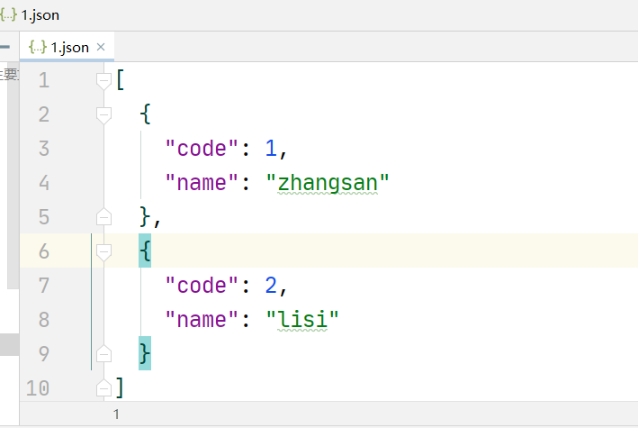
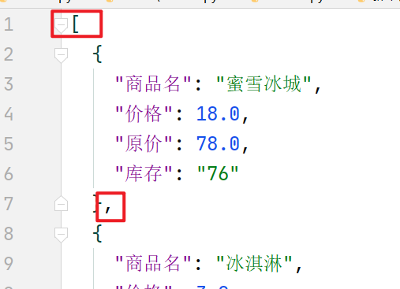
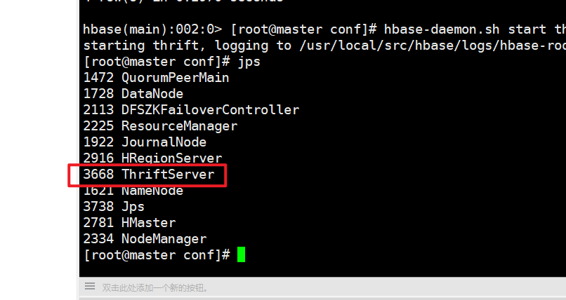

# 第八章 数据存储

## 8.1 Json数据存储

### 8.1.1 JSON格式

​	Json，全程是 `JavaScript Object Notation`，是一种轻量级的数据交换格式，它通过对象和数组的组合来表示数据，构造简洁但是结构化程度非常高的格式。

​	在Json格式有两大表示结构：对象和数组。

**对象结构：**

​		以”{”大括号开始，以”}”大括号结束。中间部分由0或多个以”，”分隔的”key(关键字)/value(值)”对构成，关键字和值之间以”：”分隔，语法结构如代码。

```javascript
{
    key1:value1,
    key2:value2,
    ...
}
```

**数组结构：**

​	以”[”开始，”]”结束。中间由0或多个以”，”分隔的值列表组成，语法结构如代码。

```javascript
[
    {
        key1:value1,
        key2:value2 
    },
    {
         key3:value3,
         key4:value4   
    }
]
```


​	实际上，由于JavaScript和Python都是脚本语言，所以它们的数据类型非常相似。

​	以下就是Json格式和Python数据类型的对照


实际上，我们在进行数据交换的过程如下：


### 8.1.2 json模块

​	Python提供了一个非常简单易用的`json`库来实现JSON文件的读写。


​	在使用json这个模块前，首先要导入json库：

```
import json
```

​	这个模块有以下几个比较常用的方法：

​	

**① 输出JSON**

​	python转码成Json格式

```python
# 将Python数据类型编码成JSON字符串
def dumps(obj, *, skipkeys=False, ensure_ascii=True, check_circular=True,
        allow_nan=True, cls=None, indent=None, separators=None,
        default=None, sort_keys=False, **kw):
```


a、将Python的str转换成JSON的string

```python
import json
json_data = json.dumps('这是一个json文本')
print(json_data)
# "\u8fd9\u662f\u4e00\u4e2ajson\u6587\u672c"
```

​	我们可以看到中文是以**Unicode编码**显示的，我们可以通过设置`ensure_ascii=False`，显示原中文格式

```python
import json
json_data = json.dumps('这是一个json文本',ensure_ascii=False)
print(json_data)
# "这是一个json文本"
```

b、将Python的dict转换成JSON的object

```python
import json
dict1 = {'key1': 1, 'key2': 2}
json_data = json.dumps(dict1)
print(json_data)
```

c、将Python的list转换成JSON的array

```python
import json
dict1 = [{'code': 1, 'name': 'zhangsan'},{'code': 2, 'name': 'lisi'}]
json_data = json.dumps(dict1)
print(json_data)
```

​	通过转码后的array会集中到一行上：

​	

​	我们还可以通过设置`indent=缩进格数`来美化转码结果

```python
import json
dict1 = [{'code': 1, 'name': 'zhangsan'},{'code': 2, 'name': 'lisi'}]
# 0个缩进
json_data = json.dumps(dict1,indent=0)
print(json_data)
```


```python
import json
dict1 = [{'code': 1, 'name': 'zhangsan'},{'code': 2, 'name': 'lisi'}]
# 0个缩进
json_data = json.dumps(dict1,indent=2)
print(json_data)
```


​	

**重点：将Python数据保存到JSON文件fp中**

```python
def dump(obj, fp, *, skipkeys=False, ensure_ascii=True, check_circular=True,
        allow_nan=True, cls=None, indent=None, separators=None,
        default=None, sort_keys=False, **kw):
```

​	`json.dump()`比`json.dumps()`多一个**fp参数**,其他用法都一样。

​	

**fp参数**传入写入的**文件对象**

```python
import json
dict1 = [{'code': 1, 'name': 'zhangsan'},{'code': 2, 'name': 'lisi'}]
# 实例化文件对象
fp = open('1.json','wt',encoding='utf-8')
# 将数据转换成JSON格式并写入文件中
json.dump(dict1,fp,indent=2)
# 关闭文件
fp.close()
```

 通过`json.dump()`就将结果写入了文件中




**② 读取json**

​	爬虫课程中不需要学习，该兴趣的同学可以参考菜鸟教程https://www.runoob.com/python/python-json.html


### 8.1.3 JSON存储爬虫数据

​	在使用JSON格式存储数据的话，我们会采取两种存储方式：

1. **全表存储**

   顾名思义，全表存储就是将所有的数据爬取完毕后，再一并写入JSON文件中。

   它的优点是最后的结果就是一个Python的字典数组，通过**json模块**写入后，无需考虑格式问题，它就是一个array。

   但是它也有一个缺点，当我们需要爬取的数据非常大量时，如果中途挂掉了，那么前面的努力就白费了。

2. **单行储存**

   单行存储，就是每爬取一个商品，将数据写入一次JSON文件中。

   它的优点就是前面的努力不会白费。

   缺点也很明显，我们在用**json模块**写入数据时，由于每行都是一个单独的字典，相当于每次都写入一个object。我们要把object集合到一个array中的时候，需要自己去构造格式。

#### 实训一：存储订餐系统爬虫数据（全表存储）

​	这个就非常简单了，我们原来就已经把所有的数据存放到一个food_ls中了，我们只需要在最后加上写入JSON文件的代码就可以了。


​	完整代码如下：

```python
# -*- coding: utf-8 -*-
""" 
订餐系统首页爬虫
"""
import requests
from lxml import etree
import re
import json

# 商品列表
food_ls = []

# 伪装请求头
headers = {
    'User-Agent':'Mozilla/5.0 (Windows NT 10.0; WOW64) AppleWebKit/537.36 \
    (KHTML, like Gecko) Chrome/70.0.3538.25 Safari/537.36 Core/1.70.3867.400 QQBrowser/10.7.4315.400'
}
response = requests.get(url='http://120.79.0.124:8080/lcvc_ebuy_jsp/shop/index', headers=headers)
page_text = response.text  # 页面文本数据
tree = etree.HTML(page_text)

# # 第一步：匹配所有div标签
div_ls = tree.xpath("/html/body/div/div/div[2]/div[2]/div")

# # 第二步：遍历每个div标签，从中匹配目标值
for div in div_ls:
    # 商品名
    name = div.xpath("./h3/text()")[0]
    # 价格
    price = float(div.xpath("./label/em/text()")[0])
    # 原价
    origin = float(div.xpath("./label/span/text()")[0])
    # 库存
    stock = div.xpath("./label/text()")[0]
    stock = re.search("(\d+)", stock).group(1)
    # print(name,price,origin,stock)

    # 将数据添加到商品列表中
    food_ls.append({"商品名":name, "价格":price, "原价":origin, "库存":stock})
    # 提醒
    print("已获取{}".format(name))

# 输出最终结果
print(food_ls)
# # --将最终结果保存到JSON文件中
# ①打开文件
fp = open('订餐系统商品.json','wt',encoding='utf-8')
# ②写入文件
json.dump(obj=food_ls,fp=fp,indent=2,ensure_ascii=False)
# ③关闭文件
fp.close()
```


#### 实训二：存储订餐系统爬虫数据（单行存储）

​	单行存储相对就要麻烦很多了，我们首先看一下全表存储的结果：

​	

  

​	我们写入的结果是一个标准的JSON格式的array，这样的格式我们再读取它的时候会很便利（比如：用pandas读取直接是DataFrame格式，用MySQL读取就是一张表）。


​	现在问题来了，我们如果一行一行写入的时候，会写入什么呢？

​	

​	每次写入的是一个object，我们就算将`json.dump()`放在循环中：

```python
    # 单行商品
    item = {"商品名":name, "价格":price, "原价":origin, "库存":stock}
    # 提醒
    print("已获取{}".format(name))
    # # --将每行保存到JSON文件中
    # ①打开文件
    fp = open('订餐系统商品单行版.json', 'at', encoding='utf-8')
    # ②写入文件
    json.dump(obj=item, fp=fp, indent=2, ensure_ascii=False)
    # ③关闭文件
    fp.close()
```


​	比起标准格式还缺少了开始的 `[`  和 商品之间的 `，`  以及结尾的 `]`



​	其实解决方法也很简单，我们单独写入这些符号就可以了。


**在开始先写入一个  `[`**

```python
    # ①打开文件
    fp = open('订餐系统商品单行版.json', 'at', encoding='utf-8')
    # ②写入文件
    fp.write('[')
    # ③关闭文件
    fp.close()
```

**在每次存储一个商品之后，写入一个`，`：**

```python
    # ①打开文件
    fp = open('订餐系统商品单行版.json', 'at', encoding='utf-8')
    # ②写入文件
    json.dump(obj=item, fp=fp, indent=2, ensure_ascii=False)
    # 写一个逗号
    fp.write(',')
    # ③关闭文件
    fp.close()
```

**在结尾写入一个 `]`**

```python
    # ①打开文件
	fp = open('订餐系统商品单行版.json', 'at', encoding='utf-8')
	# ②写入文件
	fp.write(']')
	# ③关闭文件
	fp.close()
```


​	同时我们发现如果每次都要进行一次IO，是对资源的极大浪费，我们只在**开始和结尾分别总共一次IO**就可以了。

**在开始先写入一个  `[`**

```python
# ①打开文件
fp = open('订餐系统商品单行版.json', 'at', encoding='utf-8')
# ②写入文件
fp.write('[')
```

**在每次存储一个商品之后，写入一个`，`：**

```python
    # ②写入文件
    json.dump(obj=item, fp=fp, indent=2, ensure_ascii=False)
    # 写一个逗号
    fp.write(',')
```

**在结尾写入一个 `]`**

```python
fp.write(']')
# ③关闭文件
fp.close()
```


完整版代码如下：

```python
# -*- coding: utf-8 -*-
""" 
订餐系统首页爬虫
"""
import requests
from lxml import etree
import re
import json


# 伪装请求头
headers = {
    'User-Agent':'Mozilla/5.0 (Windows NT 10.0; WOW64) AppleWebKit/537.36 \
    (KHTML, like Gecko) Chrome/70.0.3538.25 Safari/537.36 Core/1.70.3867.400 QQBrowser/10.7.4315.400'
}
response = requests.get(url='http://120.79.0.124:8080/lcvc_ebuy_jsp/shop/index', headers=headers)
page_text = response.text  # 页面文本数据
tree = etree.HTML(page_text)

# ①打开文件
fp = open('订餐系统商品单行版.json', 'at', encoding='utf-8')
fp.write('[')

# # 第一步：匹配所有div标签
div_ls = tree.xpath("/html/body/div/div/div[2]/div[2]/div")

# # 第二步：遍历每个div标签，从中匹配目标值
for div in div_ls:
    # 商品名
    name = div.xpath("./h3/text()")[0]
    # 价格
    price = float(div.xpath("./label/em/text()")[0])
    # 原价
    origin = float(div.xpath("./label/span/text()")[0])
    # 库存
    stock = div.xpath("./label/text()")[0]
    stock = re.search("(\d+)", stock).group(1)
    # print(name,price,origin,stock)

    # 单行商品
    item = {"商品名":name, "价格":price, "原价":origin, "库存":stock}
    # 提醒
    print("已获取{}".format(name))
    # # --将每行保存到JSON文件中
    # ②写入文件
    json.dump(obj=item, fp=fp, indent=2, ensure_ascii=False)
    # 写一个逗号
    fp.write(',')

# ③关闭文件
fp.write(']')
fp.close()
```

​	

​	其实最终结果还有一个小问题，就是最后一个数据多一个`，`，我们手动删去，也可以用IO进行删除，也可以做校验最后一个商品不写逗号，感兴趣的同学自己去研究一下。


## 8.2 关系型数据库存储

​	关系型数据库是基于关系模型的数据库，而关系模型是通过二维表来保存的，所以它的存储方式是行列组成的表，每一列就是一个字段，每一行就是一条记录。

​	关系型数据有很多种，比如SQLite，MySQL，Oracle，SQL Server等等。

​	在本章中，我们主要以MySQL的存储为主。

### 8.2.1 MySQL的存储

下载地址：https://dev.mysql.com/downloads/installer/

#### ① MySQL的安装

MySQL是一个轻量级的关系数据库，我们来进行它的安装。

​	**Windows下的安装：**

​	1、下载安装包之后运行安装包，勾选同意，Next


2、选择安装类型
第一个选项包含了一些MySQL其他组件，如果只安装MySQL数据库，选择第二项Server only就行。这里我直接选择默认的Developer Default


3、检查必需项（Check Requirements）
Execute-->Next；出现警告框点击“是”继续


4、Installation
点击Execute开始执行安装，等全部安装完之后，点击Next


5、进入配置界面 Product Configuration，Next


6、进行服务配置，MySQL默认端口为3306，Next


7、Accounts and Roles
这里一般不添加具有普通用户权限的MySQL用户账户，而是用root账户。


8、Windows Service
这里注意MySQL服务名（Windows Service Name）为:MySQL80


9、Apply Configuration(应用配置)
点击Execute


10、配置完成之后Finish


11、然后再配置MySQL的实例，点击next
　　Check-->Next-->Execute


12、执行完毕之后点击Finish，又回到了主程序，然后点击Next


13、安装完成，Finish,到这里MySQL就安装完成了。


​	**Linux下的安装：**

​		请参考《大数据应用》实训手册。


#### ② 在MySQL中创建数据库

**如何启动MySQL？（windows下）**

1、按下win+R键打开“运行”，在输入框里面输入“cmd”，点击确定：

2、在命令行里面输入“net stop mysql”就是关闭mysql服务，输入“net start mysql”,接着按回车键，开启mysql服务：

3、重复第一步在mysql安装目录的bin文件下，打开一个新的命令行， 输入“mysql -uroot -p”，之后输入数据库密码就可以登录数据库了。

4、输入 `create database spider;`


#### ③ pymysql的使用

本章节我们来介绍一下Python3 使用 PyMySQL 连接数据库，并实现简单的增删改查。


##### a、PyMySQL

​	PyMySQL 是在 Python3.x 版本中用于连接 MySQL 服务器的一个库，Python2中则使用mysqldb。

​	PyMySQL 遵循 Python 数据库 API v2.0 规范，并包含了 pure-Python MySQL 客户端库。


##### b、下载PyMySQL

```python
pip install PyMySQL
```


##### c、连接MySQL

​	连接数据库前，请先确认你已经创建了数据库 SPIDER.

​	我们通过`pymysql.connect()`来进行MySQL数据库连接：

```
pymysql.connect()参数说明
    host(str):      MySQL服务器地址
    port(int):      MySQL服务器端口号
    user(str):      用户名
    passwd(str):    密码
    db(str):        数据库名称
    charset(str):   连接编码
```

​	连接SPIDER数据库：

```python
import pymysql

# 打开数据库连接     pymysql.connect(host,port,user,passwd,db,charset )
db = pymysql.connect("localhost","root","root","SPIDER" )
print(db) # <pymysql.connections.Connection object at 0x00000214489CD908>
print(type(db)) # <class 'pymysql.connections.Connection'>
```

​	返回一个**\<Connection>**对象

##### d、Connection对象

​	**Connection**对象有四大方法：

1. ​    cursor()        	使用该连接创建并返回游标
2. ​    commit()         提交当前事务
3. ​    rollback()        回滚当前事务
4. ​    close()             关闭连接


​	我们可以通过游标来实现SQL语句，流程如下

​	执行sql语句流程： **创建游标 --> 编写SQL语句 --> 使用游标执行SQL语句**

```python
# 使用 cursor() 方法创建一个游标对象 cursor
cursor = db.cursor()
print(cursor)   # <pymysql.cursors.Cursor object at 0x0000019F46967320>
print(type(cursor))     # <class 'pymysql.cursors.Cursor'>
```

##### e、Cursor对象	

cursor对象支持的方法：

1. execute(op)     执行一个数据库的查询命令
2. fetchone()      取得结果集的下一行
3. fetchmany(size) 获取结果集的下几行
4. fetchall()      获取结果集中的所有行
5. rowcount()      返回数据条数或影响行数
6. close()         关闭游标对象


如果对sql语句不熟悉，可以访问 SQL基础教程 https://www.runoob.com/sql/sql-tutorial.html

#### ④ 创建表

​	建表语句

```sql
CREATE TABLE 表名称
(
列名称1 数据类型 索引(约束),
列名称2 数据类型 索引(约束),
列名称3 数据类型 索引(约束),
....
)
```

​	在pymysql中创建数据表：

```python
# 使用 cursor() 方法创建一个游标对象 cursor
cursor = db.cursor()
 
# 使用 execute() 方法执行 SQL，如果表存在则删除
cursor.execute("DROP TABLE IF EXISTS EMPLOYEE")
 
# 使用预处理语句创建表
sql = """CREATE TABLE EMPLOYEE (
         FIRST_NAME  CHAR(20) NOT NULL,
         LAST_NAME  CHAR(20),
         AGE INT,  
         SEX CHAR(1),
         INCOME FLOAT )"""
 
cursor.execute(sql)
 
#关闭游标
cursor.close()
    
# 关闭数据库连接
#db.close()
```

#### ⑤ 数据库插入操作

​	插入语句

```sql
INSERT INTO table_name (列1, 列2,...) VALUES (值1, 值2,....)
```

​	在pymsql中插入数据

```python
# 使用cursor()方法获取操作游标 
cursor = db.cursor()

# SQL 插入语句
sql = """INSERT INTO EMPLOYEE(FIRST_NAME,
         LAST_NAME, AGE, SEX, INCOME)
         VALUES ('{}', '{}', {}, '{}', {})""".format('Mac','Mohan',20,'M',2000)
try:
   # 执行sql语句
   cursor.execute(sql)
   # 提交到数据库执行
   db.commit()
except:
   # Rollback in case there is any error
   #数据库的游标操作类型文件读写中的文件指针，会随着运行进行指针的移动，所以当sql运行失败时，我们需要让游标回滚至操作前的位置
   
   db.rollback()

# 关闭数据库连接
#db.close()
```


#### ⑥ 查询数据

Python查询Mysql使用 fetchone() 方法获取单条数据, 使用fetchall() 方法获取多条数据。

- fetchone(): 该方法获取下一个查询结果集。结果集是一个对象。
- fetchall():接收全部的返回结果行。
- rowcount: 这是一个只读属性，并返回执行execute()方法后影响的行数。


​	SQL查询语句

```sql
SELECT * FROM 表名 (WHERE 查询条件)
SELECT 列名称 FROM 表名 (WHERE 查询条件)
```

​	在pymysql中查询数据

```python
# 使用cursor()方法获取操作游标 
cursor = db.cursor()

# SQL 查询语句
sql = "SELECT * FROM EMPLOYEE"

try:
    # 执行SQL语句
    cursor.execute(sql)
    # 获取所有记录列表
    results = cursor.fetchall()
    cols = cursor.description
    print(results)
    print(cols) 
    
except Exception as e:
    print(e)
   
finally:
    pass
    #db.close()
```


#### ⑦ 更新数据

​	SQL更新语句

```sql
UPDATE 表名 SET 列名称 = .... WHERE 查询条件
```

​	在pymysql中更新数据

```python
# 使用cursor()方法获取操作游标 
cursor = db.cursor()
 
# SQL 更新语句
sql = "UPDATE EMPLOYEE SET AGE = AGE + 1 WHERE SEX = '{}'" .format('M')
try:
   # 执行SQL语句
   cursor.execute(sql)
   # 提交到数据库执行
   db.commit()
except:
   # 发生错误时回滚
   db.rollback()
```


#### ⑧ 删除数据

```python
# 使用cursor()方法获取操作游标 
cursor = db.cursor()
 
# SQL 删除语句
sql = "DELETE FROM EMPLOYEE WHERE AGE > %s" % (20)
try:
   # 执行SQL语句
   cursor.execute(sql)
   # 提交修改
   db.commit()
except:
   # 发生错误时回滚
   db.rollback()
```


### 8.2.2 pymysql异常类

DB API中定义了一些数据库操作的错误及异常，下表列出了这些错误和异常:


### 8.2.3 MySQL存储爬虫数据

​	在MySQL中，只有单行存储方式。

#### 实训三：虎扑勇士板爬虫(MySQL)

​	勇士总冠军！！！！！！！！


- 获取流言板前20页的中**所有讨论**的**标题**，**回复**，**浏览**，**作者**，**时间**
- 每解析完一个商品，提示"已获取xxxx"
- 将爬取到的数据存进MySQL数据库中，并新增一个自增的主键ID，结构如下：


完整代码：

```python
# -*- coding: utf-8 -*-
""" 
    虎扑--勇士流言板爬虫
"""
import requests
from lxml import etree
import pymysql
import random
from datetime import datetime

# 一、准备工作
# 1.1 准备url
# {}里面接收页码  page = n
base_url = 'https://bbs.hupu.com/warriors-{}'
# 1.2 准备头信息
# ua池
ua_pools = [
    'Mozilla/5.0 (Windows NT 10.0; WOW64) AppleWebKit/537.36 (KHTML, like Gecko) Chrome/77.0.3865.120 Safari/537.36 Core/1.77.103.400 QQBrowser/10.9.4624.400',
    'Mozilla/5.0 (Windows NT 10.0; Win64; x64) AppleWebKit/537.36 (KHTML, like Gecko) Chrome/100.0.4896.127 Safari/537.36',
    'Mozilla/5.0 (Windows; U; Windows NT 6.0; en-GB; rv:1.9.2.9) Gecko/20100824 Firefox/3.6.9 ( .NET CLR 3.5.30729; .NET CLR 4.0.20506)',
    'Mozilla/5.0 (X11; U; Linux i686; de-DE; rv:1.9.2.8) Gecko/20100725 Gentoo Firefox/3.6.8',
]
# header字典
headers = {}

# 连接数据库
# !!!!!改成你自己的数据库设置！！！！！！！！！！！
connect = pymysql.connect(host='localhost', user='root', passwd='root', db='SPIDER')
# 创建操作游标
cursor = connect.cursor()
# sql语句创建数据库表
table_sql = '''
create table IF NOT EXISTS hupu_warrior(
    ID int NOT NULL PRIMARY KEY AUTO_INCREMENT,
    TITLE VARCHAR(255) NOT NULL,
    AUTHOR VARCHAR(50) NOT NULL,
    REPOST int,
    VIEWS int,
    POST_TIME TIME
);'''
# 执行sql
cursor.execute(table_sql)

# 二、请求数据（多页）
for page in range(1, 6):
    # url补全
    url = base_url.format(page)
    # 随机ua
    headers['user-agent'] = random.choice(ua_pools)
    # 发送请求
    response = requests.get(url=url, headers=headers)
    # 获取文本
    text = response.text

    # 三、解析数据（xpath）
    # 实例化一个hupu树
    hupu_tree = etree.HTML(text)
    # 获取li_list
    li_list = hupu_tree.xpath('//li[@class="bbs-sl-web-post-body"]')
    # 遍历li_list
    for li in li_list:
        # //*[@id="container"]/div/div[3]/div/div[2]/div[3]/ul/li[1]
        #//*[@id="container"]/div/div[3]/div/div[2]/div[3]/ul/li[29]/div/div[3]/a
        # ① 标题
        title = ''.join(li.xpath('./div/div[1]/a/text()'))
        # ② 回复/浏览
        post_view = ''.join(li.xpath('./div/div[2]/text()'))
        repost, view = [int(i) for i in post_view.split('/')]
        # ③ 作者
        author = ''.join(li.xpath('./div/div[3]/a/text()'))
        # ④ 时间
        re_time = str(datetime.now().year) + '-' + ''.join(li.xpath('./div/div[4]/text()'))
        post_time = datetime.strptime(re_time,'%Y-%m-%d %H:%M')

        # 四、数据存储
        # 将结果通过游标写入数据库
        # 写SQL
        query = '''
        insert into hupu_warrior(TITLE,AUTHOR,REPOST,VIEWS,POST_TIME)VALUES(
        "{}","{}",{},{},"{}")
        '''.format(title,author,repost,view,post_time)
        # 数据指针回滚机制
        try:
            # 执行SQL
            cursor.execute(query)
            # 提交执行
            connect.commit()
        except Exception as e:
            print(e)
            # 失败就回滚
            connect.rollback()

        else:
            # 成功提示
            print('已经成功添加{}'.format(title))


# 结尾
print("结束")

# 关闭游标
cursor.close()
# 关闭数据库链接
connect.close()
```

结果：


#### 实训四：豆瓣爬虫

```python
# -*- coding: utf-8 -*-
""" 
    虎扑--勇士流言板爬虫
"""
import requests
from lxml import etree
import pymysql
import random
from datetime import datetime

# 一、准备工作
# 1.1 准备url
# {}里面接收页码  page = n
base_url = 'https://bbs.hupu.com/warriors-{}'
# 1.2 准备头信息
# ua池
ua_pools = [
    'Mozilla/5.0 (Windows NT 10.0; WOW64) AppleWebKit/537.36 (KHTML, like Gecko) Chrome/77.0.3865.120 Safari/537.36 Core/1.77.103.400 QQBrowser/10.9.4624.400',
    'Mozilla/5.0 (Windows NT 10.0; Win64; x64) AppleWebKit/537.36 (KHTML, like Gecko) Chrome/100.0.4896.127 Safari/537.36',
    'Mozilla/5.0 (Windows; U; Windows NT 6.0; en-GB; rv:1.9.2.9) Gecko/20100824 Firefox/3.6.9 ( .NET CLR 3.5.30729; .NET CLR 4.0.20506)',
    'Mozilla/5.0 (X11; U; Linux i686; de-DE; rv:1.9.2.8) Gecko/20100725 Gentoo Firefox/3.6.8',
]
# header字典
headers = {}

# 连接数据库
# !!!!!改成你自己的数据库设置！！！！！！！！！！！
connect = pymysql.connect(host='localhost', user='root', passwd='root', db='SPIDER')
# 创建操作游标
cursor = connect.cursor()
# sql语句创建数据库表
table_sql = '''
create table IF NOT EXISTS hupu_warrior(
    ID int NOT NULL PRIMARY KEY AUTO_INCREMENT,
    TITLE VARCHAR(255) NOT NULL,
    AUTHOR VARCHAR(50) NOT NULL,
    REPOST int,
    VIEWS int,
    POST_TIME TIME
);'''
# 执行sql
cursor.execute(table_sql)

# 二、请求数据（多页）
for page in range(1, 6):
    # url补全
    url = base_url.format(page)
    # 随机ua
    headers['user-agent'] = random.choice(ua_pools)
    # 发送请求
    response = requests.get(url=url, headers=headers)
    # 获取文本
    text = response.text

    # 三、解析数据（xpath）
    # 实例化一个hupu树
    hupu_tree = etree.HTML(text)
    # 获取li_list
    li_list = hupu_tree.xpath('//li[@class="bbs-sl-web-post-body"]')
    # 遍历li_list
    for li in li_list:
        # //*[@id="container"]/div/div[3]/div/div[2]/div[3]/ul/li[1]
        #//*[@id="container"]/div/div[3]/div/div[2]/div[3]/ul/li[29]/div/div[3]/a
        # ① 标题
        title = ''.join(li.xpath('./div/div[1]/a/text()'))
        # ② 回复/浏览
        post_view = ''.join(li.xpath('./div/div[2]/text()'))
        repost, view = [int(i) for i in post_view.split('/')]
        # ③ 作者
        author = ''.join(li.xpath('./div/div[3]/a/text()'))
        # ④ 时间
        re_time = str(datetime.now().year) + '-' + ''.join(li.xpath('./div/div[4]/text()'))
        post_time = datetime.strptime(re_time,'%Y-%m-%d %H:%M')

        # 四、数据存储
        # 将结果通过游标写入数据库
        # 写SQL
        query = '''
        insert into hupu_warrior(TITLE,AUTHOR,REPOST,VIEWS,POST_TIME)VALUES(
        "{}","{}",{},{},"{}")
        '''.format(title,author,repost,view,post_time)
        # 数据指针回滚机制
        try:
            # 执行SQL
            cursor.execute(query)
            # 提交执行
            connect.commit()
        except Exception as e:
            print(e)
            # 失败就回滚
            connect.rollback()

        else:
            # 成功提示
            print('已经成功添加{}'.format(title))


# 结尾
print("结束")

# 关闭游标
cursor.close()
# 关闭数据库链接
connect.close()
```

结果：


## 8.3 非关系数据库存储

### 8.3.1	Redis数据库

Redis 是完全开源的，遵守 BSD 协议，是一个高性能的 key-value 数据库。

Redis 与其他 key - value 缓存产品有以下三个特点：

- Redis支持数据的持久化，可以将内存中的数据保存在磁盘中，重启的时候可以再次加载进行使用。
- Redis不仅仅支持简单的key-value类型的数据，同时还提供list，set，zset，hash等数据结构的存储。
- Redis支持数据的备份，即master-slave模式的数据备份。


#### ① Redis的安装

**windows下的安装：**

​	下载地址：https://github.com/tporadowski/redis/releases。


​	Redis 支持 32 位和 64 位。这个需要根据你系统平台的实际情况选择，这里我们下载 **Redis-x64-xxx.zip**压缩包

到 C 盘，解压后，将文件夹重新命名为 **redis**。


​	打开文件夹（本例目录为`D:\Redis`），内容如下：


 	将redis 的路径加到系统的环境变量里


​	命令行输入（**注意是你自己的路径**）：

```
redis-server D:\Redis\redis.windows.conf
```


​	成功后会显示如下画面：


​		也可能是这个画面：


​		两者看到一个就说明Redis安装成功。

​	

​		这时候另启一个 cmd 窗口，原来的不要关闭，不然就无法访问服务端了。

​		切换到 redis 目录下运行:

```
redis-cli.exe -h 127.0.0.1 -p 6379
```

​		设置键值对:

```
set myKey abc
```

​		取出键值对:

```
get myKey
```


**Linux下的安装**

​	**下载地址：**http://redis.io/download，下载最新稳定版本。

​	本教程使用的最新文档版本为 2.8.17，下载并安装：

```
# wget http://download.redis.io/releases/redis-6.0.8.tar.gz
# tar xzf redis-6.0.8.tar.gz
# cd redis-6.0.8
# make
```

​	执行完 **make** 命令后，redis-6.0.8 的 **src** 目录下会出现编译后的 redis 服务程序 redis-server，还有用于测试的客户端程序 redis-cli：

​	下面启动 redis 服务：

```
# cd src
# ./redis-server
```

​	注意这种方式启动 redis 使用的是默认配置。也可以通过启动参数告诉 redis 使用指定配置文件使用下面命令启动。

```
# cd src
# ./redis-server ../redis.conf
```

​	**redis.conf** 是一个默认的配置文件。我们可以根据需要使用自己的配置文件。

​	启动 redis 服务进程后，就可以使用测试客户端程序 redis-cli 和 redis 服务交互了。 比如：

```shell
# cd src
# ./redis-cli
redis> set foo bar
OK
redis> get foo
"bar"
```


#### ② Redis五大数据类型（了解）


##### **1.String类型**

​	String是 redis 最基本的数据类型。一个 key 对应一个value。redis的String可以表示任何数据，比如 jpg图像或者[序列化](https://so.csdn.net/so/search?q=序列化&spm=1001.2101.3001.7020)的对象，***\*String的最大值能存储512MB\****。


**常用命令：get、set、incr、decr、mget**

**`set`：**往redis里输入key-value，如：输入 key 为name，value为zhujunwen


**`get`：**输入 key 值，返回对应的 value 值。如：


**`incr`：**自增1，如：


**`decr`：**自减。


**`mget`：**一次性获取多个key的value。如：


普通的 key-value键值对都可以用 string来保存，例如：

1. 访问量统计，每次访问博客和文章，都用 incr 命令加一。
2. 做缓存。


##### **2.List类型**

​	Redis列表是简单的字符串列表，按照插入顺序排序。你可以添加一个元素到列表的头部（左边）或者尾部（右边）

一个列表最多可以包含 232 - 1 个元素 (4294967295, 每个列表超过40亿个元素)。


**常用命令：lpush、lpop、rpush、rpop、llen**

**`lpush`：**从列表List的左边插入一个元素。

**`lpop`：**从列表List的左边移出一个元素。

**`rpush`：**从列表List的右边插入一个元素。

**`rpop`：**从列表List的右边移出一个元素。

**`llen`：**打印当前列表List中的元素个数。


​	作为队列，因为 list 的两端操作比较方便，所以可以用于一些需要获取最新数据的场景，如新闻类应用的最新新闻。


##### **3.Set类型**

 Redis 的 Set 是 String 类型的无序集合。集合成员是唯一的，这就意味着集合中不能出现重复的数据。


**常用命令：sadd、srem、scard、sismember**

**`sadd`：**往set中添加数据。

**`srem`：**从set中删除数据。

**`scard`：**查看set中存在的元素个数。

**`sismember`：**查看set中是否存在某个数据。


应用场景：

1. 好友推荐，根据set的内容求交集，大于某个阈值就可以推荐。
2. 利用set的唯一性，统计网站内所有独立ip。


##### **4.hash类型**

​	用于存储、修改对象属性。比如：用户（姓名、性别、爱好），文章（标题、发布时间、作者、内容）。其中 用户相当于key，（姓名、性别、爱好）相当于存储的value。


**常用命令：hget、hset、hmget**

**`hget`：**通过key值，从hash里取对应的value

**`hset`：**往hash里，添加key-value

**`hmget`：**一次性获取多个key的value


##### **5.zset类型 （有序集合）**

​	在redis中，set和zset都是元素的集合，都不允许有重复的元素。不同的是，zset的每个元素都会关联一个分数(分数可以

重复)，redis通过这个分数为集合中的成员进行排序。


**常用命令：zadd、zcard、zrange、zrem、zrevrange**

**`zadd`：**添加数据


**`zrem`：**删除元素


​	

`zrem`还可以一次性删除多个元素：


**`zcard`：**查询数据


**`zrange`：**数据排序，根据分数从小到大

withscores表示用分数进行排序。下面命令的 0、2 表示排序的区间是第0个到第二个元素。


**`zrevrange`：**数据排序， 根据分数从大到小1.

例如返回分值最高的前3个元素：


应用场景：

​		1.排行榜，因为zset 本来就是有序的，并且有排序功能。


#### ③ redis-py的使用


参考链接：https://www.runoob.com/w3cnote/python-redis-intro.html


Python 要使用 redis，需要先安装 redis 模块：


##### 1.连接

​	redis 提供两个类 Redis 和 StrictRedis, StrictRedis 用于实现大部分官方的命令，Redis 是 StrictRedis 的子类，用于向后兼用旧版本。

```python
import redis
# 连接redis数据库
r = redis.StrictRedis(host='127.0.0.1',port=6379,db=0)
# 添加String数据
r.set('foo','bar')
# 查询String数据
print(r.get('foo'))
# 查看类型
print(type(r.get('foo')))
# <class 'bytes'>
```

​	redis 取出的结果默认是字节，我们可以设定 **decode_responses=True** 改成字符串。

```python
import redis
# 连接redis数据库
r = redis.Redis(host='127.0.0.1',port=6379,decode_responses=True)
# 添加String数据
r.set('name','bigData')
# 查询String数据
print(r.get('name'))
# 查看类型
print(type(r.get('name')))
# <class 'str'>
```

##### 2.连接池

​	redis-py 使用 connection pool 来管理对一个 redis server 的所有连接，避免每次建立、释放连接的开销。


​	默认，每个Redis实例都会维护一个自己的连接池。可以直接建立一个连接池，然后作为参数 Redis，这样就可以实现多

个 Redis 实例共享一个连接池。

```python
import redis

# 创建连接池
pool = redis.ConnectionPool(host='localhost',port=6379,decode_responses=True)
# 从连接池中创建连接
r = redis.Redis(host='localhost',port=6379,decode_responses=True,connection_pool=pool)
```


##### 3.操作String


**.set(name, value, ex=None, px=None, nx=False, xx=False)**

- ex - 过期时间（秒）
- px - 过期时间（毫秒）
- nx - 如果设置为True，则只有name不存在时，当前set操作才执行
- xx - 如果设置为True，则只有name存在时，当前set操作才执行

```python
# .set() 插入String
r.set(name='mykey',value=25,ex=None,px=None)
```


**.setnx(name, value)**

​	设置值，只有name不存在时，执行设置操作（添加）

```python
print(r.setnx('fruit1', 'banana'))  # fruit1不存在，输出为True
```


**.mset(\*args, \**kwargs)**

​	批量设置值（接收字典）

```python
r.mset({'k1': 'v1', 'k2': 'v2'})
print(r.mget("k1", "k2"))   # 一次取出多个键对应的值
print(r.mget("k1"))
```


**.get(name)**

​	查询值（单值）

```python
print(r.get('k1'))
```


**mget(keys, \*args)**

​	批量获取

```python
print(r.mget('k1', 'k2'))
print(r.mget(['k1', 'k2']))
print(r.mget("k1", "k2"))  # 将目前redis缓存中的键对应的值批量取出来
```


##### 4.操作hash

**.hset(name, key, value)**

​	**单个**增加--修改(单个取出)--没有就新增，有的话就修改name对应的hash中设置一个键值对（不存在，则创建；否则，修改）

- name - redis的name
- key - name对应的hash中的key
- value - name对应的hash中的value

```python
r.hset("hash1", "k1", "v1")
r.hset("hash1", "k2", "v2")
print(r.hkeys("hash1"))  # 取hash中所有的key
print(r.hget("hash1", "k1"))    # 单个取hash的key对应的值
print(r.hmget("hash1", "k1", "k2"))  # 多个取hash的key对应的值
r.hsetnx("hash1", "k2", "v3")  # 只能新建
print(r.hget("hash1", "k2"))
```


**.hmset(name, mapping)**

在name对应的hash中批量设置键值对

- name - redis的name
- mapping - 字典，如：{'k1':'v1', 'k2': 'v2'}

```python
r.hmset("hash2", {"k2": "v2", "k3": "v3"})
print(r.hmget('hash2',{'k2','k3'}))
```


**.hmget(name, keys, *args)**

在name对应的hash中获取多个key的值

- name - reids对应的name
- keys - 要获取key集合，如：['k1', 'k2', 'k3']
- *args - 要获取的key，如：k1,k2,k3

```python
print(r.hget("hash2", "k2"))  # 单个取出"hash2"的key-k2对应的value
print(r.hmget("hash2", "k2", "k3"))  # 批量取出"hash2"的key-k2 k3对应的value --方式1
print(r.hmget("hash2", ["k2", "k3"]))  # 批量取出"hash2"的key-k2 k3对应的value --方式2
```


**.hgetall(name)**

​	取出所有的键值对

```python
print(r.hgetall("hash2"))
```


#### 实训五：虎扑勇士板爬虫（Redis）

```python
# -*- coding: utf-8 -*-
""" 
    虎扑--勇士流言板爬虫
"""
import requests
from lxml import etree
import redis
import random
from datetime import datetime
import re

# 一、准备工作
# 1.1 准备url
# {}里面接收页码  page = n
base_url = 'https://bbs.hupu.com/warriors-{}'
# 1.2 准备头信息
# ua池
ua_pools = [
    'Mozilla/5.0 (Windows NT 10.0; WOW64) AppleWebKit/537.36 (KHTML, like Gecko) Chrome/77.0.3865.120 Safari/537.36 Core/1.77.103.400 QQBrowser/10.9.4624.400',
    'Mozilla/5.0 (Windows NT 10.0; Win64; x64) AppleWebKit/537.36 (KHTML, like Gecko) Chrome/100.0.4896.127 Safari/537.36',
    'Mozilla/5.0 (Windows; U; Windows NT 6.0; en-GB; rv:1.9.2.9) Gecko/20100824 Firefox/3.6.9 ( .NET CLR 3.5.30729; .NET CLR 4.0.20506)',
    'Mozilla/5.0 (X11; U; Linux i686; de-DE; rv:1.9.2.8) Gecko/20100725 Gentoo Firefox/3.6.8',
]
# header字典
headers = {}

# 连接Redis数据库
# !!!!!改成你自己的数据库设置！！！！！！！！！！！
# 创建连接池
pool = redis.ConnectionPool(host='localhost',port=6379,decode_responses=True)
# 从连接池中创建连接
r = redis.Redis(host='localhost',port=6379,decode_responses=True,connection_pool=pool)


# 二、请求数据（多页）
for page in range(1, 6):
    # url补全
    url = base_url.format(page)
    # 随机ua
    headers['user-agent'] = random.choice(ua_pools)
    # 发送请求
    response = requests.get(url=url, headers=headers)
    # 获取文本
    text = response.text

    # 三、解析数据（xpath）
    # 实例化一个hupu树
    hupu_tree = etree.HTML(text)
    # 获取li_list
    li_list = hupu_tree.xpath('//li[@class="bbs-sl-web-post-body"]')
    # 遍历li_list
    for li in li_list:
        # //*[@id="container"]/div/div[3]/div/div[2]/div[3]/ul/li[1]
        #//*[@id="container"]/div/div[3]/div/div[2]/div[3]/ul/li[29]/div/div[3]/a
        # ① 标题
        title = ''.join(li.xpath('./div/div[1]/a/text()'))
        # ② 回复/浏览
        post_view = ''.join(li.xpath('./div/div[2]/text()'))
        repost, view = [int(i) for i in post_view.split('/')]
        # ③ 作者
        author = ''.join(li.xpath('./div/div[3]/a/text()'))
        # ④ 时间
        re_time = str(datetime.now().year) + '-' + ''.join(li.xpath('./div/div[4]/text()'))

        # ⑤ 编号（用作key）
        ori_code = ''.join(li.xpath("./div/div[1]/a/@href"))
        code = re.search("\D*(\d*)\D*",ori_code).group(1)

        # 四、数据存储
        # 将结果写入Redis数据库
        try:
            r.hmset(name=code,mapping={"标题":title,'回复量':repost,'浏览量':view,'作者':author,"发布时间":re_time})
        except Exception as e:
            print(e)
            continue
        else:
            print("已成功获取{}".format(title))

# 结尾
print("结束")
```


结果：


### 8.3.2 Hbase数据库

#### ① Hbase的安装

​	参考《大数据高级应用》实训手册

#### ② Hbase数据结构

​	HBase以表的形式存储数据。表有行和列组成。列划分为若干个列族(column family)

​	其余参考《大数据高级应用》实训手册

#### ③ happybase的使用

​	参考链接：https://cloud.tencent.com/developer/article/1406584


​	安装Thrift

```
pip install thrift
```

​	安装happybase

```
pip install happybase
```


**首先开启hbase的thrift进程（在linux上执行）**

1.开启服务：

```
hbase-daemons.sh start thrift
```

执行完使用jps命令查看是否存在ThriftServer服务（三台都检查）




2.关闭服务：

```
hbase-daemons.sh stop thrift
```

##### 1.连接

```python
happybase.Connection(host=’localhost’, port=9090, timeout=None, autoconnect=True, table_prefix=None, table_prefix_separator=b’_’, compat=’0.98’, transport=’buffered’, protocol=’binary’)
```

- host：主机名    
- port：端口,thrift的默认端口是9090    
- timeout：超时时间    
- autoconnect：连接是否直接打开    
- table_prefix：用于构造表名的前缀    
- table_prefix_separator：用于table_prefix的分隔符    
- compat：兼容模式    
- transport：运输模式    
- protocol：协议

```python
import happybase
# 连接hbase
connection = happybase.Connection(host="192.168.126.150",port=9090,
                                  protocol='compact',transport='framed')
# 输出connection
print(connection)   # <happybase.connection.Connection object at 0x000001D5832865C0>
# 查看类型
print(type(connection)) # <class 'happybase.connection.Connection'>
```

open()：打开传输，无返回值

```python
connection.open()
```

close()：关闭传输，无返回值

```python
connection.close()
```


##### 2.连接池

​	Hbase自带有线程安全的连接池，踏允许多个线程共享和重用已经打开的连接。这对于多线程的应用是非常有用的。当一个线程申请一个连接，它将获得一个租赁凭证，在此期间，这个线程单独享有这个连接。当这个线程使用完该连接之后，它将该连接归还给连接池以便其他的线程可以使用

```python
import happybase

# 创建连接，通过参数size来设置连接池中连接的个数
pool = happybase.ConnectionPool(size=3, host='192.168.126.150')
# 获取连接
with pool.connection(timeout=500) as connection:
    print(connection.tables())
```

##### 3.建表

```
create_table(name,families)：创建表
```

- name：表名
- families：列族

```python
families = {
    "cf":dict(),
    "df":dict()
}
connection.create_table(name,families)      # 如果连接时，有传递表前缀参数时，真实表名将会是："{}_{}".format(table_prefix,name)
```

​	标准版

```python
import happybase

# 连接hbase
connection = happybase.Connection(host="192.168.126.150",port=9090)

# 输出connection
connection.create_table(
    'school:myStudy',
    {
        'cf1': dict(max_versions=10),
        'cf2': dict(max_versions=1, block_cache_enabled=False),
        'cf3': dict(),  # use defaults
    }
)
```


##### 4.表操作（主要插入数据）

​	**实例化表对象**

```
happybase.Table(name,connection)：获取表实例  
```

- name：表名
- connection：连接

```python
import happybase

# 连接hbase
connection = happybase.Connection(host="192.168.126.150",port=9090)

# 获取表实例
table = happybase.Table("school:myStudy",connection)
print(table)  # <happybase.table.Table name='school:myStudy'>
print(type(table)) # <class 'happybase.table.Table'>
```


​	**表插入数据**

```
table.put(row, data, timestamp=None, wal=True)：插入数据，无返回值  
```

- row: 行
- data: 数据，dict类型，{列:值}构成，列与值皆为str类型
- timestamp：时间戳，默认None，即写入当前时间戳
- wal：是否写入wal，默认为True

```python
# 在row1行,cf:1列插入值1
table.put("row1",{"cf:1":"1"})
```

​	使用put一次只能存储一行数据

​	如果row key已经存在，则变成了修改数据


**更好的存储数据**

​	`table.put()`方法会立即给Hbase Thrift server发送一条命令。其实这种方法的效率并不高，我们可以使用更高效的

`table.batch()`方法。

```python
# 使用batch一次插入多行数据
bat = table.batch()
bat.put('www.test5.com', {'cf1:price': 999, 'cf2:title': 'Hello Python', 'cf2:length': 34, 'cf3:code': 'A43'})
bat.put('www.test6.com', {'cf1:content': u'剃须刀', 'cf1:price': 168, 'cf1:rating': '97%'})
bat.put('www.test7.com', {'cf3:function': 'print'})
bat.send()
```

​	更有用的方法是使用上下文管理器来管理batch，这样就不用手动发送数据了，即不再需要bat.send()

```python
# 使用with来管理batch
with table.batch() as bat:
    bat.put('www.test5.com', {'cf1:price': '999', 'cf2:title': 'Hello Python', 'cf2:length': '34', 'cf3:code': 'A43'})
    bat.put('www.test6.com', {'cf1:content': u'剃须刀', 'cf1:price': '168', 'cf1:rating': '97%'})
    bat.put('www.test7.com', {'cf3:function': 'print'})
```


​	batch将数据保存在内存中，知道数据被send，第一种send数据的方法是显示地发送，即bat.send()，第二种send数据

的方法是到达with上下文管理器的结尾自动发送。这样就存在一个问题，万一数据量很大，就会占用太多的内存。所以我们

在使用table.batch()的时候要通过batch_size参数来设置batch的大小。

```python
# 通过batch_size参数来设置batch的大小
with table.batch(batch_size=10) as bat:
    for i in range(16):
        bat.put('www.test{}.com'.format(i), {'cf1:price': '{}'.format(i)})
```


#### 实训六：虎扑勇士板爬虫（Hbase）

首先要创建namespace


```python
# -*- coding: utf-8 -*-
"""
    虎扑--勇士流言板爬虫
"""
import requests
from lxml import etree
import happybase
import random
from datetime import datetime
import re

# 一、准备工作
# 1.1 准备url
# {}里面接收页码  page = n
base_url = 'https://bbs.hupu.com/warriors-{}'
# 1.2 准备头信息
# ua池
ua_pools = [
    'Mozilla/5.0 (Windows NT 10.0; WOW64) AppleWebKit/537.36 (KHTML, like Gecko) Chrome/77.0.3865.120 Safari/537.36 Core/1.77.103.400 QQBrowser/10.9.4624.400',
    'Mozilla/5.0 (Windows NT 10.0; Win64; x64) AppleWebKit/537.36 (KHTML, like Gecko) Chrome/100.0.4896.127 Safari/537.36',
    'Mozilla/5.0 (Windows; U; Windows NT 6.0; en-GB; rv:1.9.2.9) Gecko/20100824 Firefox/3.6.9 ( .NET CLR 3.5.30729; .NET CLR 4.0.20506)',
    'Mozilla/5.0 (X11; U; Linux i686; de-DE; rv:1.9.2.8) Gecko/20100725 Gentoo Firefox/3.6.8',
]
# header字典
headers = {}

# 连接Hbase数据库
# !!!!!改成你自己的数据库设置！！！！！！！！！！！
# 连接hbase
connection = happybase.Connection(host="192.168.126.150",port=9090)
# 创建表（用异常捕获防止表已经创建）
try:
    # 建表(首先要创建命名空间)
    connection.create_table(
        "hupu:warrior",
        {
            "base":{}, # 基本信息：标题，作者，时间
            "degree":{} # 热度：回复量，评论量
        }
    )
except Exception as e:
    print(e)
    pass

# 实例化表对象
table = happybase.Table('hupu:warrior',connection)

# 二、请求数据（多页）
for page in range(1, 6):
    # url补全
    url = base_url.format(page)
    # 随机ua
    headers['user-agent'] = random.choice(ua_pools)
    # 发送请求
    response = requests.get(url=url, headers=headers)
    # 获取文本
    text = response.text

    # 三、解析数据（xpath）
    # 实例化一个hupu树
    hupu_tree = etree.HTML(text)
    # 获取li_list
    li_list = hupu_tree.xpath('//li[@class="bbs-sl-web-post-body"]')
    # 遍历li_list
    for li in li_list:
        # //*[@id="container"]/div/div[3]/div/div[2]/div[3]/ul/li[1]
        #//*[@id="container"]/div/div[3]/div/div[2]/div[3]/ul/li[29]/div/div[3]/a
        # //*[@id="container"]/div/div[3]/div/div[2]/div[3]/ul/li[1]/div/div[1]/a
        # ① 标题
        title = ''.join(li.xpath('./div/div[1]/a/text()'))
        # ② 回复/浏览
        post_view = ''.join(li.xpath('./div/div[2]/text()'))
        repost, view = [i for i in post_view.split('/')]
        # ③ 作者
        author = ''.join(li.xpath('./div/div[3]/a/text()'))
        # ④ 时间
        p_time = str(datetime.now().year) + '-' + ''.join(li.xpath('./div/div[4]/text()'))

        # ⑤ 编号（用作key）
        ori_code = ''.join(li.xpath("./div/div[1]/a/@href"))
        code = re.search("\D*(\d*)\D*",ori_code).group(1)


        # 四、数据存储
        # 将结果写入Hbase数据库
        try:
            table.put(code, {"base:title":title,"base:author":author,"base:p_time":p_time,
                         "degree:repost":repost,"degree:view":view})

        except Exception as e:
            print(e)
            connection

        else:
            print("已成功获取{}".format(title))

# 结尾
print("结束")
```


结果：

