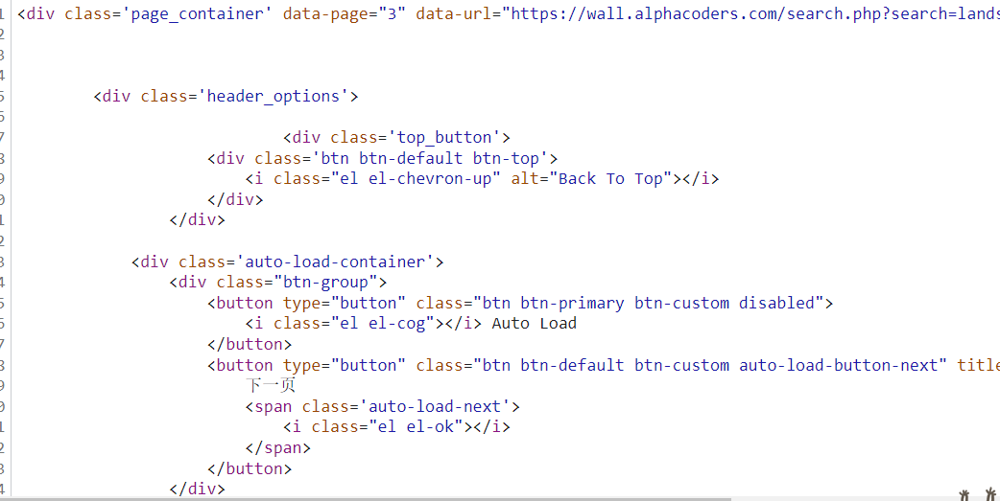

# 第九章 Ajax数据采集

​	有时我们用requests抓取页面得到的结果，可能和在浏览器中看到的不一样；在浏览器中可以看到正常显示的页面数据，而使用requests得到的结果中并没有这些数据。

​	比如我们在**第六章Xpath解析网页**中的实训三图片爬虫中（链接：https://wall.alphacoders.com/search.php?search=%E9%A3%8E%E6%99%AF&lang=Chinese），我们明明在网页下拉后中可以看到上百张图片，而我们在requests中只请求到30张图片。


​		

​	这就是因为requests获取的都是原始HTML文档，而浏览器的页面是在JavaScript处理数据后生成的结果。

​	这些数据的来源可能有多种：可能是通过Ajax加载的，可能是包含在HTML文档中的，也可能是经过JavaScript和特点算法计算后生成的。

​	本章主要介绍第一种来源--Ajax加载。数据加载是一种异步加载方式，原始页面最初不会包含某些数据，当原始页面加载完后，会再向服务器请求某个接口获取数据，然后数据才会经过处理从而呈现在网页上，这其实是发送了一个Ajax请求。

​	按照Web的发展趋势来看，这种形式的页面会越来越多。

​	所有如果遇到这样的页面，直接利用requests等库来抓取原始HTML文档，是无法获取有效数据的，这时需要分析网页后台向接口发送的Ajax请求。如果可以用requests模拟Ajax请求，就可以成功抓取页面数据。


## 9.1 Ajax请求

​	参考自：https://blog.csdn.net/weixin_45709134/article/details/111194732

### 9.1.1 概念

​	Ajax 即“Asynchronous Javascript And XML（异步 JavaScript 和 XML），是指一种创建交互式、快速动态网页应用的网页开发技术，无需重新加载整个网页的情况下，能够更新部分网页的技术。

​	对于传统的网页，如果想更新其内容，就必须刷新整个页面，但有了Ajax，可以在页面不被全被刷新的情况下更新。

​	**Ajax 是一种浏览器通过 js 异步发起请求， 局部更新页面的技术。**

```
- Ajax 请求的局部更新， 浏览器地址栏不会发生变化
- 局部更新不会舍弃原来页面的内容
- 同步按你的代码顺序执行，异步不按照代码顺序执行，异步的执行效率更高。
```

### 9.1.2  实例引入

**实例一：**

​	以https://wall.alphacoders.com/search.php?search=%E9%A3%8E%E6%99%AF&lang=Chinese为例：


​	我们打开【下一页】按钮，并将网页往下拉，一直下滑，就可以发现会有不断的新的图片被加载出来，这个过程其实

就Ajax加载的过程。


​	同时能够看出，页面其实并没有整个刷新，这意味着页面的链接没有变化，但是网页中却多了新的内容，也就是后面刷出来的新图片。这就是通过Ajax获取新数据并呈现的过程。

​	我们可以通过开发者工具(或其他抓包工具)来抓取Ajax包：

​	打开开发者工具，在过滤器中选择筛选**【XHR】**，

​	

​	我们就可以在下面找到抓取到的异步数据包了。

​	以其中一个异步数据包为例：


​	这个数据包的正文类型是**text/html**：




**实例二：**

​	我们查看另外一个同样是Ajax请求获取数据的实例。

链接：https://movie.douban.com/explore#!type=movie&tag=%E7%83%AD%E9%97%A8&sort=recommend&page_limit=20&page_start=0


​	

这个网站相对起来更加极端，它甚至在原始HTML文档不设置任何数据。


​	它的所有数据都是异步获取的。


​	但和实例一不一样的地方是，它的正文类型是**application/json**的。


### 9.1.3 基本原理

初步了解了Ajax之后，我们接下来了解一下它的基本原理。从发送Ajax请求到网页更新的过程可以简单分为以下三步：

1. **发送请求**
2. **解析内容**
3. **渲染页面**


**发送请求**

​	我们知道JavaScript可以实现页面的各种交互功能，Ajax也不例外，它也是由JavaScript实现的。

​	比如:

```javascript
/*
1.创建XMLHttpReq对象
2.调用open方法设置参数
3.调用send方法发送请求
4.在send方法前绑定onreadystatechange事件,处理请求完成后操作
*/
function ajaxRequest() {
 // 1、我们首先要创建XMLHttpRequest 
var xmlhttprequest = new XMLHttpRequest();
  //2、调用open方法设置请求参数
xmlhttprequest.open("GET","http://localhost:8080/16_json_ajax_i18n/ajaxServlet?action=javaScriptAjax",true);
  //4、在send方法前绑定onreadystatechange事件，处理请求完成后的操作。
xmlhttprequest.onreadystatechange = function(){
if (xmlhttprequest.readyState == 4 && xmlhttprequest.status == 200) {
	alert("收到服务器返回的数据：" + xmlhttprequest.responseText);
	var jsonObj = JSON.parse(xmlhttprequest.responseText);
	// 把响应的数据显示在页面上
	document.getElementById("div01").innerHTML = "编号：" + jsonObj.id + " , 姓名：" + jsonObj.name;
		}
}
 // 3、调用send方法发送请求
	xmlhttprequest.send();
```

​	这是JavaScript对Ajax最底层的实现，实际上就是先新建一个XMLHttpRequest对象xmlhttp，然后调用onreadystatechange属性设置监听，最后调用open和send方法向某个链接（也就是服务器）发送请求。

​	这里的请求发送由JavaScript完成。由于设置了监听，所以当服务器返回响应时，onreadystatechange对应的方法便会被触发，然后在这个方法里面解析响应内容即可。


**解析内容**

​	服务器返回响应之后，onreadystatechange属性对应的方法就被触发了，此时利用xmlhttp的responseText属性便可得到响应内容。这类似我们Python爬虫中利用requests向服务器发起请求，然后得到响应的过程。

​	从上面两个实例中，我们可以知道这个返回内容可能是HTML，也可能是JSON。接下来只需要在方法中 用JavaScript进一步处理即可。如果是JSON的话，可以进行解析和转化。


**渲染网页**

​	JavaScript有进行改变网页内容的能力，因此解析完响应内容之后，就可以调用JavaScript来基于解析完的内容对网页进行下一步处理了。

​	例如，通过document.getElementById().innerHTML操作，可以更改某个元素内的源代码，这样网页显示的内容就改变了。这种操作也被称为DOM操作，即对网页文档进行操作，如果更改，删除等。


## 9.2 Ajax分析

​	我们以9.1中的实例二豆瓣电影为例，我们知道刷新的电影内容由Ajax加载而得，而且页面的链接不会发生变化。

​	我们可以借助浏览器的开发者工具来对AJax请求进行分析。

### 9.2.1 开发者工具分析Ajax请求

​	首先，我们用chrome浏览器打开实例二的链接【https://movie.douban.com/explore#!type=movie&tag=%E7%83%AD%E9%97%A8&sort=recommend&page_limit=20&page_start=0】。


​	打开开发者工具的【Network】，并刷新页面，得到以下：


​	Ajax有特殊的请求类型，叫做`xhr`。在【Network】的筛选器中，就可以筛选`xhr`。


​	筛选完之后，我们就可以查看到所有的AJax请求包。


​	我们找到其中一个数据包:


这个数据包的正文类型是JSON格式，我们可以在【Preview】里面查看格式化的JSON数据


我们会发现我们想要的电影数据就是在这个JSON的数据包中。


我们回去观察一下头信息，会发现：


​	

Ajax数据包的链接和网页的链接是不一样的，我们把Ajax链接输入到浏览器中：


我们就会看到实际的数据，那么我们只需要在Python中请求AJax的链接即可。


## 9.3 Ajax请求爬虫

### 实训一：电影爬虫

​	链接：https://spa1.scrape.center/


​	对于这个网站，它的数据并不在原始的HTML文档上。


​	

它的所有数据是通过Ajax请求获取的


​	我们可以发现Ajax请求无非也就是一个GET请求，我们按照GET请求的方式请求就可以获得想要的数据了。根据第4章所

学习的知识，我们首先要来分析它的头信息和分页规则：

​	

​	


​	**结论一：**

​					url：https://spa1.scrape.center/api/movie/

​					请求方式: GET

​	


​	**结论二:**

​				返回类型: json


​																						                第一页	


​																											  第二页


​																											  第三页


​	

​	**结论三:**

​				两个GET参数：  ① limit = 10         ② offset = 10*(页码-1)


​	分析返回内容：


用Python视角看，返回的结果是一个字典，字典有两个键值对（分别是**count**和**results**）。我们想要的电影数据在**results**的值中，以字典列表形式存储

```python
'''
    Ajax请求电影数据
'''
import requests
import json
import redis

# 1.准备工作
# url
base_url = "https://spa1.scrape.center/api/movie/"
# 伪装头信息
headers = {
    'User-Agent':'Mozilla/5.0 (Windows NT 10.0; Win64; x64) AppleWebKit/537.36 (KHTML, like Gecko) Chrome/84.0.4147.105 Safari/537.36'
}
# GET请求参数
params = {
    "limit":10,
    "offset":0
}

# 电影总列表
movie_list = []

# 连接redis数据库
r = redis.Redis(host="127.0.0.1", port=6379, password=None, db=5)


# 2.分页发起请求
# 前十页
for page in range(1, 11):
    # 更新GET参数
    params["offset"] = 10 * (page - 1)
    # 发起GET请求
    response = requests.get(url=base_url, headers=headers, params=params)
    # 返回类型是JSON，直接通过response.json()获取
    json_data = response.json()

    # 3.数据解析
    # 通过分析，我们知道数据的键值对为 results，并且也字典列表的形式存储
    data = json_data["results"]

    # 4.1 持久化存储（redis方式）
    for d in data:
        # d中有个别数据是list形式，把它们强行转成str   如：'categories': ['剧情', '爱情']
        for key in d.keys():
            d[key] = str(d[key])
        # 写入hashmap
        r.hmset(name=d["id"],mapping=d)
        # 提示
        print("已成功获取{}".format(d["name"]))

    # 4.2 持久化存储（json方式--准备工作）
    movie_list.extend(data)


# 4.2 持久化存储（json方式--全表存储）
fp = open("Ajax电影.json",'wt',encoding="utf-8")
json.dump(obj=movie_list,fp=fp,ensure_ascii=False,indent=2)
fp.close()


# 结束
print("结束")
```


### 实训二：订餐系统爬虫（网站暂时失效）

```python
import requests
import json

#美食类型id列表
productTypeId_ls = [6,25,47,48,46,49,63]
#动态ajax请求的url
url = 'http://120.25.164.234:8081/api/shop/product/normalProducts'
#伪装头信息
headers = {
    'User-Agent': 'Mozilla/5.0 (Windows NT 6.1; Win64; x64) AppleWebKit/537.36 (KHTML, like Gecko) Chrome/91.0.4472.77 Safari/537.36'
}

#get请求参数
params = {
    'productTypeId': None,
    'page': None,
    'limit': 10,
}


for productTypeId in productTypeId_ls:
    params['productTypeId'] = productTypeId  #传入美食类别id productTypeId
    #print(params)
    print('----------正在抓取类别编号为{}的商品-------------'.format(productTypeId))

    #抓取第一页
    try:
        print('正在抓取第1页')
        params['page'] = 1
        response = requests.get(url=url, headers=headers, params=params)  # 获取响应
        data_dirt = response.json()  # 取出json数据object  -- 字典类型
        data = data_dirt['data']  # 获取data数据
        all_data = data  #第一页的数据
        #print(all_data)
        flag = data[0]['id']  # 判断是否出现重复页面的标准
    except Exception as e:
        print(e)
        continue


    #抓取第二页以后的数据
    page = 2
    while True:
        params['page'] = page  #传入页码 page
        try:
            print('正在抓取第{}页'.format(page))
            response = requests.get(url=url,headers=headers,params=params) #获取响应
            data_dirt = response.json() #取出json数据object  -- 字典类型
            data = data_dirt['data'] #获取data数据
            #print(data)
            #print(data)
            #break
            if data[0]['id'] == flag:
                raise ConnectionResetError('抓到重复页面')
            if len(data) == 0:
                raise ValueError('无数据')
        except Exception as e:
            print(e)
            break

        else:
            all_data.extend(data) #无返回值，直接在列表后面添加
            flag = data[0]['id']  #判断是否出现重复页面的标准
            page += 1

    print(len(all_data))
    with open('./{}餐品.json'.format(productTypeId),'wt',encoding='utf-8') as fp:
        json.dump(all_data,fp,ensure_ascii=False)
```


### 实训三：图片爬虫（针对Ajax）

链接：https://wall.alphacoders.com/search.php?search=%E9%A3%8E%E6%99%AF&lang=Chinese

在第六章的实训三中，我们已经抓取原始HTML文档的图片，接下来我们要把通过Ajax刷新的图片进行爬取


我们通过9.1.2的实例引入，已经找到Ajax的请求包，接下来就对它发起请求即可。


```python
'''
	Ajax壁纸爬取
'''
import requests
from lxml import etree

# 图片站链接
url = "https://wall.alphacoders.com/search.php?"
# 伪装头信息
headers = {
    "User-Agent": "Mozilla/5.0 (Windows NT 10.0; Win64; x64) AppleWebKit/537.36 (KHTML, like Gecko) Chrome/99.0.4844.84 Safari/537.36"
}
# 请求参数
params = {
    'search':'landscape',
    'lang':'Chinese',
    'quickload':'300',
    'page':None
}

# 分页发起请求
for page in range(2,5):
    # 补齐参数
    params['page'] = page
    # 发起请求
    response = requests.get(url=url,headers=headers,params=params)
    text = response.text

    # 用xpath解析
    # 1.实例化etree
    tree = etree.HTML(text)
    # 2.获取div列表
    div_ls = tree.xpath('//div[@class="thumb-container-big "]')

    # 3. 遍历div列表
    for div in div_ls:

        # ① 图片编号
        code = div.xpath("./@id")[0].split("_")[1]

        # ② 图片链接（big链接）
        src = ''.join(div.xpath(".//div[@class='boxgrid']/a/picture/source/@srcset"))
        # print(img_src)
        # 这里获取的是350p的图片，转换成原图格式
        # 获得链接 https://images2.alphacoders.com/677/thumb-350-677740.webp
        # 原图链接 https://images2.alphacoders.com/677/677740.jpg
        origin_src = src.replace("thumb-350-","").replace("webp","jpg")
        # print(origin_src)

        # 请求图片
        img = requests.get(origin_src,headers).content
        # print(img)

        # 保存图片
        fp = open("{}.jpg".format(code),"wb")
        fp.write(img)
        fp.close()
    
        # 提示
        print("已保存{}图片".format(code))
```


### 实训四：英雄联盟皮肤图片爬虫

```python
import requests
import json
import os
import time


headers = {
    'user-agent':'Mozilla/5.0 (Windows NT 10.0; WOW64) '
                 'AppleWebKit/537.36 (KHTML, like Gecko) Chrome/70.0.3538.25 Safari/537.36'
}


def get_html(url,headers=headers):

    r = requests.get(url=url,headers=headers)
    if r.status_code == 200:
        return r
    else:
        print('响应失败，响应码为：',r.status_code)


def get_hero_id():
    '''

    获取所有英雄的ID和名字

    :return: ①ls_heroID   list  存储英雄ID   ②ls_heroName  list 存储英雄名字


    '''
    url = 'https://game.gtimg.cn/images/lol/act/img/js/heroList/hero_list.js'

    dir_hero = get_html(url).json()

    ls_hero = dir_hero['hero']

    ls_heroID = []  # 存储英雄ID

    ls_heroName = []  # 存储英雄名字


    for hero in ls_hero:
        ls_heroID.append(hero['heroId'])

        ls_heroName.append(hero['name'])

    return ls_heroID,ls_heroName


if __name__ == '__main__':
    ls_heroId, ls_heroName = get_hero_id()

    for i in range(len(ls_heroId)):
        try:
            heroName = ls_heroName[i]
            heroId = ls_heroId[i]

            # # 分开存储
            # downloadPath = './全部皮肤_2022/{}/'.format(heroName)
            # if not os.path.exists(downloadPath):
            #     os.mkdir(downloadPath)

            # 全部存储
            downloadPath = './全部皮肤/'
            if not os.path.exists(downloadPath):
                os.mkdir(downloadPath)

            #
            hero_json_url = 'https://game.gtimg.cn/images/lol/act/img/js/hero/{}.js'.format(heroId)
            hero_json = get_html(url=hero_json_url).json()

            for skin in hero_json['skins']:
                skin_name = skin['name'].replace('/', '／')
                skin_mainImg = skin['mainImg']
                if skin_mainImg != '':
                    img = get_html(skin_mainImg).content
                    fileName = '{}{}_{}.jpg'.format(downloadPath, heroName, skin_name)  # 分开存储
                    with open(fileName, 'wb') as fp:
                        fp.write(img)
                    print(skin_name, '爬取完毕')
                # time.sleep(3)
        except Exception as e:
            print(e)
            pass
        continue

    print('爬取结束')

```

